# Lec10: Hash Tables
## Search/Insert/Remove in $O(1)$ time
If keys are all distinct integers from universe $U=\{0, 1, \dots, m-1\}$
Just allocate an array of size $m=|U|$
So that the three operations can be done in $O(1)$ time
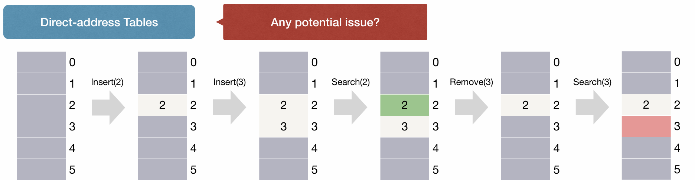
We can call this **direct-address tables**

But issues arose.
The universe can be extremely large, and so the **space complexity** is unacceptable.

## Hashing
Huge universe $U$ of possible keys.
Much smaller $n$ actual keys.
So only spend $n$ space, much smaller than $U$

Design hash function $h: U\rightarrow [m]$
$h(k)$ decides the index of slot in the table for storing $k$
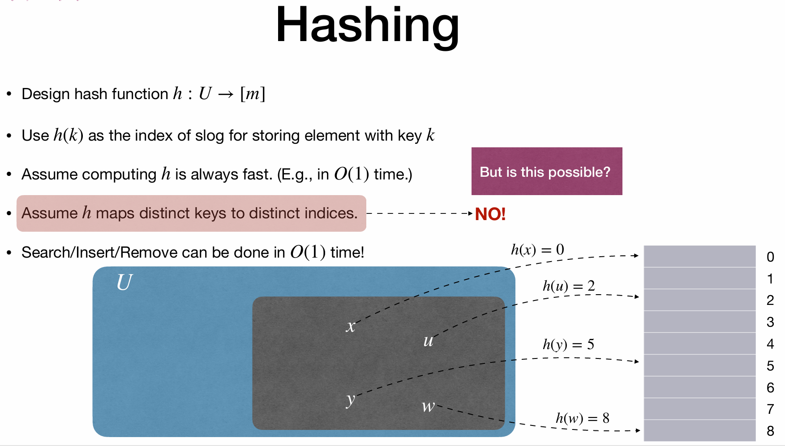
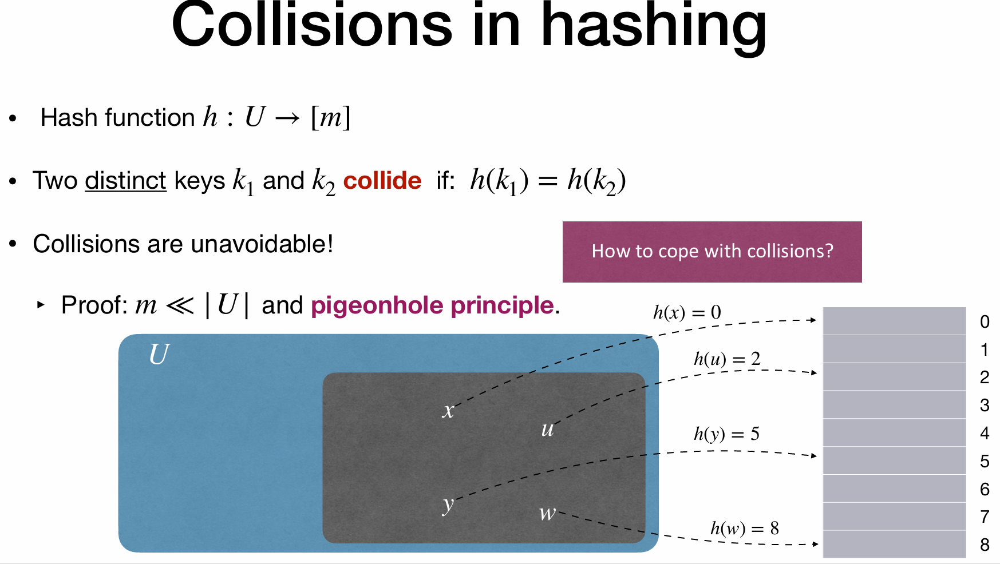
How to cope with collision?
Use chaining.

### Chaining
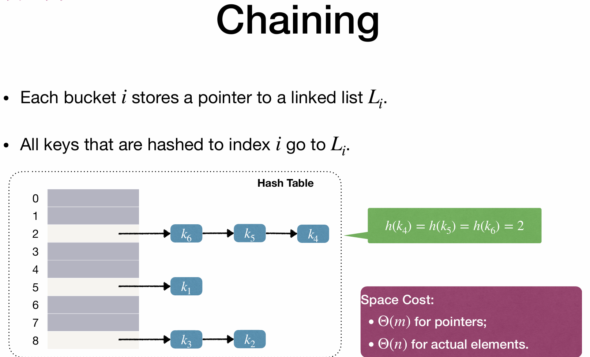
Build a linked list to maintain the keys with same has values.
Each time we insert, insert into the front of the linked list, to make faster.
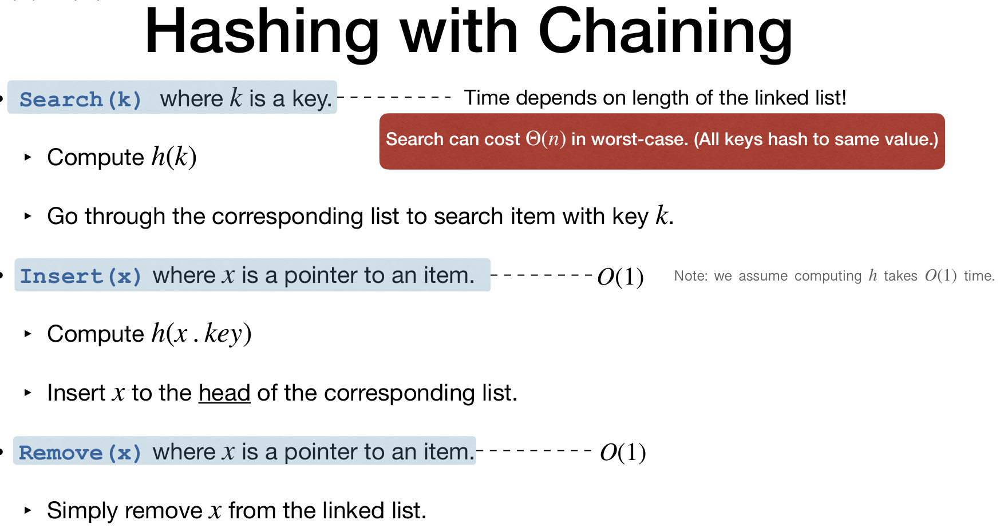
The remove calls search first, so reach $O(1)$, if not, should be $O(n)$

Mathcal analysis:
**Simple Uniform Hashing** Assumption
- Each key is equally likely to be mapped to every bucket
- Keys are mapped independently

$\alpha$ is the size of the linked list in one bucket

So when m is roughly equal to n, hash table cost $O(n)$ space and $O(1)$ time

In reality, “Simple Uniform Hashing” does not hold!
Keys are not that random (they usually have **patterns**)

## Design Hash Functions

### The Division Method
Common technique when designing hash functions

Example:
Hash function: h(k) = k mod m
Two keys collide if k1 ≡ k2 (mod m)
How to select m?
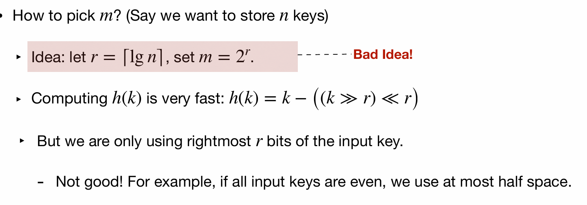
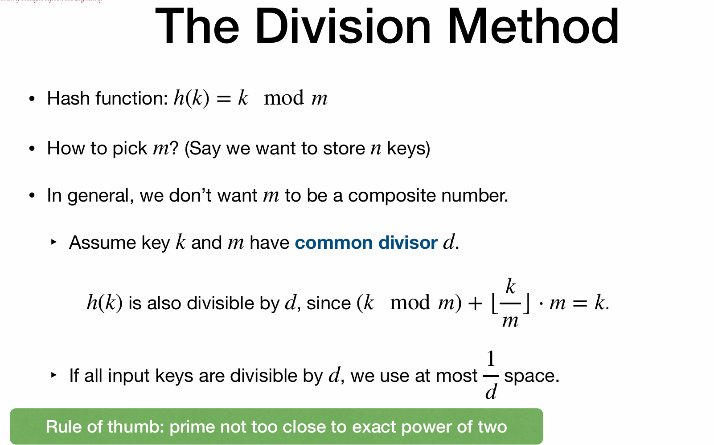

### The Multiplication Method
Assume that any key length is at most $w$, that is its binomial number can be expressed within $w$ bits.
Fix our hash table to have size $m=2^r$ in which $r\leq w$
And we fix one constant $A$ satisfying $0<A<2^w$, that is, $A$ can be expressed within $w$ bits.

Now we define our hash function to be
$$
h(k)=(Ak \text{ mod } 2^w) >> (w-r)
$$

As $A$ and $k$ are both $w$ digit numbers, their product get a $2w$ digit number, and then get mod to keep the lower $w$ digits, at last right shift $(w-r)$ digits to get the $r$ higher digits as the hash value.
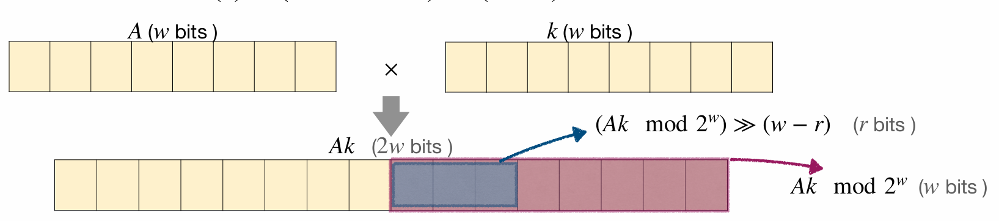

This method is faster than division method, cuz bitshifting and multiplication are faster than division.

However when one hash function is fixed, there definitely exist certain "bad inputs" that make different keys hash to the same value.
This adversial input can result in poor performance for hash tables.

### Universal Hashing
Once hash function is **fixed and known**, there must exist a set of “bad” keys that hash to the same value.
Such **adversarial input** will result in poor performance!

Use randomization!
Pick a **random** hash function $h$ when the hash table is first built, and does not change it afterwards.

**Universal Hash Family**
A collection of hash functions $\mathcal{H}$ is universal if:
For any $x\neq y$, at most $\frac{|\mathcal{H}|}{m}$ in $\mathcal{H}$ making $h(x)=h(y)$
In which m is the size of the hash table, and $|\mathcal{H}|$ is the size of the hash family.

Therefore, the probability of collision(that is $h(x)=h(y)$) is at most $\frac{1}{m}$

Comparing the Simple Uniform Hashing and Universal Hashing:
- Simple Uniform Hashing:Uncertainty due to randomness of **input**.
- Universal Hashing: Uncertainty due to **choice of function**  (and potentially randomness of input).

And then we can calculate the expected time for search/insert/remove operations under the assumption of universal hashing.
#### Performance of Hashing with Chaining
!Yet understood.
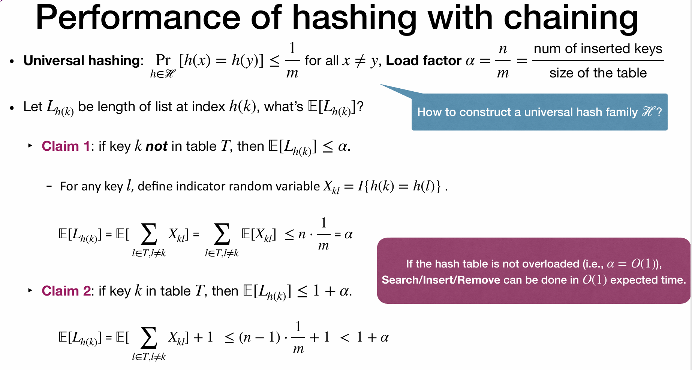
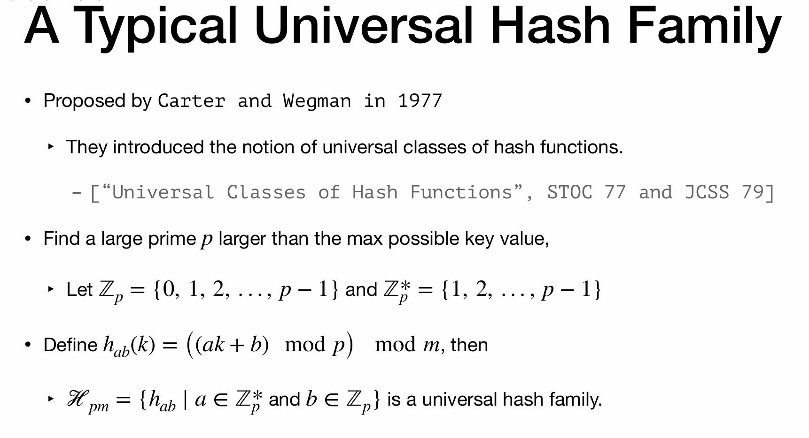
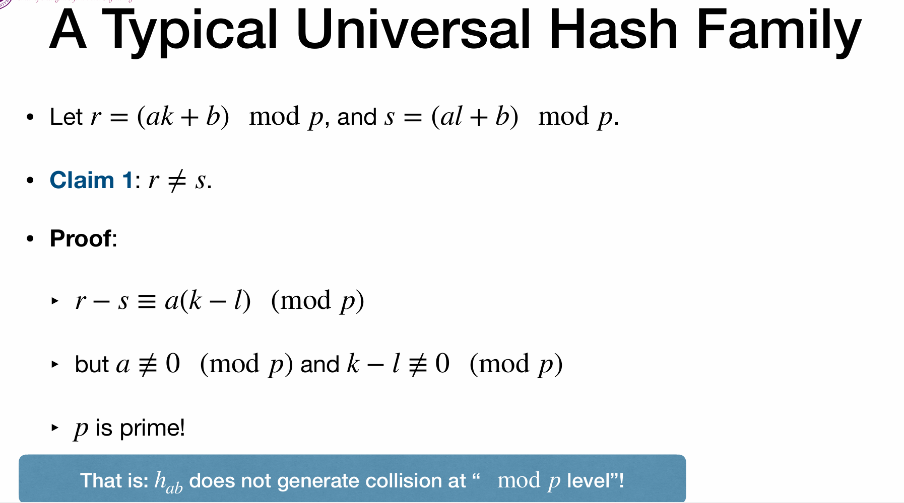
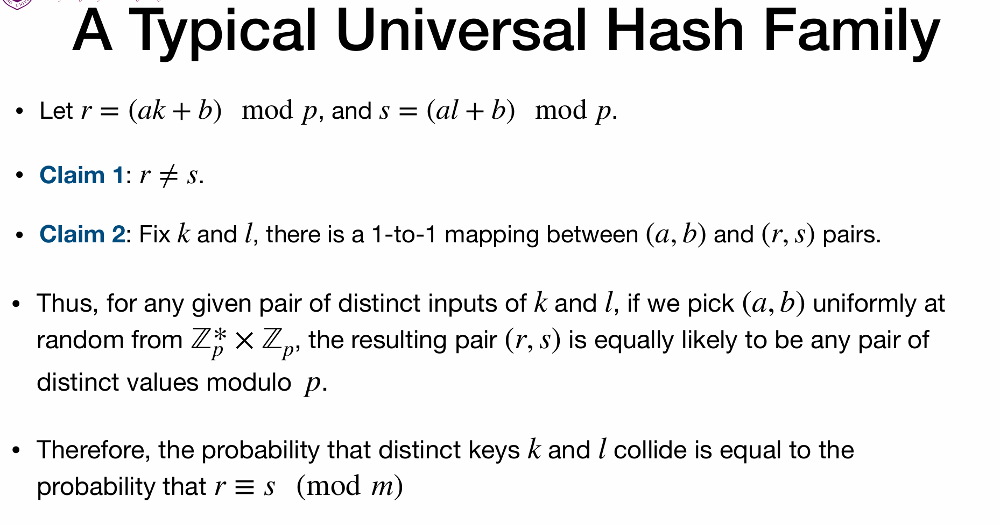
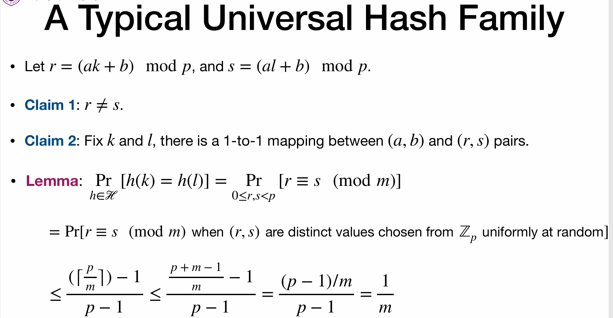

## Open Addressing
No linked lists, all items store in the table, one item per bucket.
Probe a sequence of buckets until an empty one if found, to avoid collision.
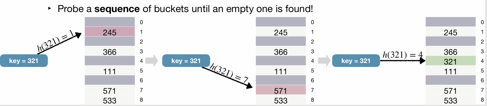

But how the probe sequence is determined?
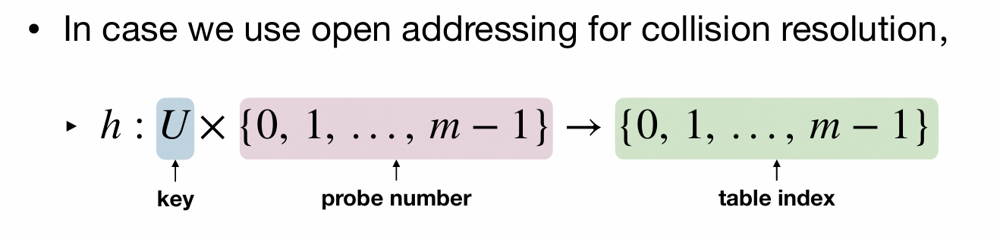
Re-define the hash function, with 2 inputs.
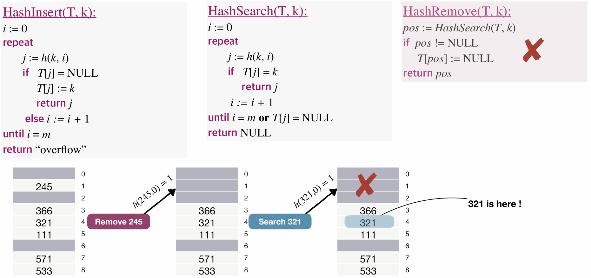
`j` refers to the next table index in the probe sequence.
Why this remove is wrong?
After remove 245, we can't find 321!
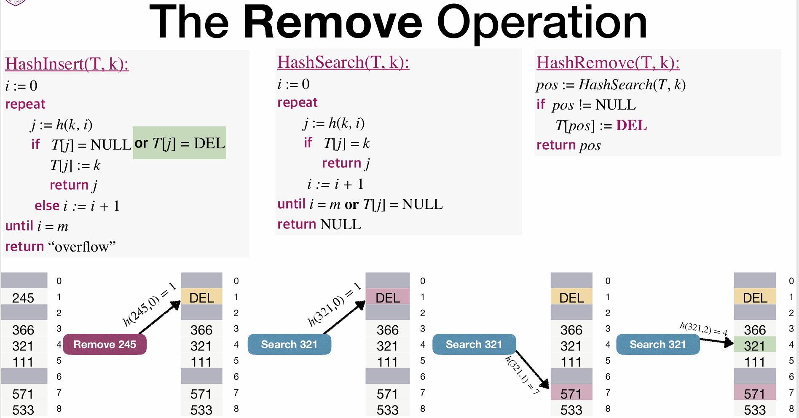
Pseudacode are shown as above, and need to mention the remove operation is special.

### Linear Probing
The hash function takes in a key $k$ and the number of probes $i$ already made, and returns the index of the next slot to be probed(inserted).

The hash function is defined as:
$$
h(k, i) = (h'(k) + i) \mod m
$$
Where $h'(k)$ is a auxiliary hash function, $i$ is the number of probing  and $m$ is the table size.

A typical instance of $h'(k)$ is the division method: $h'(k) = k \mod m$
For example if we set $m=10$, key $k=23$, then the probe sequence is:
$$
3, 4, 5, 6, 7, 8, 9, 0, 1, 2
$$
We first check index 3(i.e.$i=0$), if occupied, then check index 4(i.e.$i=1$, the first time of probing), and so on.

Since the initial probe position determines the entire probe sequence, only $m$ distinct probe sequences are used with linear probing

And linear probing could lead to another problem: **(Primary) Clustering**
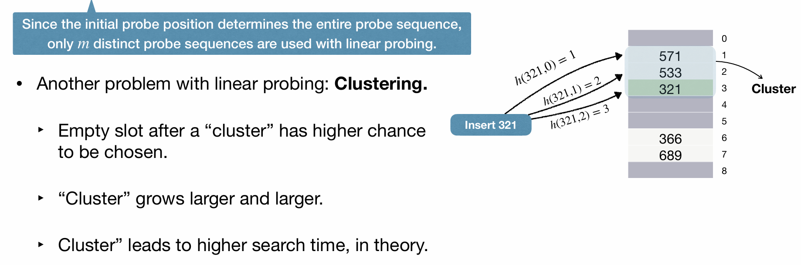
Empty slot after a “cluster” has higher chance to be chosen, and cluster grows larger and larger, leading to a higher search time.

### Quadratic Probing
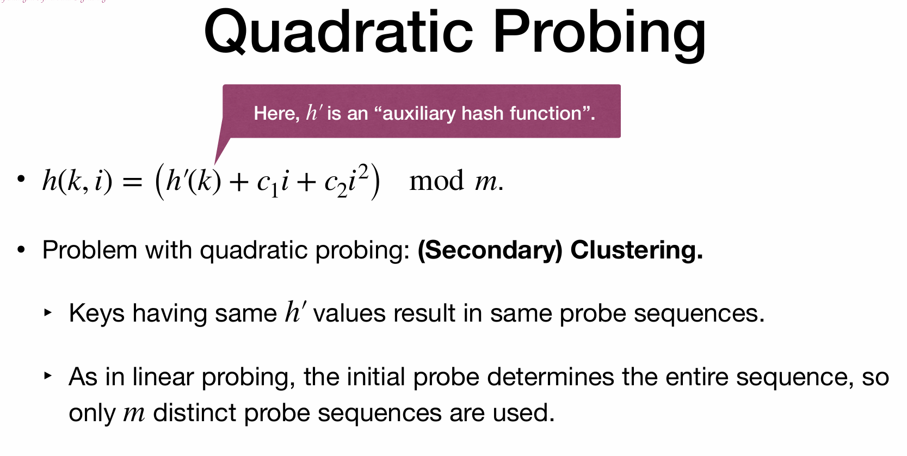

### Double Hashing
Use 2 independent auxiliary hash functions $h_1(k)$ and $h_2(k)$
$$
h(k, i) = (h_1(k) + i \cdot h_2(k)) \mod m
$$
Different from linear and quadratic probing, the second hash function $h_2(k)$ decides the step size of each probe.
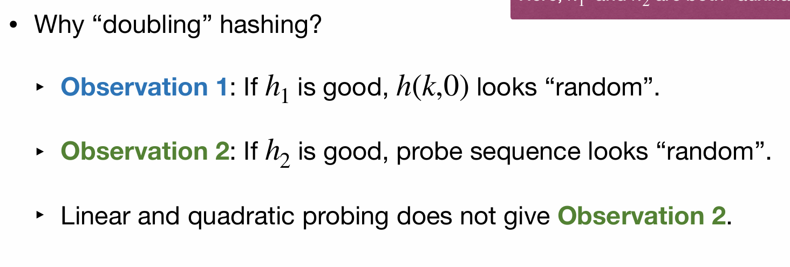
The step size varies instead of being fixed in linear and quadratic probing.

## Chaining vs Open Addressing
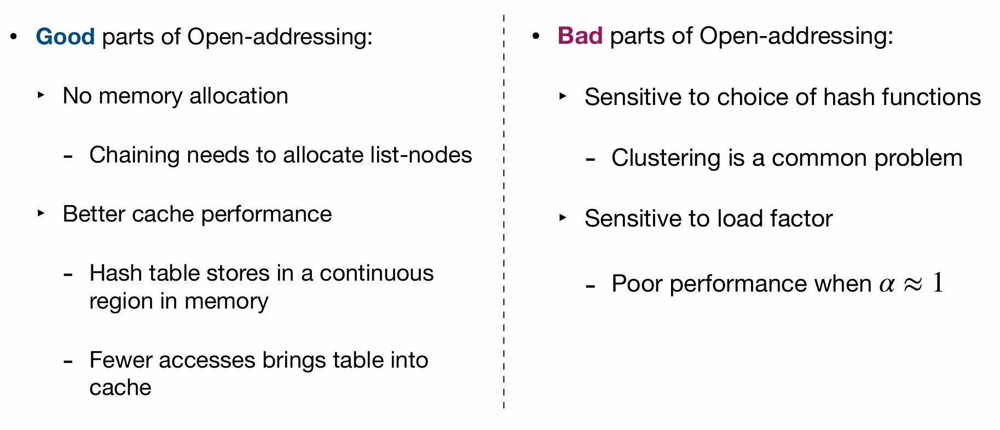