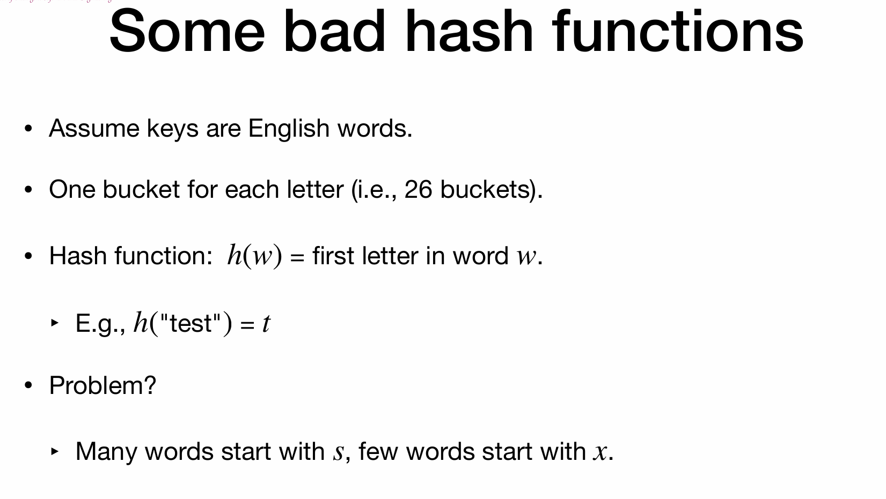

# Lec10: Hash Tables
## Hashing
Huge universe $U$ of possible keys.
Much smaller $n$ actual keys.

Design hash function $h: U\rightarrow [m]$

How to cope with collision?

### Chaining

Build a linked list to maintain the keys with same has values.
Each time we insert, insert into the front of the linked list, to make faster.

The remove calls search first, so reach $O(1)$, if not, should be $O(n)$

Mathcal analysis:

Optimistically assume:
- Each key is equally likely to be mapped to every bucket
- Keys are mapped independently

$\alpha$ is the size of the linked list in one bucket

So when m is roughly equal to n, hash table cost $O(n)$ space and $O(1)$ time

In reality, “Simple Uniform Hashing” does not hold!
Keys are not that random (they usually have **patterns**)

## Design Hash Functions

