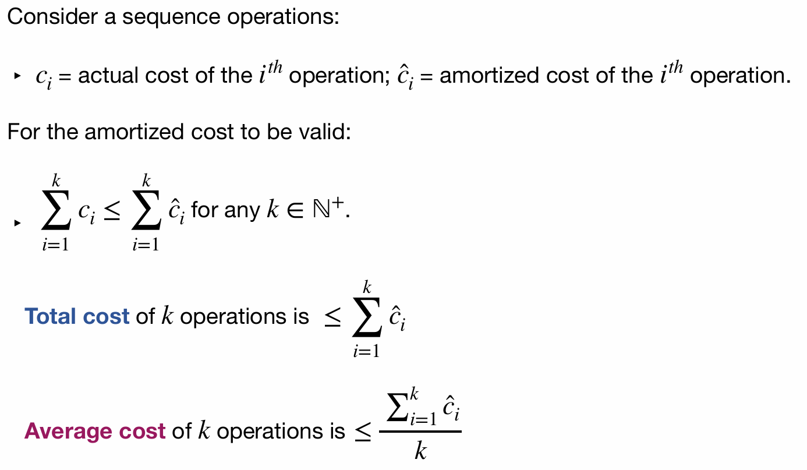
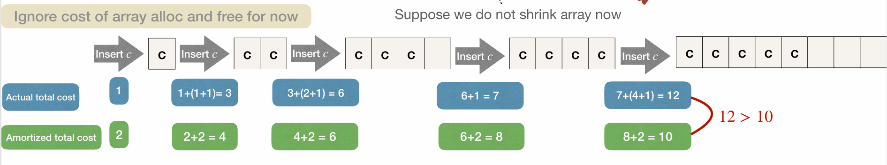
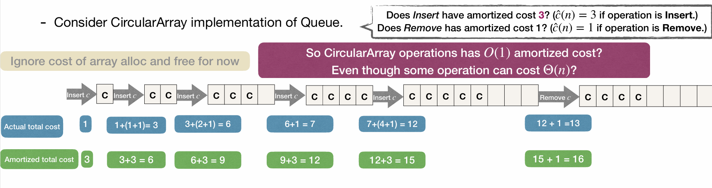
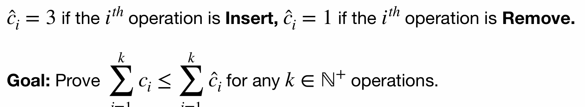
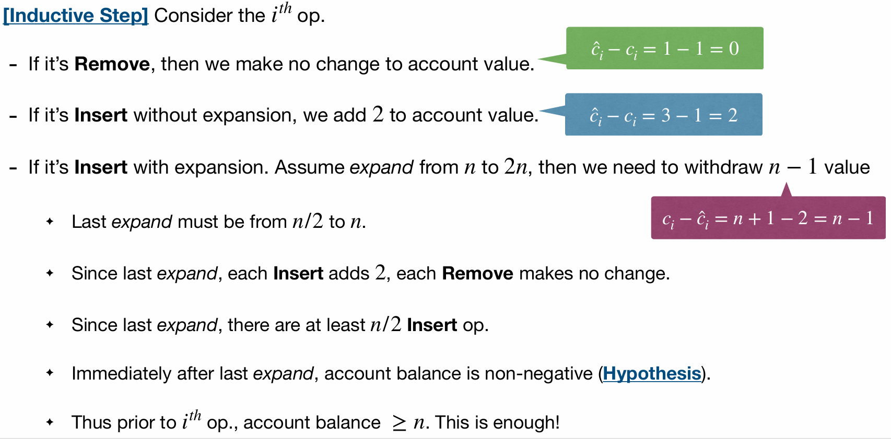

# Lec11: Amortized Analysis
## Implement Queue with CircularArray
Recall when we use CircularArray to implement Queue.
When the array is full:
- Allocate a new array of double size.
- Copy existing items to the new array, and insert new element.
- Delete old array.

## Amortized Analysis
A technique for analyzing average cost.

Idea: Even when expensive operations **must be performed**, it is often possible to get away with performing them **rarely**, so that the “average” cost per operation is not so high

Note: Amortized analysis is different from what is commonly referred to as **average case analysis**, because it does not make any assumption about the **distribution** of the data values, whereas average case analysis assumes the data are not “bad".

That is, amortized analysis is a **worst case analysis**, but for **a sequence of operations**, rather than for individual operations.

## Aggregate Method in Amortized Analysis
One assumes that there is no need to distinguish between the different operations on the data structure, then we just **add up** the cost of all the operations and then divide by the number of operations
$$
\text{aggregate cost} = \frac{\text{maximum amount of work done by any series of } m \text{ operations}\text{ operations}}{m}
$$

Back to our example of inserting into a circular array implemented queue:
Assume we insert $N=2^k$ elements into an initially empty queue.
Every time the queue is full, we double the size of the array.
So total cost of doubling the array is:
$$
1+2+4+\dots + 2^{k-1} = 2^k - 1 \approx N
$$
And we plus the cost of $N$ insertions, so total cost is about $2N$.

So the amortized cost per operation is about:
$$
\frac{2N}{N} = 2 = O(1),
$$
which is constant level.

## Amortized Analysis
Note: Different operations may have different amortized costs.

If the amortized cost of a certain operation is $\hat{c}(n)$, then for a sequence of $k$ operations, the actual total cost must be no more than $\sum_{i=1}^k\hat{c}(n_i)$, where $n_i$ is the size of the data structure when operating the $i$th operation.

Using the aggregate method as previously discussed, we can get the amortized cost of each operation, and in this example, we see in the fifth insertion, the actual total cost is 12 while the amortized total cost is 10, so not valid!

How the total cost is calculated?
Add the cost of the previous operation, then 1 for insertion and add the size of doubling when needed.

We change the amortized cost of insertion to 3, then the amortized total cost is 15, which is valid.

## Amortized Analysis Techniques
### The Accounting Method
Basic concept:
Consider a sequence of operations: $c_i$ as the actual cost of the $i$th operation, and $\hat{c_i}$ as the amortized cost of the $i$th operation. The amortized cost needs to be valid.

Imagine we have a bank account $B$ with initial balance $0$.
For each operation $i$, spend $\hat{c_i}$ money
- if $\hat{c_i} \geq c_i$, then deposit the extra $\hat{c_i} - c_i$ money into the bank account $B$.
- if $\hat{c_i} < c_i$, then withdraw $c_i - \hat{c_i}$ money from the bank account $B$.

Amortized cost is valid if the bank account $B=\sum_{i=1}^{k}(\hat{c_i} - c_i)$ never goes negative.

#### Example: CircularArray based Queue

Strategy: account always non-negative via **induction** on $k$.

By induction, we know this amortized cost is valid.

#### Example: Binary Counter
