# Lec12: Disjoint Sets (Union-Find)

## DisjointSet ADT

A **disjoint-set** ADT (also known as Union-Find ADT) maintains a collections of sets $S=\{S_1,S_2,\ldots,S_k\}$ that are disjoint and dynamic.
Each set $S_i$ is represented by "leader" element chosen from $S_i$.

DisjointSet ADT supports the following operations:

- MakeSet(x): Create a new set $S_i=\{x\}$ containing only element $x$ and add it to $S$.
- Union(x, y):  find the sets containing $x$ and $y$, say $S_x$ and $S_y$, respectively. Remove $S_x$ and $S_y$ from $S$ and add $S_x\cup S_y$ to $S$.
- Find(x): Return a pointer to the leader of the set containing $x$.

A typical application is to compute connected components in a graph.
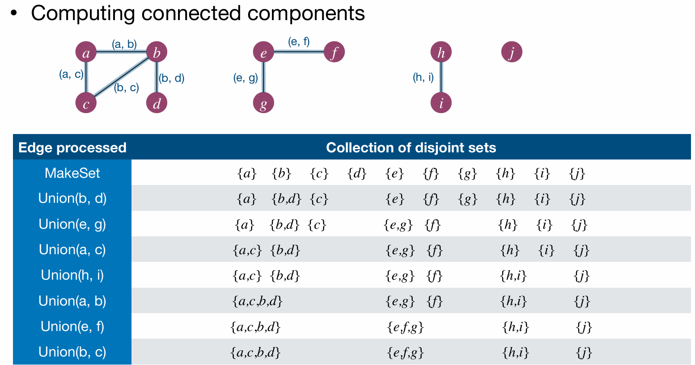
What is a connected component?

```
// first connected component
A — B — C
     |
     D

// second connected component
E — F

// third connected component
G
```

Like in this graph we can see 3 connected components.
We can imagine splitting the graph into many connected parts and connected components are the largest connected parts.

### Linked-list implementation of DisjointSet

Basic idea: Use linked-list to represent and store each set $S_i$.

Every set object has two pointers:

- `head`: points to the head of the set.
- `tail`: points to the tail of the set.
  The linked-list contains the elements in the set $S_i$.
  Each element has a pointer pointing back to the set object, and the leader of a set is the first element in the linked-list.
  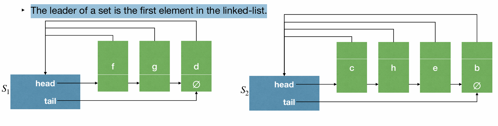

Operation implementation:

- MakeSet(x): Create a linked list containing only $x$. $O(1)$
- Find(x): Follow pointer from $x$ back to the set object, then return pointer to the first element in the linked-list. $O(1)$
- Union(x,y): Append list of $S_y$ to the end of list of $S_x$.  $O(1)$
  Update `tail` of $S_x$ to point to the last element of $S_y$ and update all pointer of elements in $S_y$ to point to $S_x$. Time depends on size of $S_y$.
  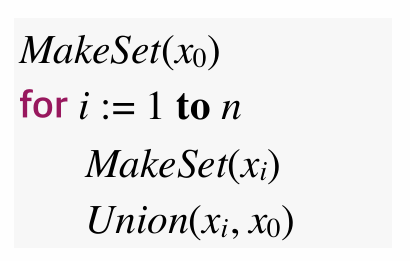
  And so, the time complexity of this sequence of operations is $O(n^2)$ cuz Union is so expensive!

To improve that, we use **Weighted-union heuristic** (or, **union-by-size**)
Basic idea is that we always append the smaller set to the larger set.
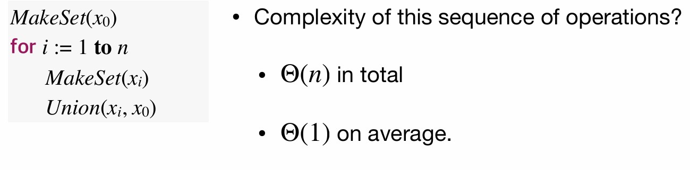
So that the time complexity of this sequence of operations drops to $O(n)$, cuz $x_i$ is always a single element formed set.

How about the worst case?
With any sequence of $n+1$ MakeSet operations, and $n$ Union operations, what is the worst-case time complexity of this sequence of operations?
$O(n\log n)$, $\log n$ for each Union operation.
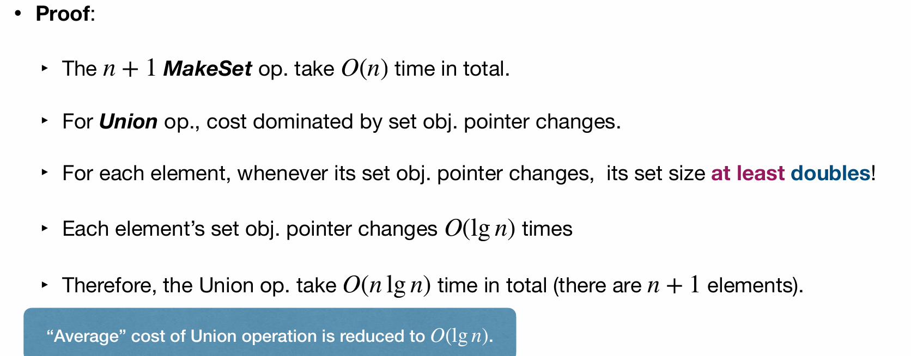

### Rooted-tree implementation of DisjointSet

Basic Idea: Use a rooted-tree to represent a set; the root of a tree is the "leader" of that set.
Each node has a pointer pointing to its parent; parent of a "leader" is the leader itself.

- MakeSet(x): Create a rooted-tree with only one node $x$. $O(1)$
- Find(x): Follow parent pointer of $x$ back to the root.
- Union(x,y): Change the parent pointer of the root of $x$ to the root of $y$.
  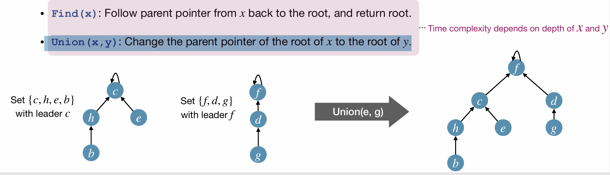

#### Linked-list vs Rooted-tree Implementation

MakeSet is fast in both cases.
For Linked-list, Find is fast but Union is slow.
For Rooted-tree, Find is slow but Union is fast.

#### Rooted-tree implementation of DisjointSet

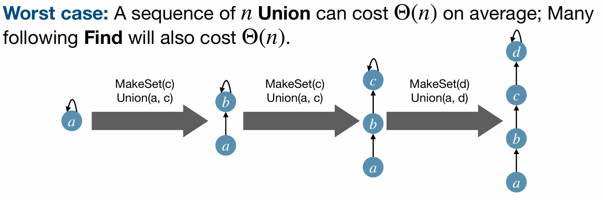
Recall the sequence of operations.
With rooted-tree implementation, the time complexity of this sequence of operations is $O(n^2)$ cuz every Union costs $O(n)$ time, need to find the root of each element.
In worst case of the sequence of operations, the longer tree always append to the single node tree, so the rooted tree would degenerate to a linked-list, and the time complexity is $O(n^2)$.

Again we use **union-by-rank heuristic**; reduce worst-case cost of Union and Find to $O(\log n)$
Each time a node's depth increases, the tree size at least doubles. So size $n$ trees has height $O(lgn)$.

1. Union by size.
   When Union 2 subtrees, append the smaller tree to the larger tree.
2. Union by height.
   When Union 2 subtrees, append the shorter tree to the taller tree.
   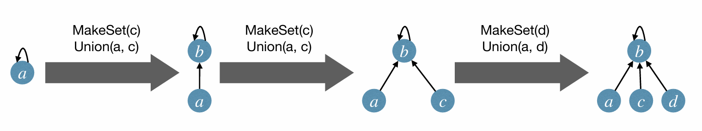

Another way to improve the performance of Union-Find is to use **path compression heuristic**.
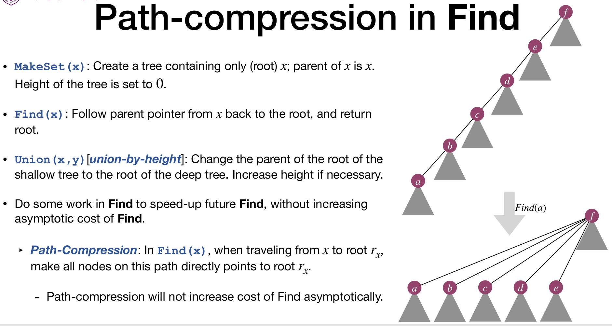
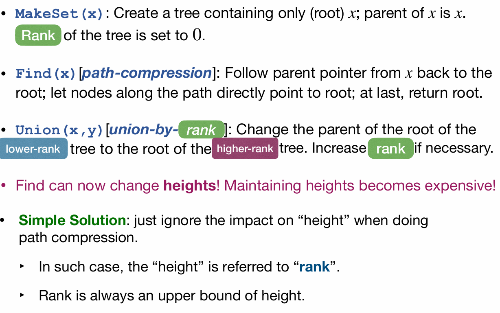
We change the parent pointer of each node on the path to point directly to the root.
Find can now change **heights**! Maintaining heights becomes expensive, so we ignore the impact on "height" when doing path compression.
Rank is no longer the actual height of the tree but an upper bound on the height.
So Union by height becomes Union by rank.
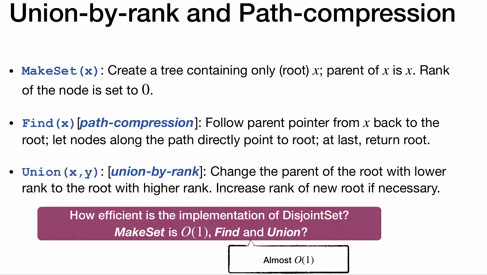
With Union-by-rank and path compression, the time complexity of Find is $O(\alpha(n))$, where $\alpha(n)$ is the inverse Ackermann function.
