# Lec13: Graphs and Graph Traversal
## Represent Graphs in Computer
### Adjacency Matrix
For the Adjacency Matrix $A=\{a_{ij}\}_{n\times n}$ of a graph $G=(V,E)$, $a_{ij}=1$ if $(i,j)\in E$, otherwise $a_{ij}=0$.
The matrix would be symmetric if $G$ is undirected.
And the matrix costs $O(n^2)$ space, regardless of $m$.
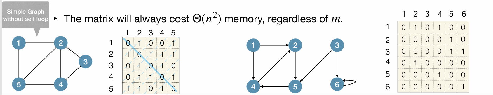

### Adjacency List
The Adjacency List of $G=(V,E)$ is a collection of $n$ lists, one for each vertex $v\in V$.
In the list for $v$, we store all vertices $w$ such that $(v,w)\in E$.
The space cost is $O(m+n)$.
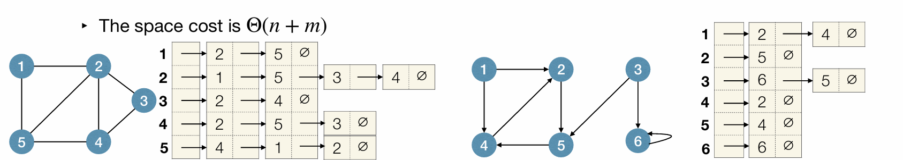

### Adjacency Matrix vs. Adjacency List
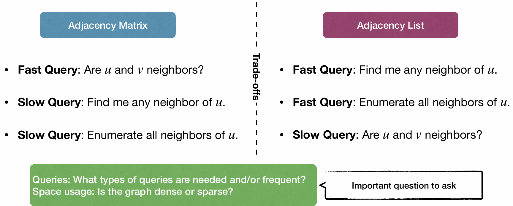
If $m$ is much smaller than $n^2$, then the adjacency list is more space-efficient.

## Search in Graphs(Graph Traversal)
Goal: Start at source node $s$ and find some node $t$ in $G$.
Or visit all nodes in $G$ reachable from $s$.

Two basic strategies for graph traversal:
- Breadth-First Search(BFS)
- Depth-First Search(DFS)
Usually use adjacency list to represent graphs in BFS and DFS.

### Breadth-First Search(BFS)
Basic idea: start at source node $s$, and visit other nodes reachable from $s$ layer by layer.
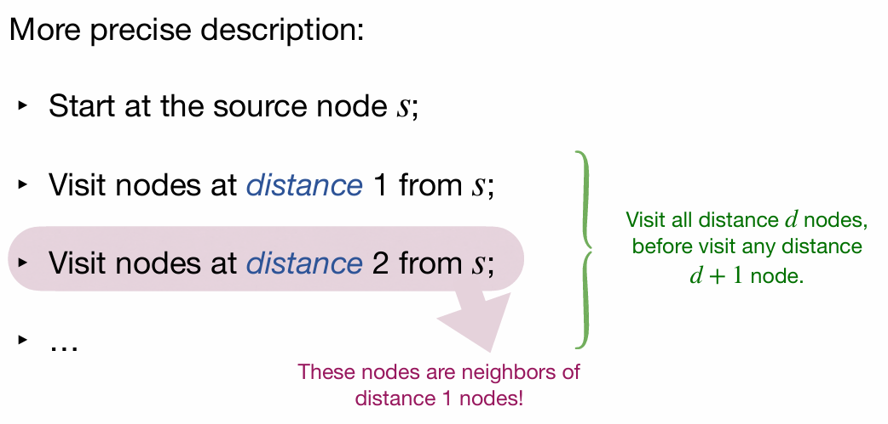
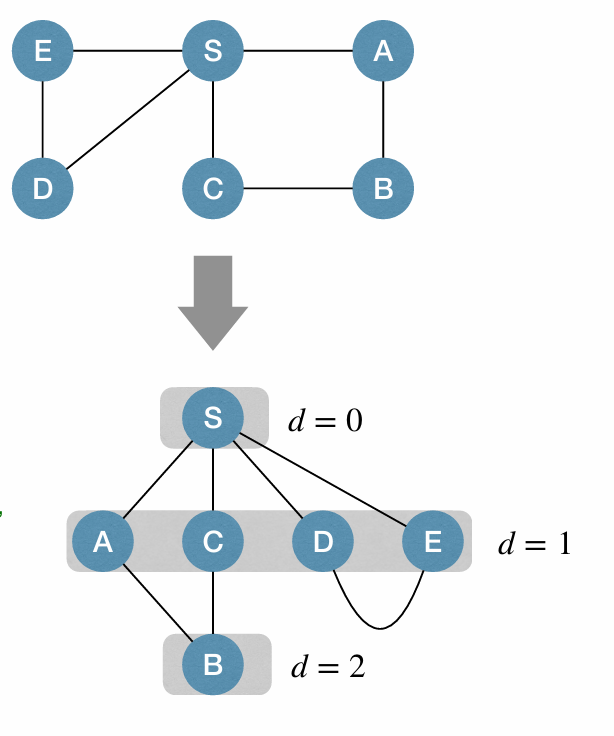

#### Implementation of BFS
Use a FIFO queue to store nodes to visit.
Nodes have 3 status:
- undiscovered(WHITE): not in queue yet
- discovered but not visited(GRAY): in queue but not visited yet
- visited(BLACK): ejected from queue and visited(all its neighbors)
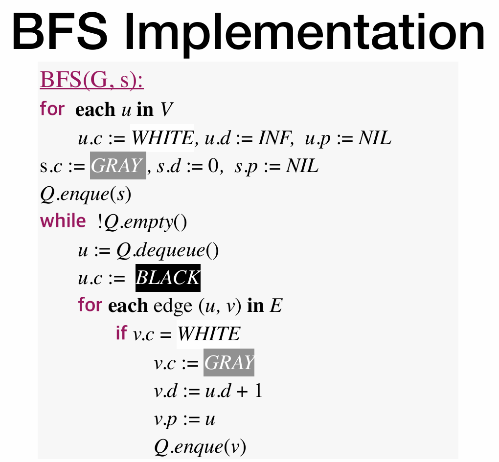
c refers to color, d refers to distance, and p refers to parent.
We keep the parent of each node to track the path from source node $s$ to any node $v$.
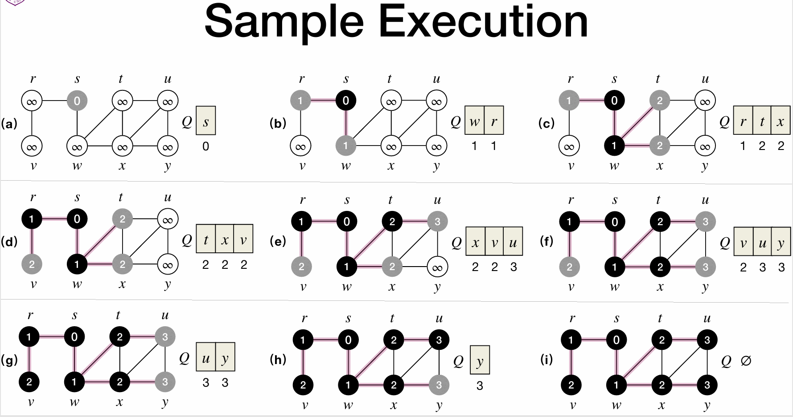
In this explanation of execution, we clearly see how the queue works, and the number of node refers to the distance from $s$(depth).

#### Performance of BFS
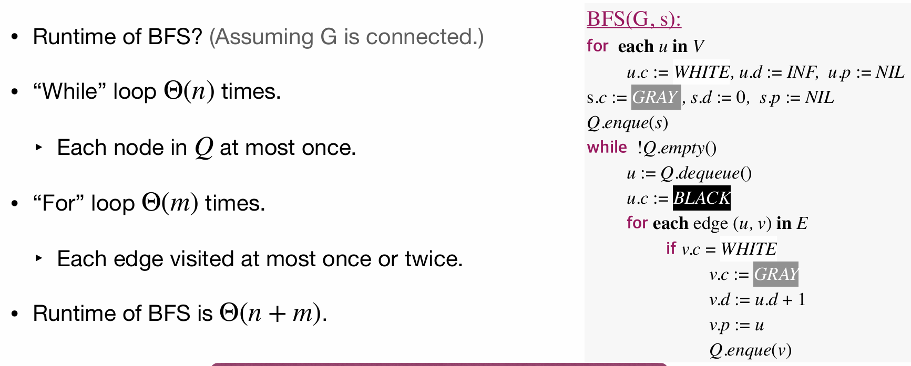
For adjacency list, the time complexity is $O(m+n)$.
We process $n$ nodes and $m$ edges and so the time complexity is $O(m+n)$.

If the graph is not connected, we just need to run BFS for each connected component.

### Depth-First Search(DFS)
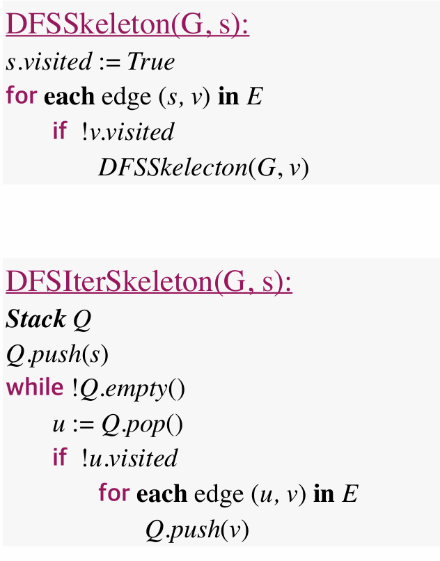
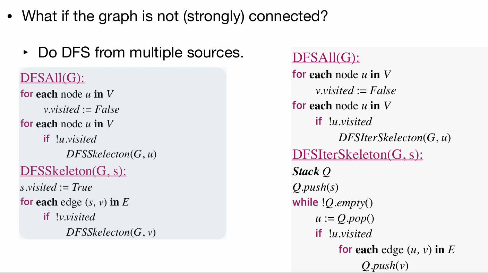
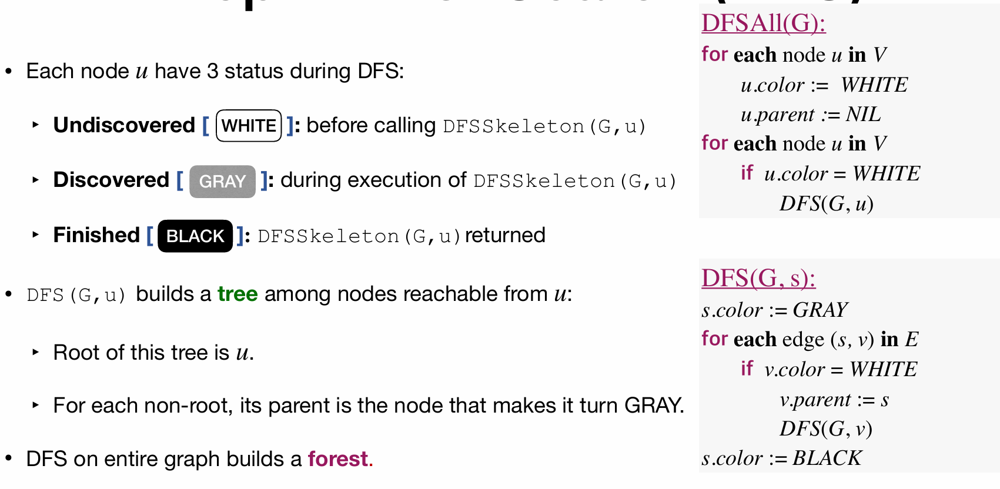
If a node is black, means that we've already processed all its neighbors, and we can return back to its parent.
We get a **DFS tree** by using DFS(G,v) for each unvisited vertex $v\in V$.
And DFS on each connected component, we get a **DFS forest**.
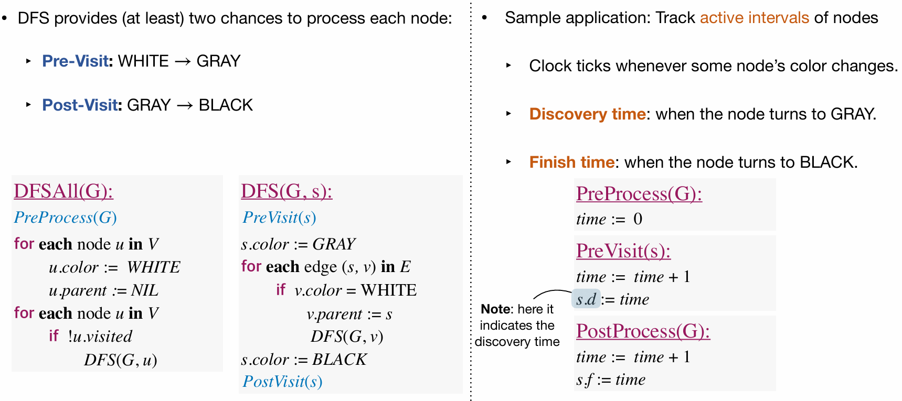
DFSAll(G) can be viewed as an entrance function, and it calls DFS(G,v) for each unvisited vertex $v\in V$.
DFS(G,v) is the main function of DFS.
It visits all nodes reachable from $v$ in DFS tree recursively.

And then we can keep a global variable as a clock to track **active intervals** of nodes
We track the time we discover each node $v.d$ and the time we finish processing all its neighbors $v.f$.
The active interval of a node $v$ is $[v.d,v.f]$.

Total runtime of DFS is $O(m+n)$.

#### Classification of Edges in DFS
DFS process classify edges of input graph into four types:
- Tree Edge: edges in DFS tree.
- Back Edge: an edge connecting a node to its ancestor in DFS tree.
- Forward Edge: non-tree edges connecting a node to its descendant in DFS tree.
- Cross Edge: other edges.
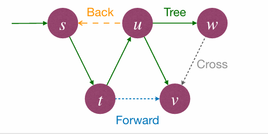

#### Properties of DFS
##### Parenthesis Theorem
Theorem: Active intervals of two nodes are either: (a) entirely disjoint; or (b) one is entirely contained within another.

##### White-path Theorem
Theorem In the DFS forest, $v$ is a descendant of $u$ iff when $u$ is discovered, there is a path in the graph from $u$ to $v$ containing only WHITE nodes.

##### Classification of edges
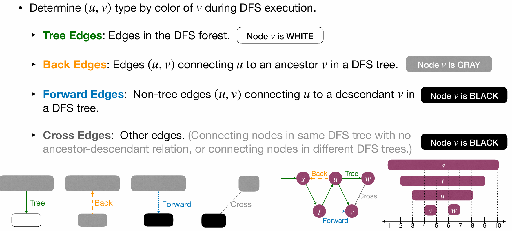

##### Types of edges in undirected graphs
In DFS of an undirected graph $G$, every edge of $G$ is either a **tree edge** or a **back edge.**
