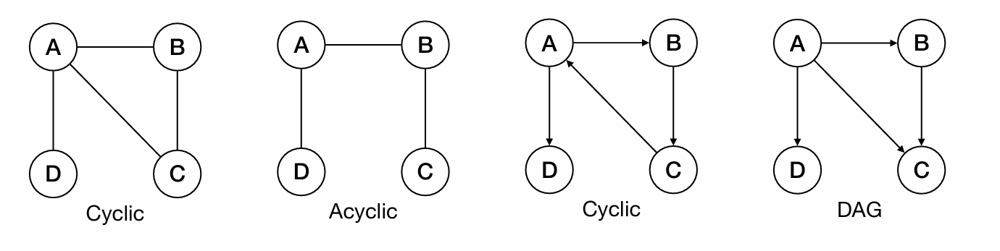
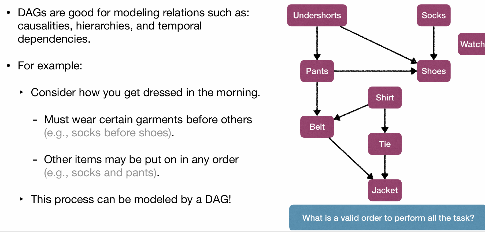
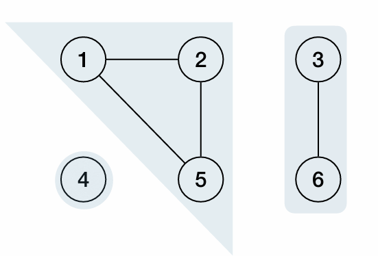
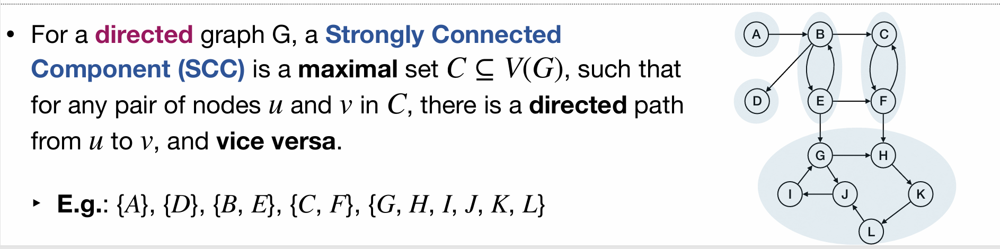
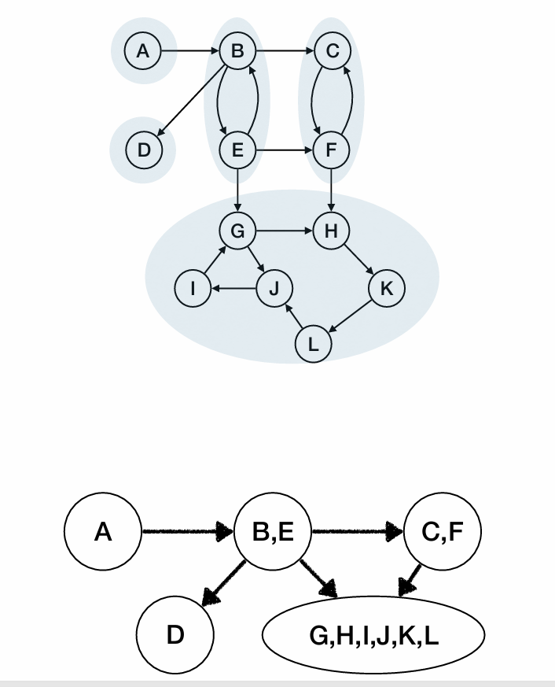
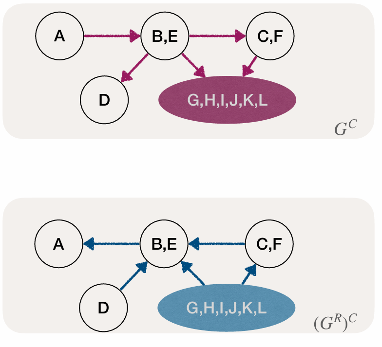
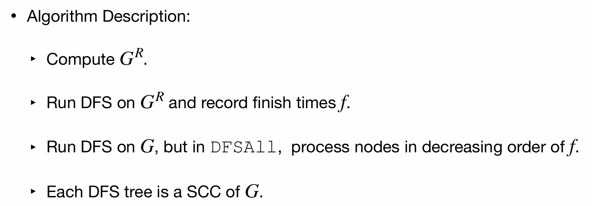

# Lec14: Some application of DFS
## Directed Acyclic Graphs (DAG)
A graph **without cycles** is called acyclic.
A directed graph **without cycles** is a directed acyclic graph (DAG).

DAGs are good for modeling relations such as: causalities, hierarchies, and temporal dependencies.

## Topological Sort
A topological sort of a DAG $G$ is a linear ordering of **its vertices** such that if $G$ contains an edge $(u, v)$ then $u$ appears before $v$ in the ordering.

$E(G)$ defines a partial order over the vertices of $G$, a topological sort gives a total order over the vertices satisfying the partial order defined by $E(G)$.

Can refer to t1 in assignment hw09 as an example of topological sort.

Topological sort is **impossible** if the graph **contains a cycle**.
A given graph may have multiple different valid topological orderings, and how to generate one?

Lemma 1: Directed graph $G$ is acyclic iff a DFS of $G$ yields no back edges

Lemma 2:  If we do a DFS in DAG $G$, then $u.f > v.f$ for every edge $(u,v) \in E(G)$
f refers to the finish time of a node in DFS.

To implement topological sort:
1. Do **DFS on $G$** to compute finishing times $u.f$ for each vertex $u$.
2. When a node finishes, insert it to the head of a list.
3. If **no back edge** is found, then the list eventually gives a Topological Ordering.
And the time complexity is $O(n+m)$, where $n$ is the number of vertices and $m$ is the number of edges.

### Source and Sink in DAG
A source node is a node with no **incoming edges**.
A sink node is a node with no **outgoing edges**.
Claim: Each DAG has at least one source and one sink.
Observations: In DFS of a DAG, node with max finish time must be a source node, and node with min finish time must be a sink node.

### Alternative Algorithm for Topological Sort
(1) Find a source node $s$ in the (remaining) graph, output it.
(2) Delete $s$ and all its outgoing edges from the graph.
(3) Repeat until the graph is empty.

## (Strongly) Connected Components
For an *undirected* graph $G$, a **Connected Component** (CC) is a maximal set $C ⊆V(G)$, such that for any pair of nodes $u$ and $v$ in $C$, there is a path from $u$ to $v$.

In this graph, its CC are $\{4\}, \{1,2,5\}$ and $\{3, 6\}$.

For a *directed* graph G, a **Strongly Connected Component** (SCC) is a **maximal** set $C ⊆V(G)$, such that for any pair of nodes $u$ and $v$ in $C$, there is a directed path from $u$ to $v$, and vice versa.

### Computing CC and SCC
For undirected graphs, we can use DFS or BFS to compute CCs in $O(n+m)$ time, just DFS(u) or BFS(u) to get all nodes in the same CC as $u$.

For directed graphs, we introduce Component Graph $G^C$ to compute SCCs.
Given a directed graph $G=(V,E)$, its component graph $G^C$ is defined as follows:
Assume $G$ has $k$ SCCs: $C_1, C_2, ..., C_k$.
Then $G^C$ has $k$ nodes: $v_1, v_2, ..., v_k$, where each $v_i$ corresponds to SCC $C_i$ in $G$.
And for each edge $(u,v) \in E(G)$, there is an edge $(v_i, v_j) \in E(G^C)$ if and only if $u$ and $v$ are in different SCCs $C_i$ and $C_j$ in $G$.

The bottom can be seen as the component graph of the top graph.

To compute SCC:
A component graph is a DAG.Each DAG has at least one source and one sink.
If we do one DFS starting from a node in a **sink SCC**, then we explore exactly nodes in that SCC and stop!
But 2 problems:
1. How to identify a node that is in a sink SCC?
2. What to do when the first SCC is done?

1. To identify a node in a sink SCC, we don't need to directly find a sink SCC. Instead, we can find a source SCC in the **transpose graph** $G^R$ . A source SCC in $G^R$ corresponds to a sink SCC in $G$.

Reverse the direction of each edge in $G$ to get $G^R$.
Do DFS in $G^R$, the node with maximum finish time is guaranteed to be in source SCC.

2. After finishing the first SCC, we can repeat the same process on the remaining graph until all nodes are visited.

Tieme complexity is $O(n+m)$.