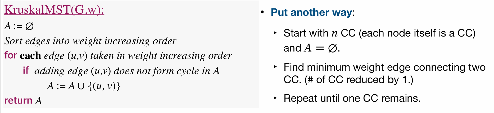
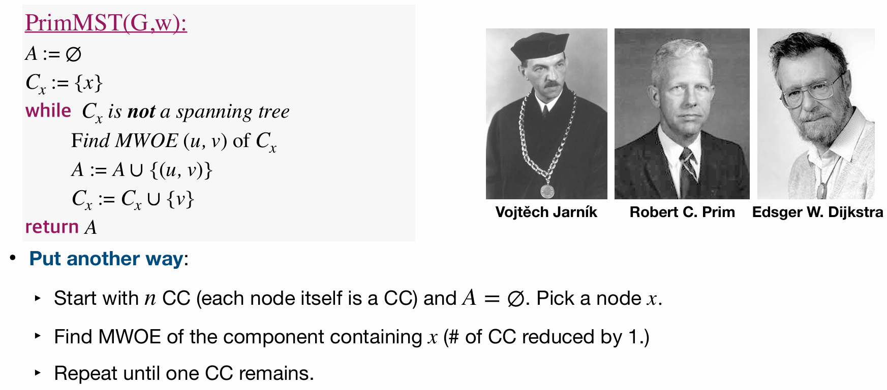

# Lec15: Minimal Spanning Tree

## Minimum Spanning Tree(MST)

Consider a connected, undirected, weighted graph $G = (V, E)$
A **spanning tree** of $G$ is a subgraph that is a tree and connects all the vertices together, and contains a subset of the edges of $G$.
A **minimum spanning tree** is a spanning tree with total weight less than or equal to the weight of every other spanning tree.

## Computing MST

Firstly, we consider a generic method:

- Start with all nodes and an empty set of edges $A$.
- Find some edges(safe edges) that can be added to $A$, maintaining the loop invariant that $A$ is a subset of some MST.
- Repeat until $A$ forms a spanning tree, that is, until it has $|V| - 1$ edges.

### **How to find safe edges?**

Some definitions:

- A **cut** $(S, V-S)$ of a graph is a partition of $V$ into two disjoint subsets $S$ and $V-S$.
- An edge $(u, v)$ **crosses** the cut if one endpoint is in $S$ and the other is in $V-S$.
- A cut **respects** a set of edges $A$ if no edges in $A$ cross the cut.
- A **light edge** is an edge with the **minimum weight** among all edges crossing a cut.

Theorem(Cut Property): Let $A$ be a subset of some MST for $G$, let $(S, V-S)$ be any cut that respects $A$, and let $(u, v)$ be a light edge crossing the cut. Then, edge $(u, v)$ is safe for $A$.

Corollary: Let $A$ be a subset of some MST for $G$, let $G_A = (V, A)$. For any connected component $C$ of $G_A$, its **minimum-weight-outgoing edge** is safe for $A$.

## Kruskal's Algorithm

Strategy for finding safe edge in Kruskal’s algorithm: Find **minimum weight edge** connecting two CCs in $G_A$

So, how to identify an edge forms a circle when adding it to $A$?
Use **Disjoint Set Union(DSU)** data structure to maintain the connected components of $G_A$.

$m$ is the number of edges, $n$ is the number of vertices.
$log^* n$ is the iterated logarithm function, which grows extremely slowly.
So we can see, the time complexity of Kruskal's algorithm is dominated by the sorting step, which is $O(m \log m)$, and as $m\geqq n - 1$, we can also express it as $O(m \log n)$.

## Prim's Algorithm

Strategy for finding safe edge in Prim’s algorithm: Keep finding MWOE in one fixed CC in $G_A$.

How to find MWOE efficiently?
Use a priority queue to maintain each remaining node's distance to the CC right now.

Now we can infer the time complexity of Prim's algorithm is $O(m \log n)$, as each edge may cause at most one decrease-key operation, and each node will cause one extract-min operation.

## Borůvka's Algorithm

- Start with each node as a separate component.
- Find the MWOE for each component, and add all those edges to $A$.
- Repeat until there is only one component.
  Thus it is able to add multiple edges to $A$ in each iteration.
  
  The number of components in G′ can drop by significantly more than a factor of 2 in a single iteration, reducing the number of iterations below the worst-case O(lg n).
  Using DSU to maintain the connected components, we can infer the time complexity of Borůvka's algorithm is also $O(m \log n)$.
