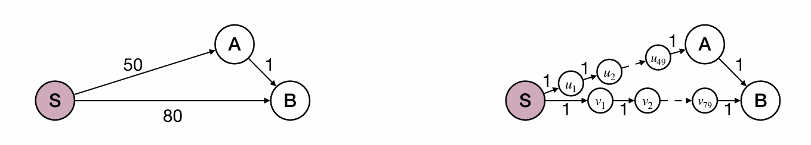
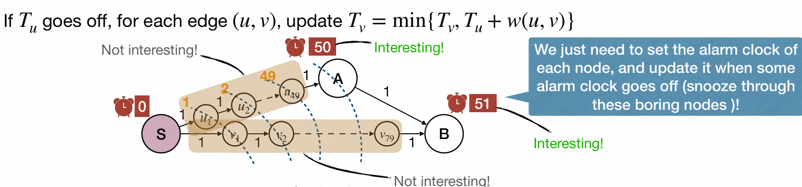
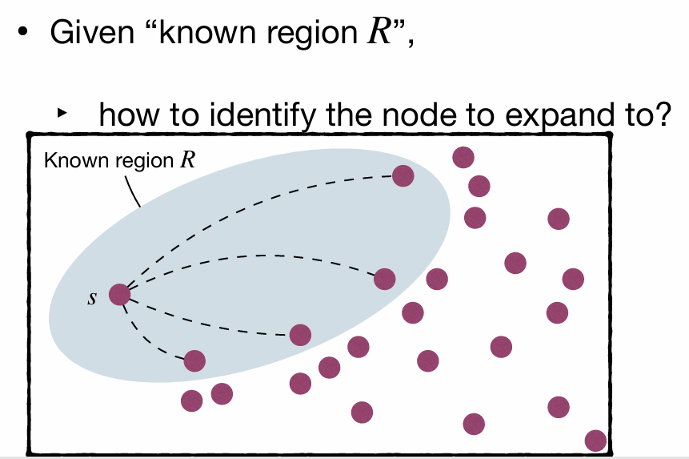
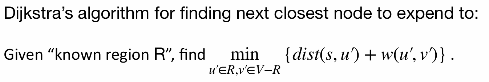
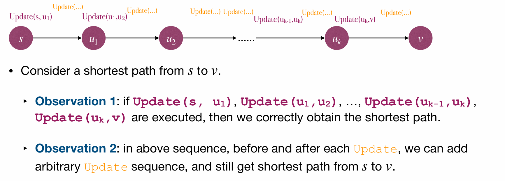
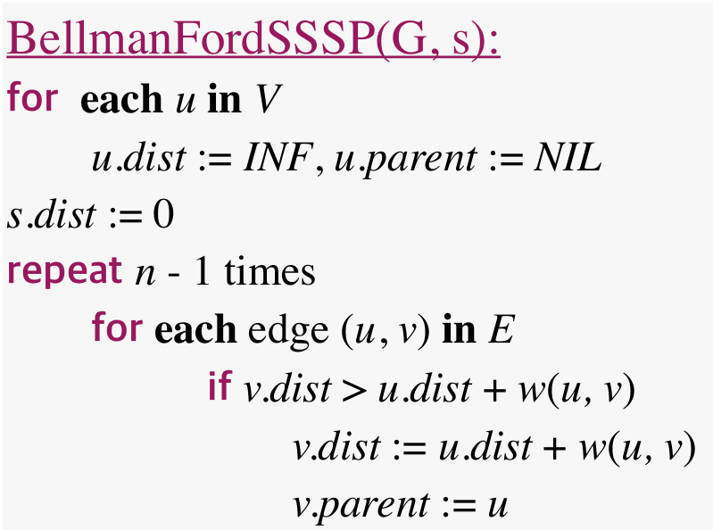
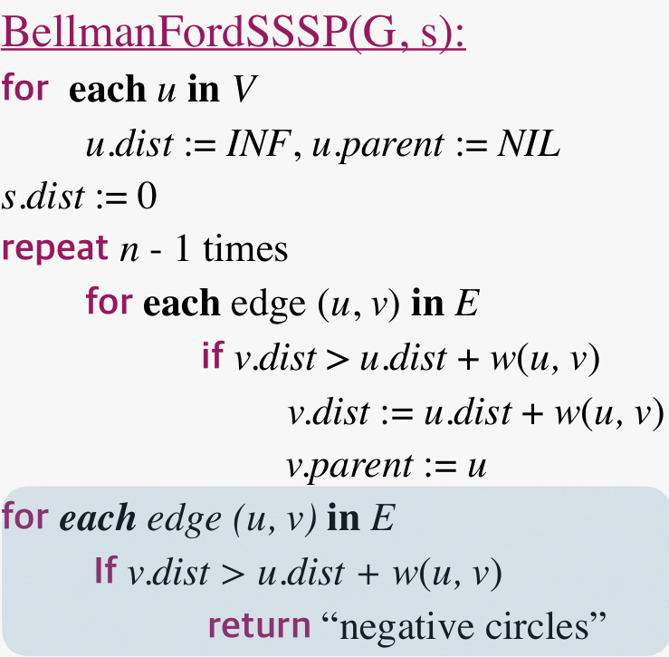

# Lec16: Single-Source Shortest Path
## The Shortest Path Problem
Consider a graph $G=(V,E)$ and a weight function that associates a real-valued weight $w(u,v)$ to each edge $(u, v)$. Given $s$ and $t$ in $V$, what’s the **min weight path** from $s$ to $t$?

Weight are not always lengths. They can represent costs, times, capacities, etc.
The graph can be **directed**, thus $w(u,v)$ is not necessarily equal to $w(v,u)$.
Negative edge weight allowed.
Negative cycle not allowed.

## Single-Source Shortest Path (SSSP)
The SSSP problem: Given a graph $G=(V,E)$ and a weight function $w(u,v)$ for each edge $(u,v)$, given a source node $s$ in $V$, find a shortest path from $s$ to every node $v$ in $V$.

Consider directed graphs without negative cycle.
Case 1: Unit weight
Case 2: Arbitrary positive weight
Case 3: Arbitrary weight without cycle
Case 4: Arbitrary weight

### Case 1: Unit weight
How to solve SSSP in an unit weight graph?
‣ That is, a graph in which each edge is of weight $1$.
"Traverse by layer" in an unweighted graph:
Visit all distance $d$ nodes before visiting any distance $d+1$ nodes, just like BFS.

### Case 2: Arbitrary positive weight
Add dummy nodes on edges so graph becomes unit weight graph.
Run BFS on the resulting graph.

But could be inefficient if weights are large.

#### Alarm Clocks
Thus we use clocks to bypass the dummy nodes.
Imagine we have a clock $T_u$ for each node $u$ in $V$.
$T_u$ is the time when node $u$ is first visited.
And the clock of source node $s$ is $0$.

If $T_u$ goes off, we traverse all edges $(u,v)$ and set $T_v = T_u + w(u,v)$ if $T_v$ is not set or $T_v > T_u + w(u,v)$.

We focus on the valid nodes and we're uninterested in the dummy nodes.
Value of $T_u$ is an estimate of the distance of $s$ to $u$.
At any time $T_u\geq dist(s,u)$, and equality holds if and only if $u$ is visited($T_u$ goes off).

In the image above, we set $T_B$ to be 80 when $s$ goes off, and we update it to be 51 when $A$ goes off.

How to implement the alarm clocks?

#### Dijkstra's Algorithm
Use priority queue to store nodes with their $T_u$ values.
```cpp
Dijkstra(s):
    for u in V:
        T[u] = INF // T is the clock for node u
        P[u] = None // P is the parent array
    T[s] = 0
    Q = priority_queue((T[u], u) for u in V)
    while Q is not empty:
        (dist, u) = Q.extract_min()
        if dist != T[u]:
            continue
        for (u, v) in E: // traverse all edges from u
            if T[v] > T[u] + w(u, v):
                T[v] = T[u] + w(u, v)
                Q.decrease_key((T[v], v)) // update priority queue
                P[v] = u
```
Efficiency of Dijkstra's Algorithm: $O((n+m)logn)$ when using binary heap.

#### Derivation of Dijkstra's Algorithm
What’s BFS doing: **expand outward** from $s$, **growing the region** to which distances and shortest paths are known.
Growth should be orderly: nodes closest to $s$ should be included first.


Shortest path from $s$ to any node $v$ must pass through nodes that are 
closer than $v$($u$ in the case).

### Case 3: Arbitrary weight without negative cycle
Dijkstra's algorithm fails when negative edges exist!
But how dist valus is maintained in Dijkstra's algorithm is still valid.
When processing edge $(u, v)$, execute procedure `Update(u, v)`: 
$v.dist = min{v.dist, u.dist + w(u,v)}$

In this way, For any $v.dist$, at any time,  $v.dist$ is either an overestimate, or correct.
Assume $u$ is the last node on a shortest path from $s$ to $v$. If $u.dist$ is correct and we run  `Update(u, v)`, then $v.dist$ becomes correct.

So we simply apply `Update(u, v)` for all edges $k+1$ times so that we can find the shortest path with at most $k+1$ edges.

Any shortest path cannot contain a cycle, so $k+1$ cannot be larger than $n-1$.

#### Bellman-Ford Algorithm
Update all edges, and repeat above step for $n − 1$ times.
The complexity is: $Θ(n(m+n))$


### Case 4: Arbitrary weight
What if negative cycle exists?
Any shortest path cannot contain a cycle no longer holds.
It means that after $n-1$ repetitions of “Update all edges”, some node $v$ still has $v.dist > u.dist + w(u,v)$ for some $(u,v)$ in $E$.
And Bellman-Ford algorithm can be used to detect negative cycle.

Add the blue part, so that we can detect negative cycle in original graph.

Bellman-Ford still works, but we can be more efficient!
**Core idea** of Bellman-Ford: perform a sequence of Update that includes every shortest path as a subsequence.
Observation: in DAG, every path, thus every shortest path, is a subsequence in the topological order.