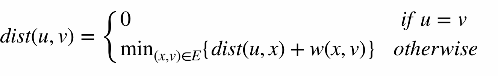
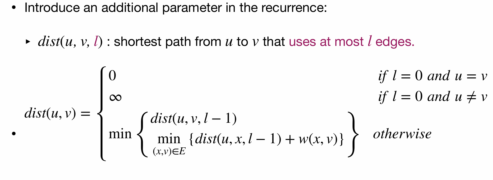
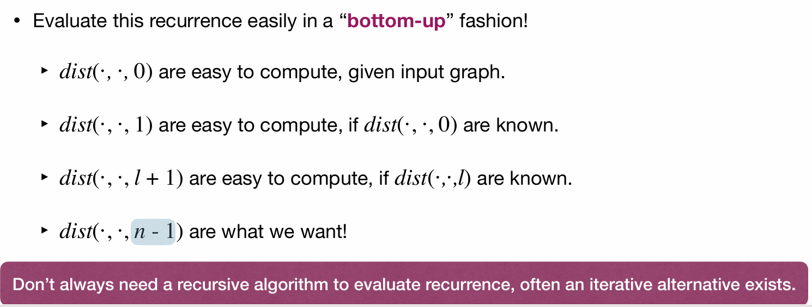
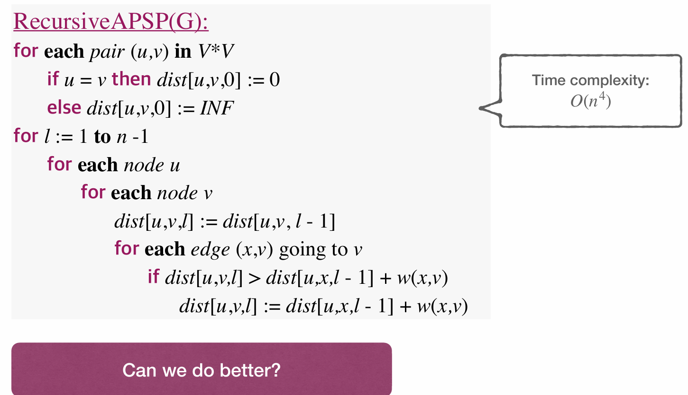
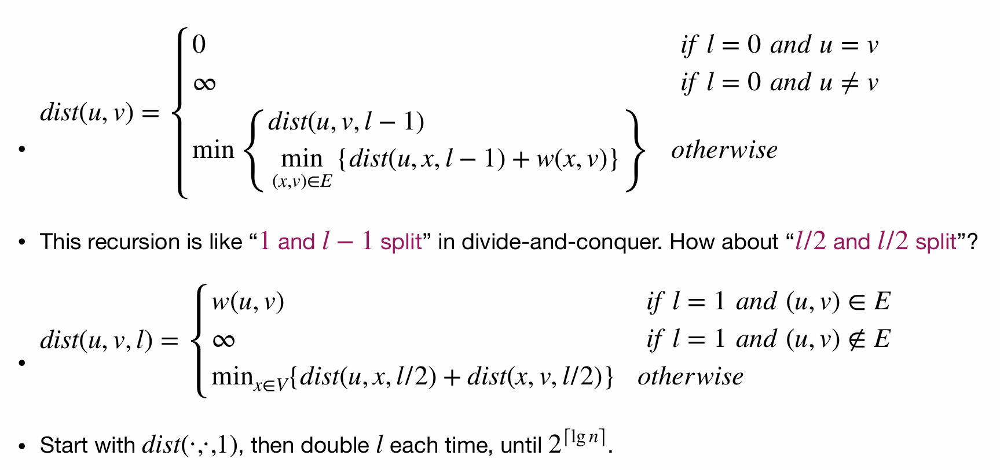
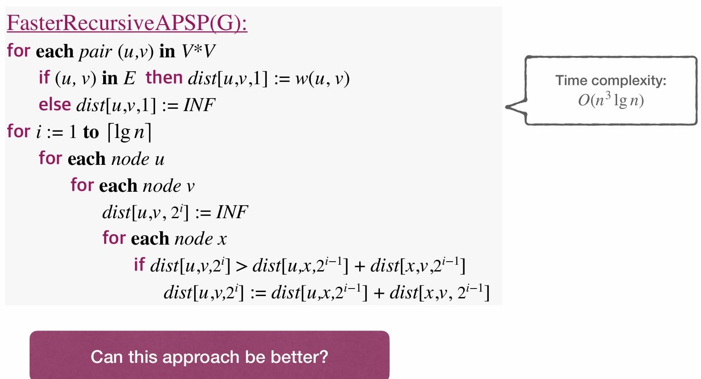
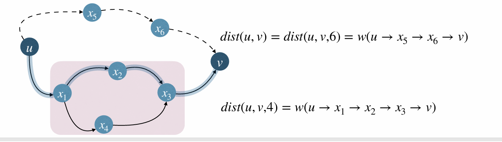
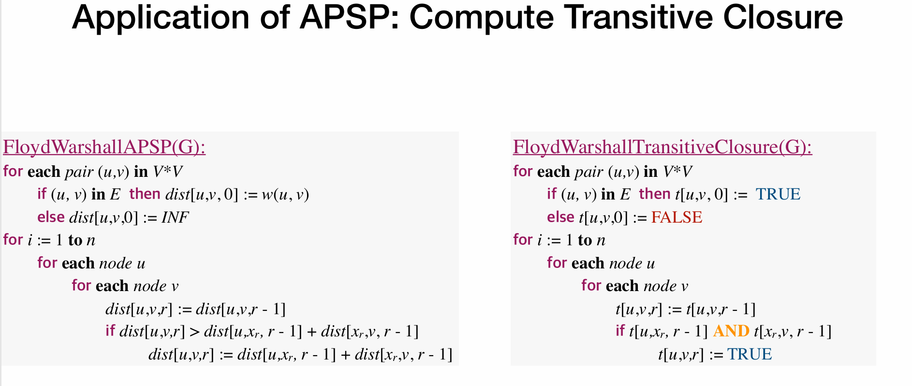

# Lec17: All-Pairs Shortest Path

## All-Pairs Shortest Path(APSP) Problem

Given a graph $G=(V,E)$ with weights $w:E\to\mathbb{R}$. Find the shortest path between all pairs of vertices $(u,v)\in V\times V$.

Straightforward solution for APSP: For each $u\in V$, execute SSSP algorithm once!

In this way, we solve arbitrary graphs with Bellman-Ford algorithm in $O(n^4)$ time.
Can we do better?
Intuition: modify edge weights **without** changing shortest path, so that Dijkstra's algorithm can work.

Let $\hat{w}$ be the new weights, and the new weights need to satisfy the following shortest path property:

So equally, for each edge $(u,v)\in E$, we change the weight by a same amount $h(u)-h(v)$.
$\hat{w}(u,v)=w(u,v)+h(u)-h(v)$
Imagine $h(u)$ as an **entry bonus** and $h(v)$ as an **exit tax** for traveling from $u$ to $v$.
We can prove the new weights $\hat{w}$ got in this way preserve shortest paths.

And further, if we want Dijkstra's algorithm to work, we need $\hat{w}(u,v)\ge 0$ for all $(u,v)\in E$.
Let $h(u)$ be the shortest path distance from $z$ to $u$, where $z$ is a fixed vertex.
In this way we can sure that $\hat{w}(u,v)\ge 0$ for all $(u,v)\in E$.

Potential problem: might unable to find $z$ reaching all vertices.
So we add node $z$ to $G$, and connect $z$ to every other node with edge weight 0(super-source).

And so we get Johnson's algorithm!

Johnson's algorithm combines Dijkstra and Bellman-Ford, resulting a runtime of $O(n^3\log n)$, for arbitrary weight graphs.

## Floyd-Warshall Algorithm

By recursion we can get this, but a cycle in the recursion will cause infinite loop.

Gradually we loose the limit of edges $l$ and add edges to get minimum distance.

Further improve this:
Previous algorithms recurse on number of edges the shortest paths use.
This time we recurse on the set of **allowed intermediate vertices**.
Number the vertices arbitrarily from 1 to n.
And we define $V_r=\{x_1,x_2,\dots,x_r\}$, representing the first $r$ vertices of $V=\{x_1,x_2,\dots,x_n\}$.
Define $dist(u,v,r)$ be the length of shortest path from $u$ to $v$, s.t. only nodes in $V_r$ are **intermediate nodes** in paths.
Let $\pi(u,v,r)$ be such a shortest path.

In this case, if $r=4$, we get $\pi(u,v,4)$ is $u\rightarrow x_1\rightarrow x_2\rightarrow x_3\rightarrow v$.
If $r=6$, we get $\pi(u,v,6)$ is $u\rightarrow x_5\rightarrow x_6\rightarrow v$.

In fact we can infer that $\pi(u,v,r)$ either:

- goes through $x_r$
- does not go through $x_r$
  For the latter case, $\pi(u,v,r)=\pi(u,v,r-1)$, i.e. the shortest path does not use $x_r$ as intermediate node.
  For the former case, $\pi(u,v,r)$ can be decomposed into two parts: $\pi(u,x_r,r)$ and $\pi(x_r,v,r)$.

$$
\pi(u,v,r)=\pi(u,x_r,r) + \pi(x_r,v,r) = \pi(u,x_r,r-1) + \pi(x_r,v,r-1)\text{ (since $x_r$ cannot be intermediate node in these two paths)}
$$

Thus we get Floyd-Warshall recurrence:

## Transitive Closure of a Directed Graph

Given a directed graph $G=(V,E)$, the transitive closure of $G$ is a graph $G^*=(V,E^*)$ such that for any pair of vertices $(u,v)$, there is an edge $(u,v)\in E^*$ if and only if there is a path from $u$ to $v$ in $G$.

To get the transitive closure of $G$, we can use Floyd-Warshall algorithm.
Assign weight 1 to each edge in $G$.
Then run Floyd-Warshall algorithm on $G$.

Or alternative way is to use boolean values instead of distances.

