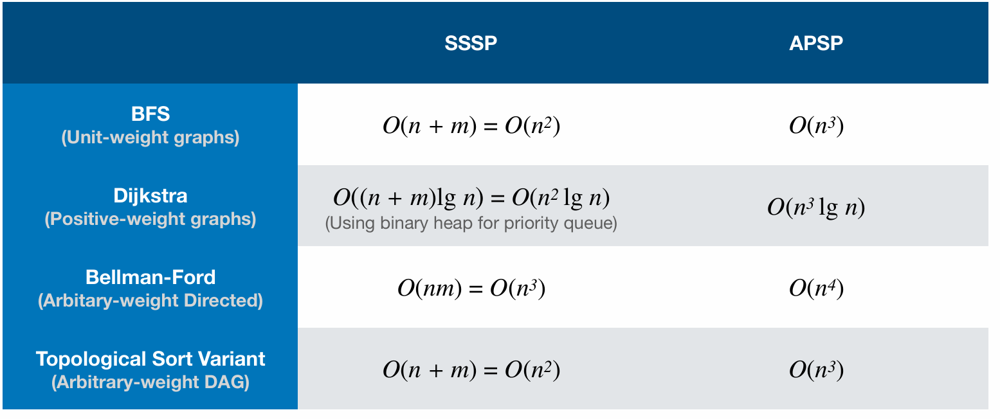
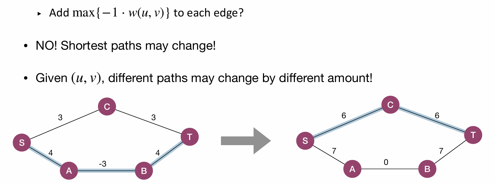
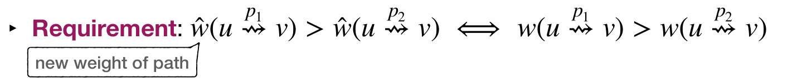
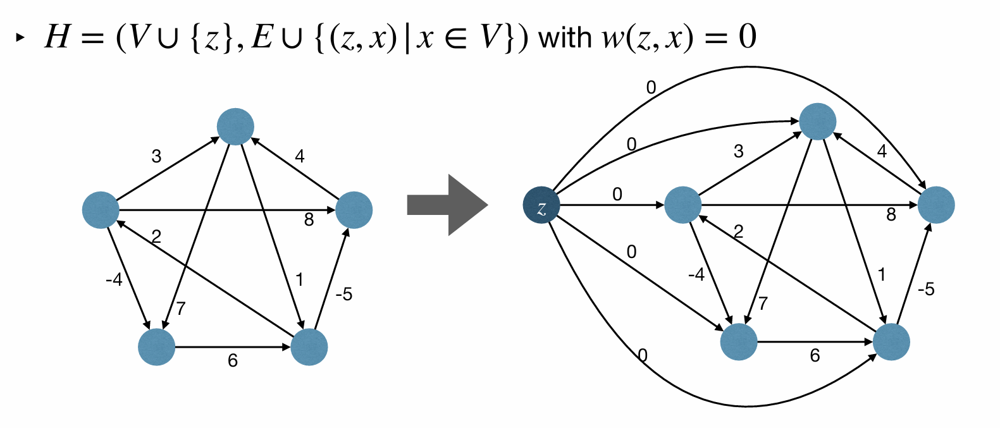
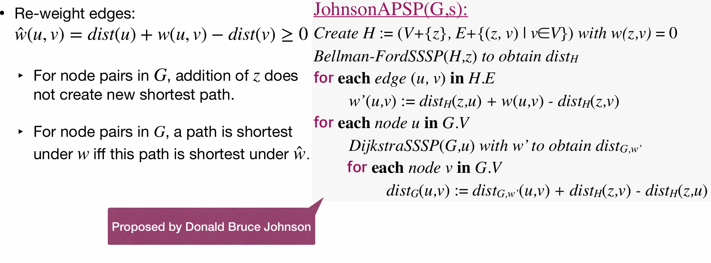
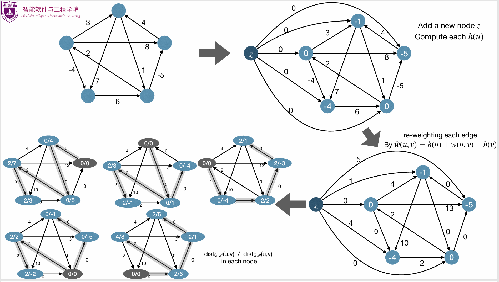

# Lec17: All-Pairs Shortest Path
## All-Pairs Shortest Path(APSP) Problem
Given a graph $G=(V,E)$ with weights $w:E\to\mathbb{R}$. Find the shortest path between all pairs of vertices $(u,v)\in V\times V$.

Straightforward solution for APSP: For each $u\in V$, execute SSSP algorithm once!

In this way, we solve arbitrary graphs with Bellman-Ford algorithm in $O(n^4)$ time.
Can we do better?
Intuition: modify edge weights **without** changing shortest path, so that Dijkstra's algorithm can work.

Let $\hat{w}$ be the new weights, and the new weights need to satisfy the following shortest path property:

So equally, for each edge $(u,v)\in E$, we change the weight by a same amount $h(u)-h(v)$.
$\hat{w}(u,v)=w(u,v)+h(u)-h(v)$
Imagine $h(u)$ as an **entry bonus** and $h(v)$ as an **exit tax** for traveling from $u$ to $v$.
We can prove the new weights $\hat{w}$ got in this way preserve shortest paths.

And further, if we want Dijkstra's algorithm to work, we need $\hat{w}(u,v)\ge 0$ for all $(u,v)\in E$.
Let $h(u)$ be the shortest path distance from $z$ to $u$, where $z$ is a fixed vertex.
In this way we can sure that $\hat{w}(u,v)\ge 0$ for all $(u,v)\in E$.

Potential problem: might unable to find $z$ reaching all vertices.
So we add node $z$ to $G$, and connect $z$ to every other node with edge weight 0(super-source).

And so we get Johnson's algorithm!

Johnson’s algorithm combines Dijkstra and Bellman-Ford, resulting a runtime of $O(n^3\log n)$, for arbitrary weight graphs.

## Floyd-Warshall Algorithm
