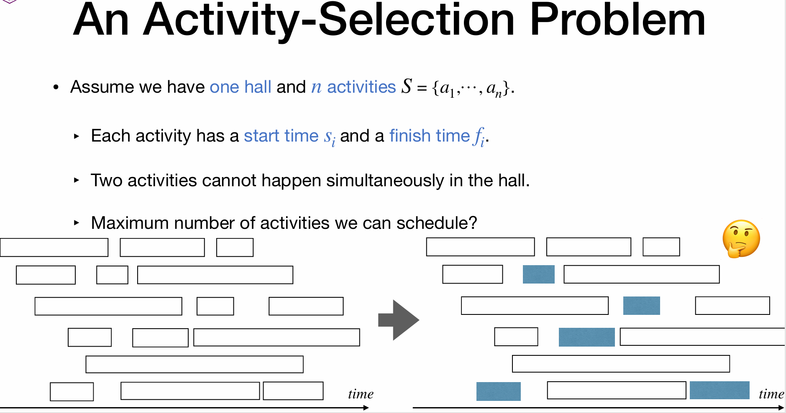
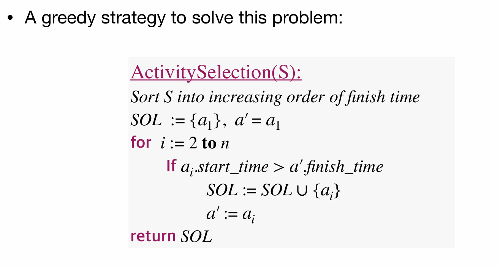

# Lec18: Greedy Strategy
## The Greedy Strategy
Given a problem, build up a solution **piece by piece**, always choosing the next piece that offers the **most obvious and immediate benefit**.
‣ Sometimes it gives optimal solution.
‣ Sometimes it gives near-optimal solution.
‣ Or, it simply fails...

For this Activity Selection Problem, the greedy strategy works perfectly.

We can start with **divide and conquer** approach.
Define $S_i$ as the set of activities that start **after incident $a_i$**.
Define $F_i$ as the set of activities that finish **before incident $a_i$**.
And so, the optimal solution can be defined as:
$$
OPT(S) =max_{1\leq i \leq n} \{OPT(F_i) + 1 + OPT(S_i)\}
$$
That is, for every chosen activity $a_i$, we can find the optimal solution by adding 1 (for $a_i$) to the optimal solutions of the two subproblems $F_i$ and $S_i$.

Observation: In any optimal solution, we can always replace the first activity with the one that finishes first.
Therefore, we can always choose the activity that finishes first as the first activity.
The activity that finishes first should finish as early as possible
That is a kind of greedy choice.

## Elements of the Greedy Strategy
If an (optimization) problem has following two properties, then the greedy 
strategy usually works for it:
- Optimal substructure.
- Greedy property.

### Optimal Substructure
A problem exhibits optimal substructure if an optimal solution to the problem contains within it optimal solution(s) to subproblem(s): 
