# Lec2: Basics of Algorithm Analysis

## Algorithm Evaluation

There're many algorithms to solve a problem, which is better?
Implementation(language, compiler, hardware) and environment matters.
In most cases, C is faster than most other languages.

## Model of Computation: Turing Machine

This is independent of previous factors.

1. There's a tape with infinite cells, each cell can store a symbol.
2. There's a head, which can read and write symbols on the tape.
3. There's a program, which is a finite set of instructions.
4. The program is executed by the head, and the head moves on the tape.
5. The head can move left or right or halt, and can read or write symbols.
6. The program can be stopped by a special symbol.

Disadvantages of Turing Machine

1. It's too slow.
2. It's too complex.

Running time: Number of steps.
Memory: Number of tape cells utilized.

## Random Access Machine (RAM)

One processor which executes instructions one by one.
There is one memory, whose cells support random access, each of limited size

Running time: Number of primitive operations.
Memory: Number of memory cells utilized.

## Correctness of Algorithm

Specification:

- Precondition(initial condition): specifies what is correct input data.
- Postcondition(final condition): specifies what is desired result.

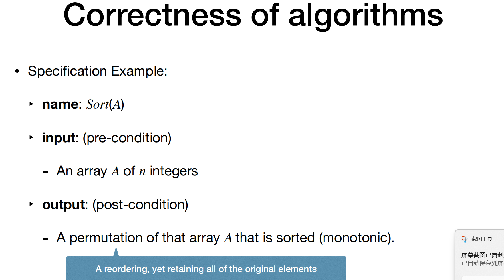

### Total correctness

An algorithm is called totally correct for the given specification if and only if for any correct input data it either:

1. halts.
2. or returns the desired output.

Usually, while checking the correctness of an algorithm it is easier to separately:

- Check whether the algorithm stops
- Then check the remaining part — This remaining part of correctness is called “Partial Correctness” of algorithm

### Partial correctness

An algorithm is partially correct if satisfies the following condition:
If the algorithm receiving correct input data stops and outputing the desired result, then it is partially correct.
If doesn't stop, for any case it is partial correct.
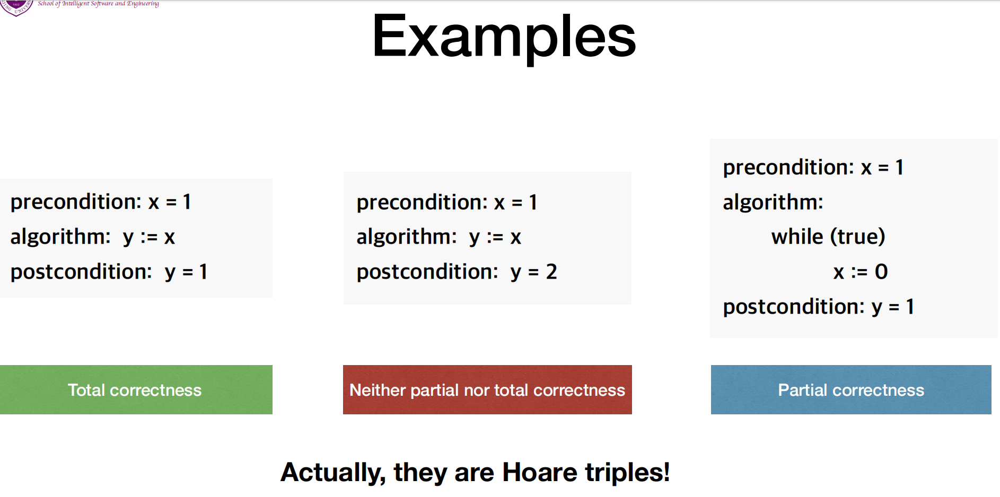

If the client inputs incorrect data, it might be an undefined behavior.

### Proof of Total Correctness

A proof of total correctness of an algorithm usually assumes 2 steps:
1.(to prove that) the algorithm always terminate for correct input data
2.(to prove that) the algorithm is partial correct

proof methods:
Variants for "termination"
Invariants for "partial correctness"

### Example: Insertion Sort

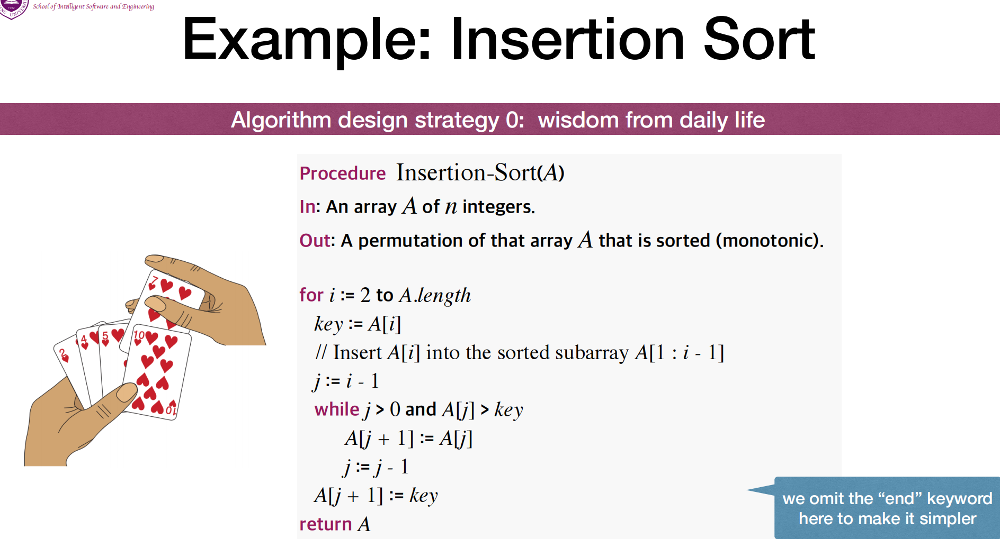

### Proof the Correctness of Insertion Sort

Step1: The algorithm outputs correct result on every instance(partially correct).
Step2: The algorithm terminates within finite steps on every instance(termination)

#### Proof of Step1

Using loop invariant for partial correctness:

- **Initialization**: It is true prior to the first iteration of the loop.
- **Maintenance**: If it is true before an iteration of the loop, it remains true before the next iteration.
- **Termination**: When the loop terminates, the invariant gives us a useful property that helps show that the algorithm is correct.

Compare the loop invariant to **mathematical induction**.

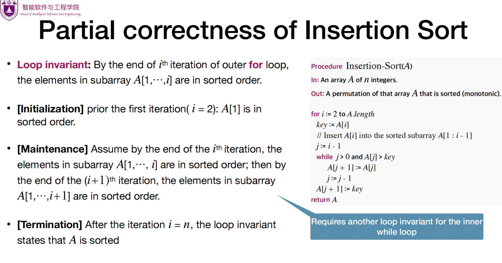
This is the first loop invariant.
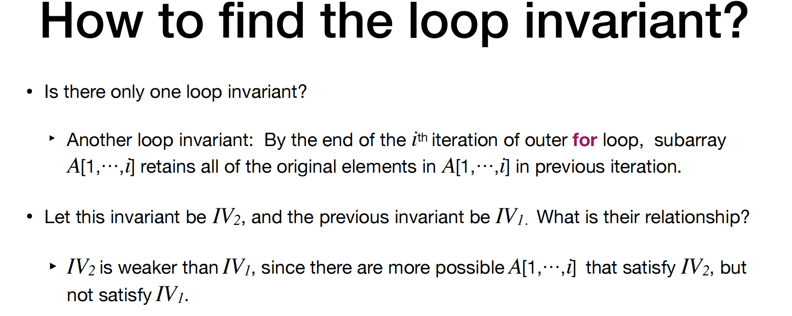
And this is a second one, we can compare if it is **weaker**.
A good (strong) loop invariant must satisfy these three properties [Initialization], [Maintenance] and [Termination]. Note that IV2 does not satisfy [Termination] property, because it does not guarantee the array to be sorted when termination met.

#### Proof of Step2

Using loop variant to prove termination.
There is no general algorithm exists that solves the halting problem for all possible programs.

Using loop variant to prove the termination:

- Show that some quantity strictly decreases.
- It cannot decrease infinitely (Bounded!), so it must terminate.

Termination of insertion sort:
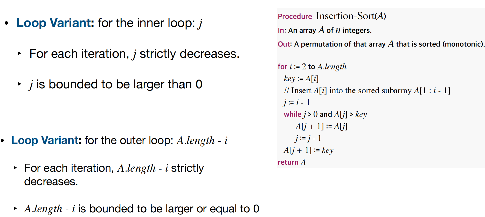

## Efficiency of Algorithms

### Complexity

**Time complexity**: how much **time** is needed before halting
**Space complexity**: how much **memory** (usually excluding input) is required for successful execution.

#### Time Complexity

Cost of an algorithm should be a function of input size $n$, say, $T(n)$
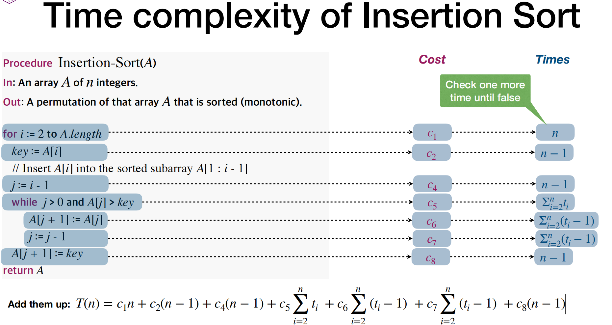
Now that $t_{i}$ is an unknown number related to input instances, we consider worst, best and average cases.
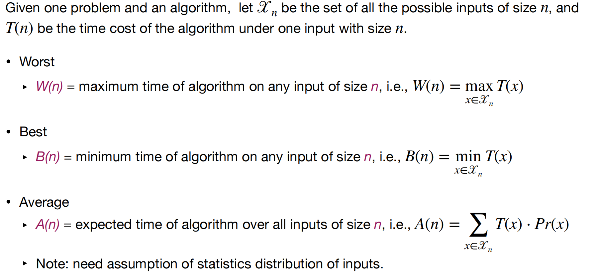
Mainly we focus on worst case.
Back to the example of insertion sort, in the best case $t_{i}$ would be 1, and in worst case $t_{i}$ would be i.

How about average case?
Hint: number of swaps equals to number of inversions(if i < j and a[i] > a[j], this pair can be viewed as an inversion).
For average cases, we calculate probability $pr(i < j | a[i] > a[j])$, and is 1/2.
Then number of swaps equals to $\sum_{i<j} pr(i < j | a[i] > a[j]) = \frac{n^{2}}{4}$.

#### Space Complexity

We only need three additional memory cells to store the variable `key`, `i`, and `j`.
So space complexity is $O(1)$.

## Asymptotic Order of Growth

In practice, we usually don't care about the unimportant details in the counted operations.
`order of growth` is what really interests us, a higher-level abstraction.

### Big $\Omicron$ Notation

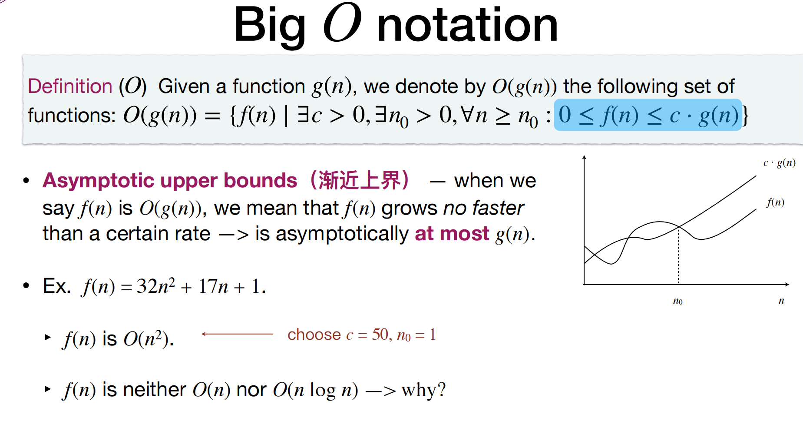

### Big $\Omega$ Notation

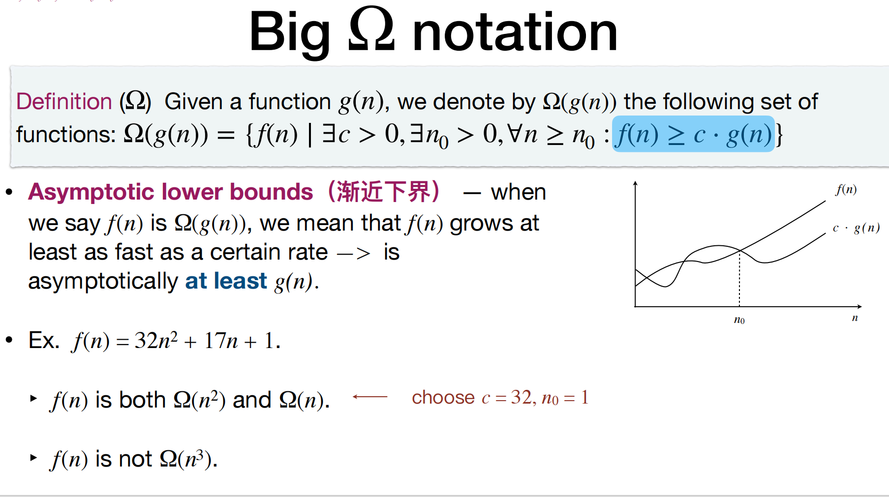

### Big $\Theta$ Notation

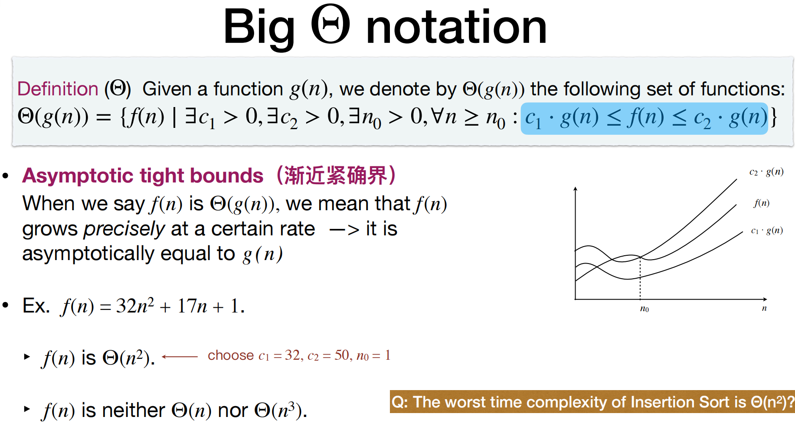

### Small $\omicron$ and $\omega$ Notation

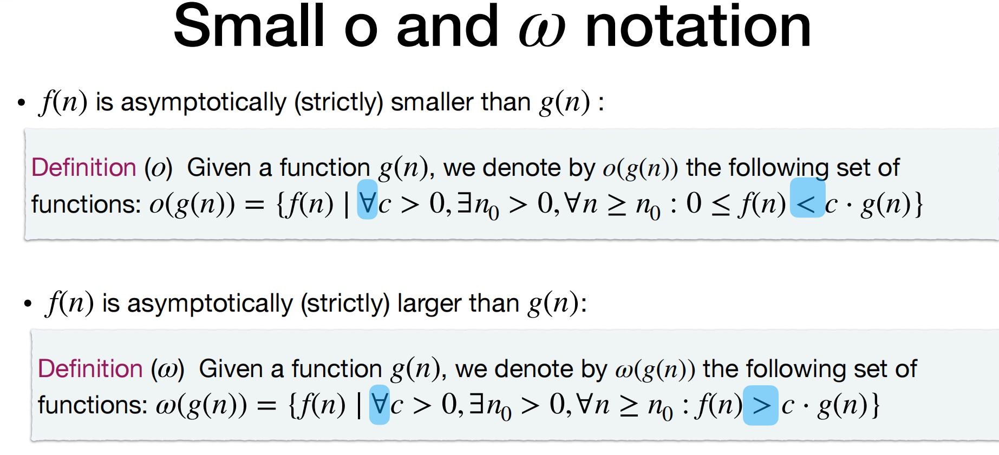

### Asymptotic Bounds and Limits

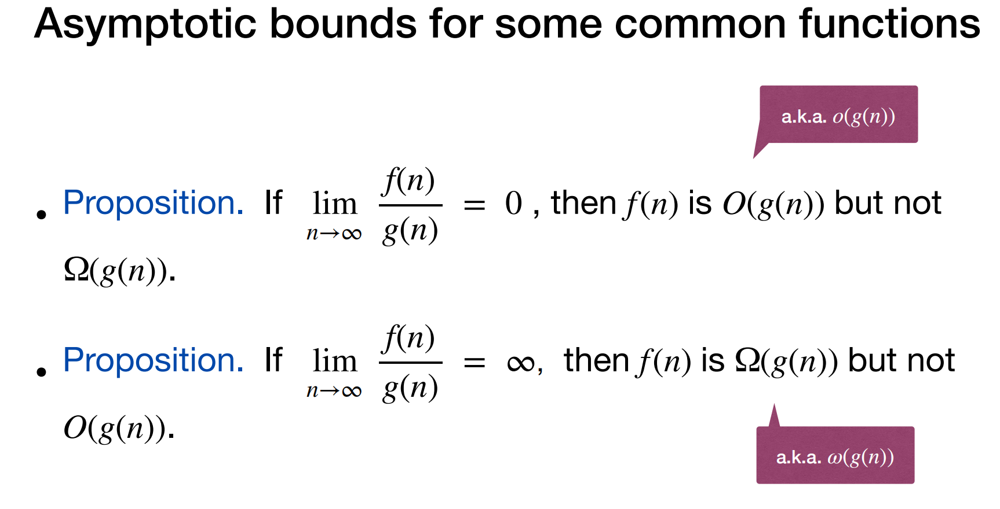
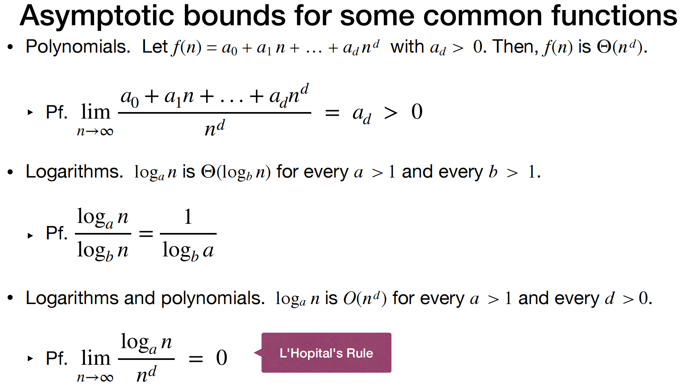
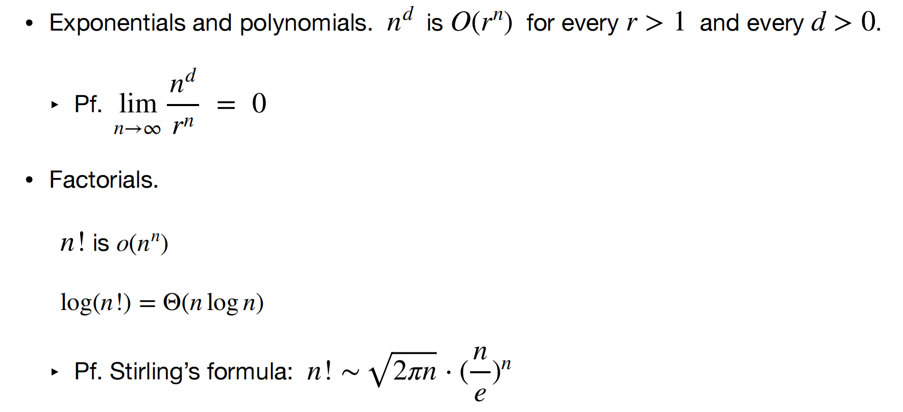
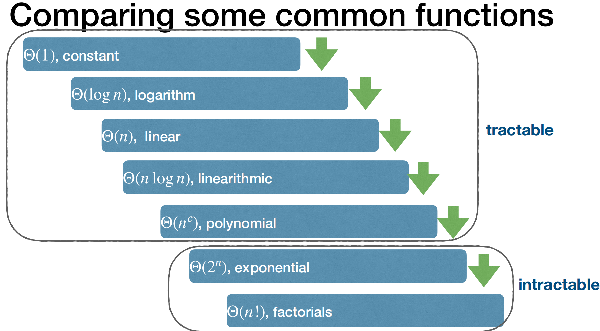
