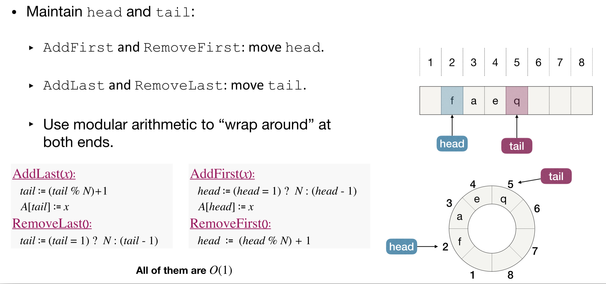
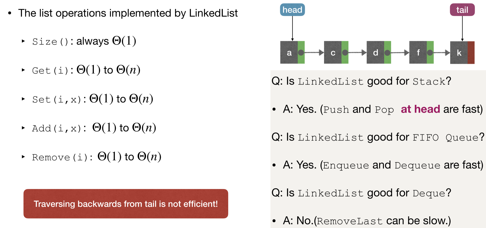
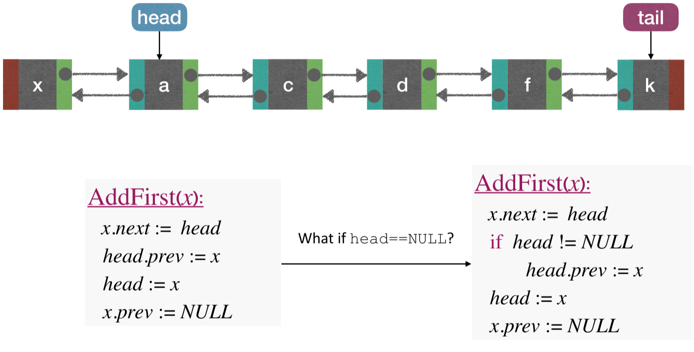
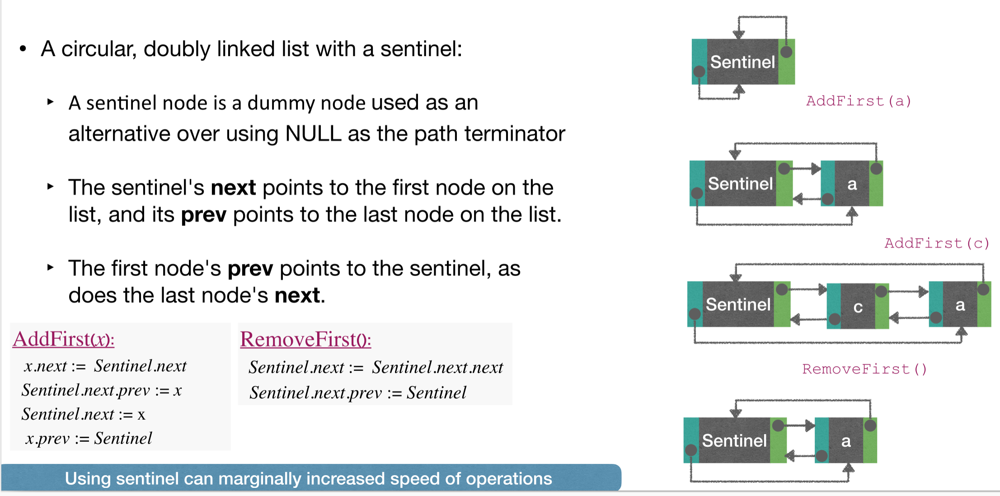
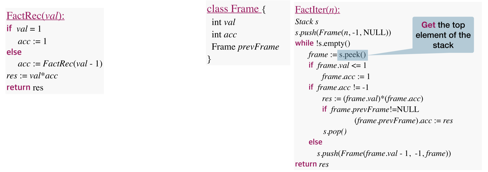

# Lec3: Basic Data Structures
## Data Structure
A data structure is a way to store and organize data in order to facilitate access and modications.

## Abstract Data Type(ADT)
A data structure usually provides an interface, also called an ADT
An ADT speci es what a data structure "can do" and "should do", but not how to do them.
**Example:**
ADT: `List`, supports `get`, `set`, `remove`, `add` ...
Data Structure: `Linked List`, `Array List` ...
A data structure is a specific implementation of ADT
An ADT is a **logical description**, and a data structure is a **concrete implementation**.

### The Quene ADT
**Quene** ADT represents a collection of items in which we could `add` and `remove` them

#### FIFO Quene
The first-in-first-out Quene, items are removed in the same order as they're added.
- Add(x) or Enqueue(x): add x to the end of the queue
- Remove() or Dequeue(): remove the first item from the queue

#### LIFO Quene: Stack
The most recently adder item is the next to be removed.
- Add(x) or Push(x): add x to the top of the stack
- Remove() or Pop(): remove the item a the top of the stack

### The Deque ADT
Deque(Double-Ended Quene), represents a sequence of items with a front and a back, supporting:
- AddFirst(x): add x to the front of the queue
- AddLast(x): add x to the back of the queue.
- RemoveFirst(): remove the first item y from queue, return y.
- RemoveLast(): remove the last item y from queue, return y.

A Deque is a generalization of FIFO and LIFO Quene, and can implement both of them.

### The List ADT
A List is a sequence of items and keeping track on their index, supporting:
- Size(): return n, the length of the list
- Get(i): return xi
- Set(i,x): set xi = x
- Add(i,x): set xj+1 = xj for n ≥ j ≥ i, set xi = x, increase list size by 1
- Remove(i): set xj = xj+1 for n − 1 ≥ j ≥ i, decrease list size by 1

List can implement Deque.

#### Using Array to Implement List - Arraylist
- Size(): always $\Theta(1)$
- Get(i): always $\Theta(1)$ arrays are stored consecutively, so it is fast to find item with given index
- Set(i, x): always $\Theta(1)$
- Add(i, x): $\Theta(1)$ to $\Theta(n)$
- Remove(i): $\Theta(1)$ to $\Theta(n)$

Queries and updates are fast, while modifications are fast at end, slow at front or middle.
So Arraylist is fast for Stack, slow for FIFO Quene.

#### Using Circular Array to Implement Deque - ArrayDeque
Another way to implement Deque: Use two pointers, to form a circular array. When we removeFirst, head pointer gets from 1 to 2. When addLast, tail pointer gets to the end, and if there is space at front, use mod operation to get tail at the front.

ArrayDeque is not good enough for a list, especially in the middle.

##### When the array is full?
Resizing arrays:
- Create a new array of greater size, and copy the elements of the original array into it.
- Abandon the old one and use the new one in place.
How large space should we request?
Suppose we have array with initial capacity being 1, the insert N items into it.
- Resize it to have 1 additional cell every time -> requiring 1 + 2 + ... + N-1 ~ $N^2$ copy operations.
- Resize it by doubling its size every time:
For simplicity, let $N=2^k$ for some constant k -> requiring 1 + 2 + ... + $2^{k} - 1$ ~ N operations.
Of course we could multiply the size by a larger value, but there would be more unused cells on average.

##### Amortized Analysis
Starting from an empty data structure, average running time per operation over a worst-case sequence of operations.
Thus, if resizing by one more cell each time, the amortized complexity is $\Theta(n)$ for each operation.
If resizing by doubling space each time, the amortized complexity is $\Theta(1)$ for each operation

##### When to Shrink Array?
When pop() each time, we shrink the array by 1 less cell?
When the array is half-full, we shrink the array to the halve size? -Causing **Thrashing** problem
Since, if now we add just one element, we need to resize the array by doubling the size, and then pop one element, we should shrink it back to the halve size
When pushes and pops come with relatively equal frequency, it will be too expensive!
Usually, when the array is 1/4 full, we shrink it to the halve size.

#### Using Linked Lists to Implement List - LinkedList

When we `push` and `pop` we don't operate on `tail` because it's hard to find a new item `tail` should point to, cuz we don't have `prev` pointer.
When we implement FIFO Quene, we can add at tail and remove at head, so it is fast.
Now that it is hard to remove at tail, LinkedList is not good for Deque.
So if we use a Doubly-Linked List it would solve the problem where it is difficult to remove at tail.

#### Using Doubly-Linked List to Implement List — DLinkedList
DLinkedList is good for Stack, FIFO Queue, and Deque; but can be slow for some List operations.

But if statements can slow the execution, so we use a Sentinel node to solve null problem.

## Applications of Basic Data Structures
### Application of FIFO Quene
Execute processes. The schedule of executing depends on their arrive time.

### Application of Stack
- Balancing symbols, like matching parentheses.
- Function Calls, especially recursion.

### Eliminating Recursion
With the help of stack, recurtion can be replaced by an iteration.

Suppose we're now in a frame with val=k, acc represents fact(k-1).

As we don't know what is fact(n-1), we set acc as -1 to represent unknown.
And if acc is -1 that means we don't know, so we push another frame until we get to the base case.
And now we get base case and get a res, so we set acc now to be res, and pop the frame.

### Tail Recursion
