# Lec4: Divide and Conquer
## The Divide-and-Conquer Approach
- Divide the given problem into a number of **subproblems** that are smaller instances of the same problem.
- Conquer the subproblems by solving them **recursively**.
- Use brute-force to solve one subproblem if it is small enough.
- Combine the solutions of subproblems to obtain the solution for the original one.

Use (strong) mathematical induction to prove the correctness of the approach.

## Merge Sort
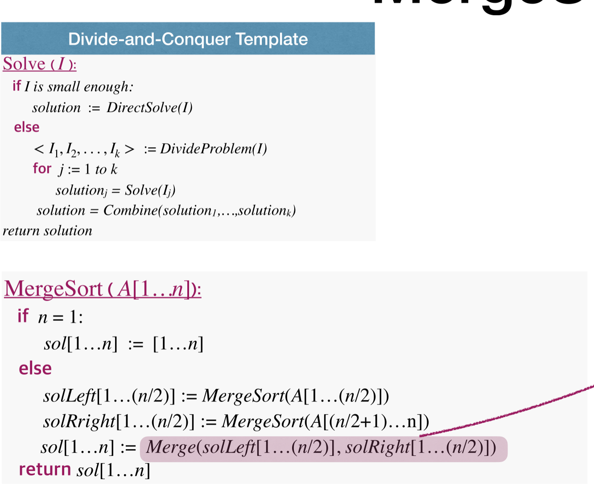
How to merge?
Use two indices, Aindex and Bindex, put the one smaller into the result array, and move the index forward(only the chosen one).
When one index meets the end, copy the rest of the another array into the result and finished.
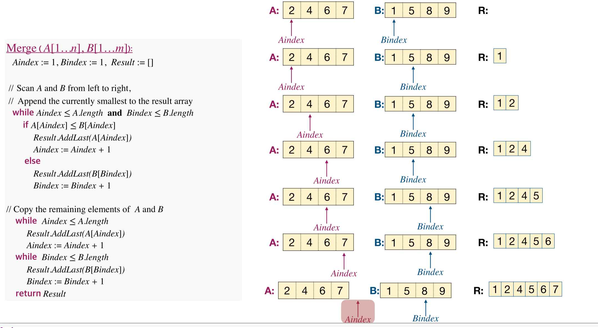
Divide the original array and recursively sort, when meet base case then return and merge.

### Time Complexity of Merge Sort
For subroutine `Merge`: 
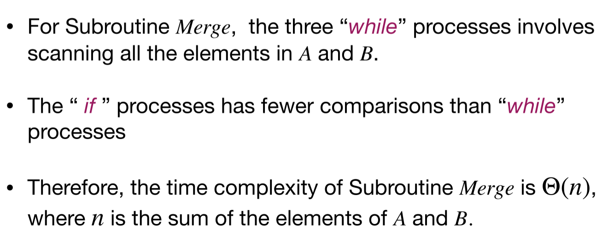

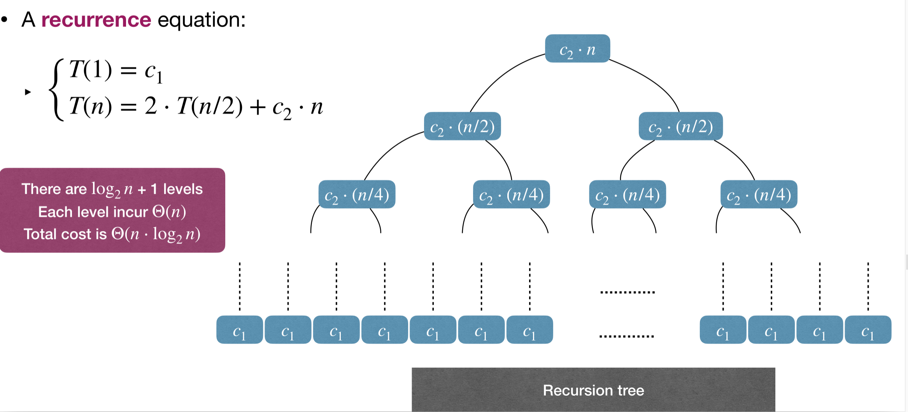
Use iteration to implement merge sort
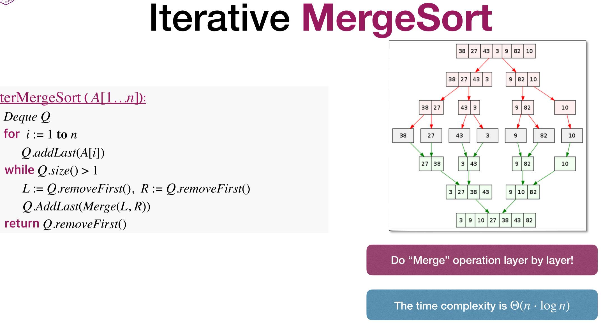

## Matrix Multiplication
Suppose we wanna multiply two $n\times n$ matrices $X$ and $Y$
The straightforward method takes $\Theta(n^3)$, so we do it block-wise.
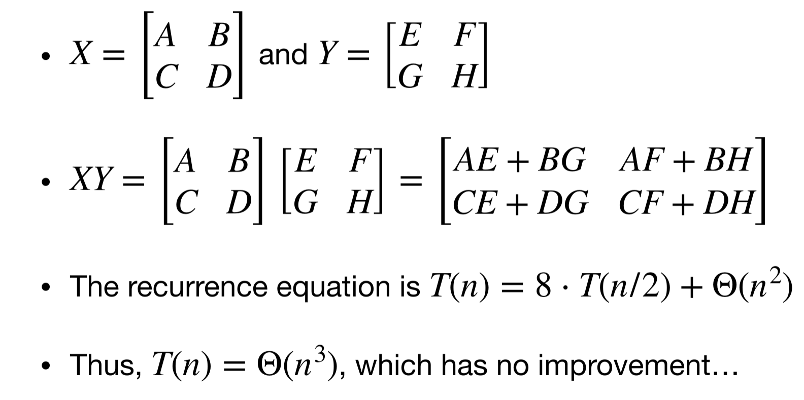
Solve 8 submultiplication with size n/2, and merge them together, whose time needs $\Theta(n^2)$

### Strassen's Algorithm for Matrix Multiplication
We don't need to know AE and BG separately, we just need their sum.
But how can we get AE+BG without knowing AE and BG?
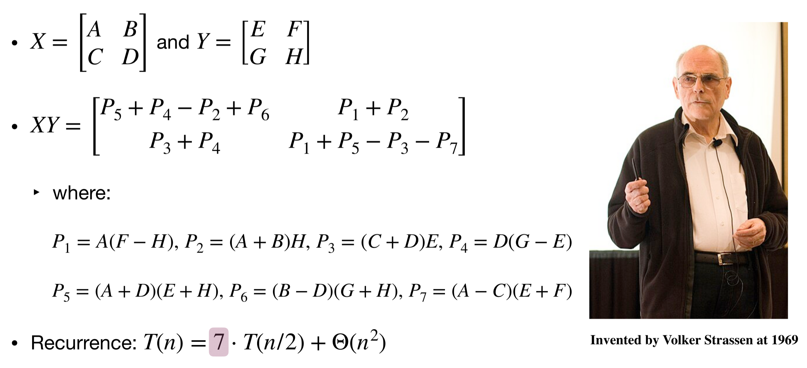

`Substitution method` to get time complexity: (aka guess and verify)
- Guess the form of the solution
- Use induction to find proper constants and prove the solution works
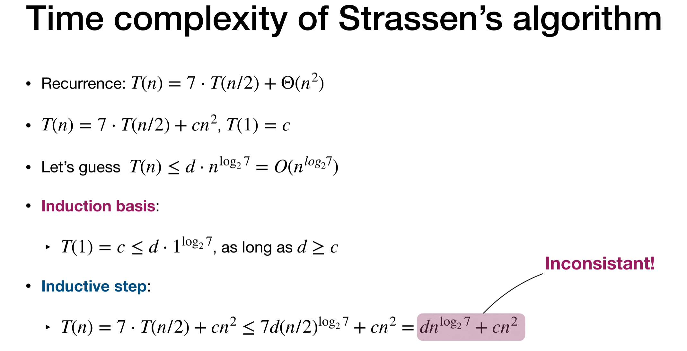
This contradicts our assumption, so it can't prove our guess.
While looking at the result we find an additional $cn^2$, so next we try to **subtract** to see whether we can prove.
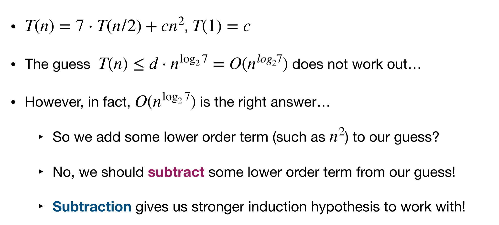
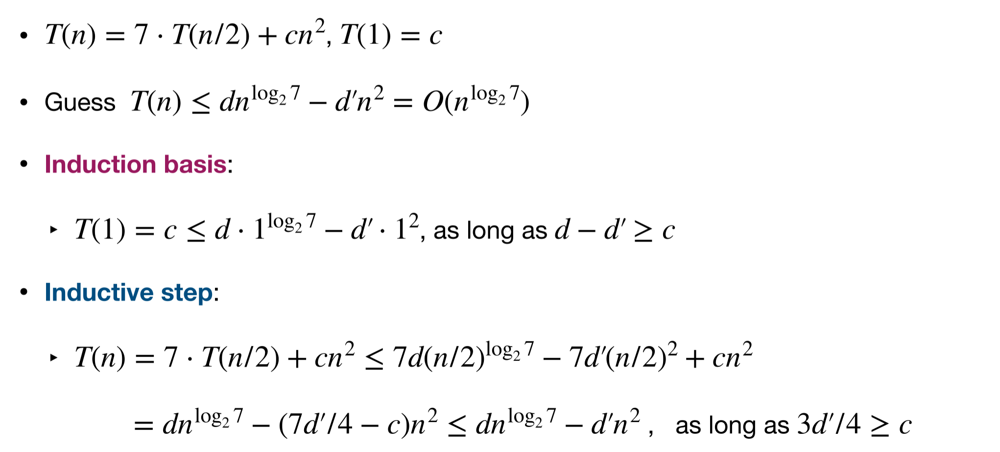
Now we can prove the time complexity of Strassen's algorithm is $O(n^{log_27})$
There is no general way to correctly guess the **tightest** asymptotic solution to an arbitrary recurrence.
**Making a good guess** takes experience and, occasionally, creativity.

Using Strassen's Algorithm, as we divide it into 7 subproblems, many **dependencies** and **recursions** are needed, not very able to calculate simultaneously, thus only when the matrix is big enough Strassen would outperform.

## The Recursion-Tree Method
A recursion tree is a rooted tree with one node for each **recursive subproblem**.
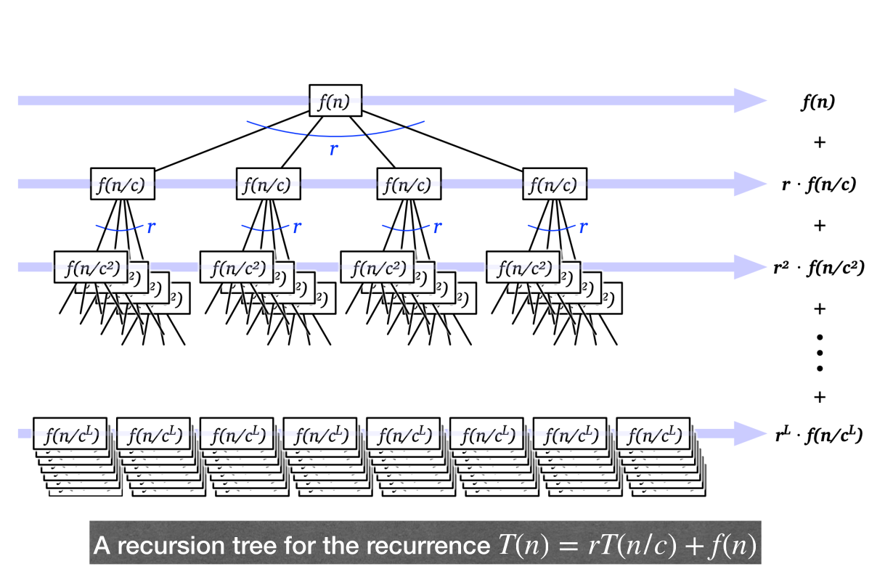
$f(n)$ can be viewed as the time needed to merge the answers of the subproblems together.

The value of each node is the time spent on that subproblem **excluding** recursive calls.

When a subproblem is small enough that we can violently solve it, we needn't divide more times to save divide and merge time.
In theory we set when we meet f(1), we stop creating branches and f(1) as a leaf, so total number of levels can be decided. In practical situations, we might not always get deep until f(1), but a specific constant $n_0$ when we can solve the small enough subproblem violently.
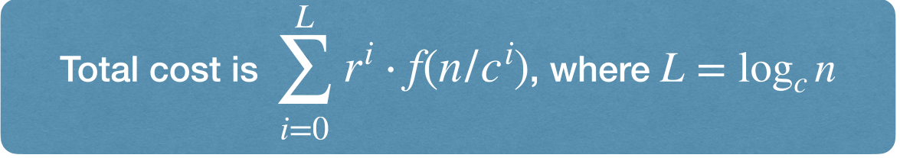

### What if the subproblems are of different sizes?
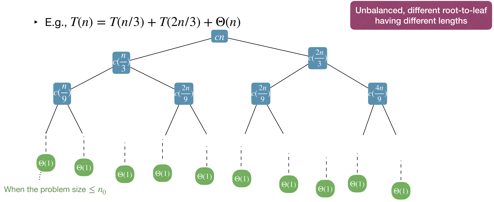
In this case $\Theta(n)$ is $f(n)$, so c as a random number, cn represents $\Theta(n)$
The number of levels(tree height), as the tree is unbalanced, is different from a balanced tree.
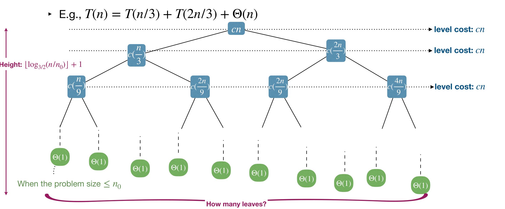
The cost of all internal nodes is:$O(nlgn)$(level cost:cn, times height)
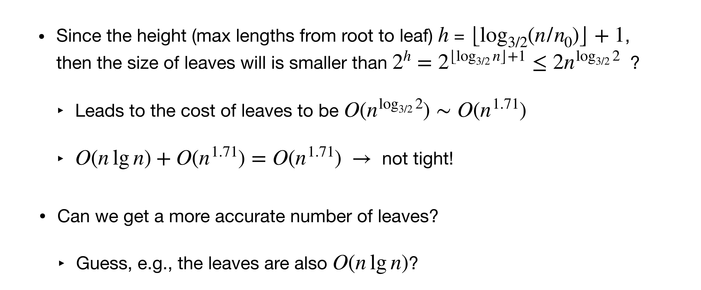
$T(n)$ to be a addition of time of internal nodes and time of leaves.
leave calculation $O(1)$, so need to get number of leaves.

The answer $O(n^{1.71})$ is not so accurate, as we might not have so many leaves.
Use `guess and verify`, we guess the time to be $O(nlgn)$

Why we hypothesize $L(n)\leq d\times nlg(n+1)$
Give a number `d` to better adjust and do induction while not changing time complexity.
When n=1, lg1=0, we can't satisfy the base case, while getting lg(n+1) solves the problem.

By mathetical induction we prove the number of leaves is also $O(nlgn)$

So the total time is $O(nlgn)$

## Master Method
Only works to certain divide and conquer questions, while very convenient.

### Simple Version of Master Method
Target problems: $T(n)=a\times T(\frac{n}{b})+\Theta(n^d)$
a: number of subproblems
b: factor by which input size shrinks
d: need to do $n^d$ work to divide into subproblems and combine their solutions.
The 3 constants are independent from input `n`.
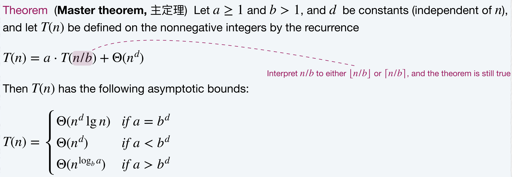

#### Application
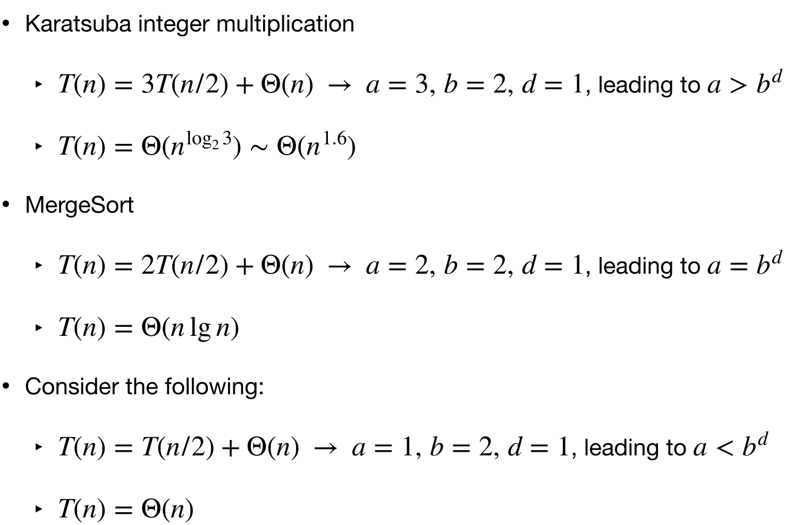

#### Proof

To get graph simpler d is eliminated, the nodes should be $c(\frac{n}{b^{t}})^d$
Add nodes in one level we get level costs.
And add the level costs together we get total cost.

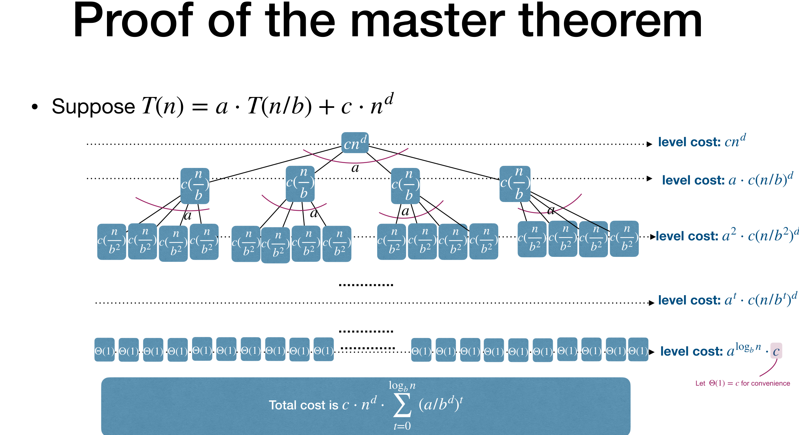
The formula of level cost is in fact a **Geometric Sum**.
Let $x=\frac{a}{b^d}$, $T(n)=cn^d\Sigma(x)^t$ (sum of a geometric sequence)

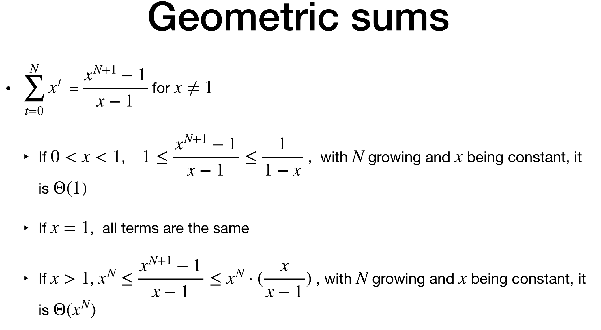
Case1: $a=b^d$
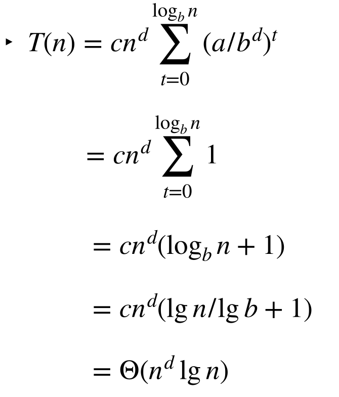
Case2: $a<b^d$
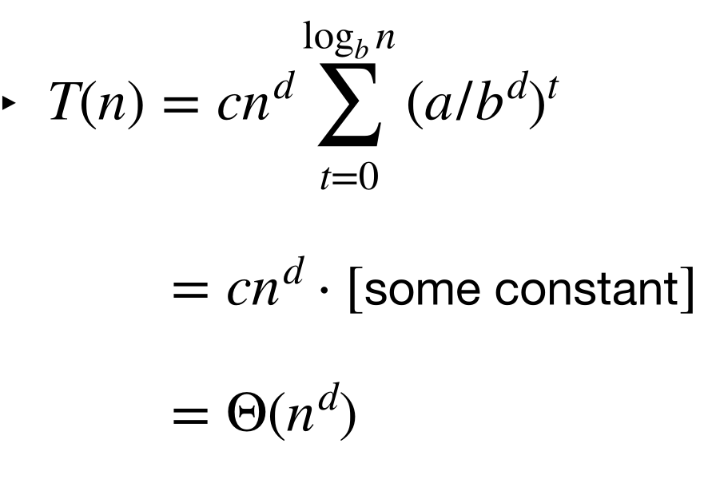
Case3: $a>b^d$
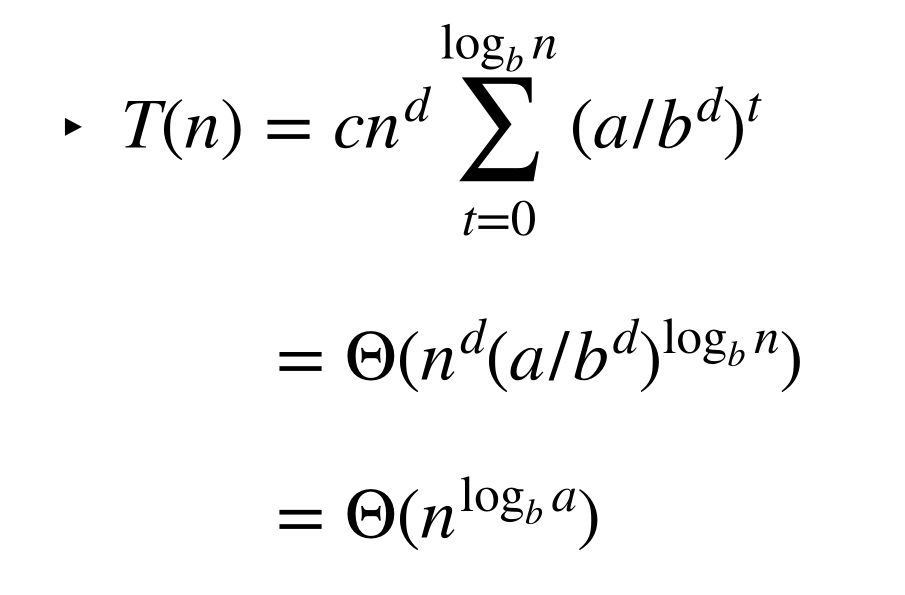

#### Insights from Master Method
What does it mean by $a>b^d$?
Meaning that a is very large, so we got many branches.
And by this we know **branching one problem** might cause the number of subproblems to **explode**, as the most work is done with the bottom of the tree.

What does it mean by $a<b^d$?
Meaning that the problems at the bottom of the tree are **smaller**, and most work is done with the subproblems at the top of the tree.

The 3 constants `a, b, d` work together to form the result of time complexity.

### General Version of Master Method
Solving the problem when $T(n)=a\times T(\frac{n}{b})+f(n)$
It's different from the simpler one as $f(n)$ acts as the divide and combine time needed for every level.
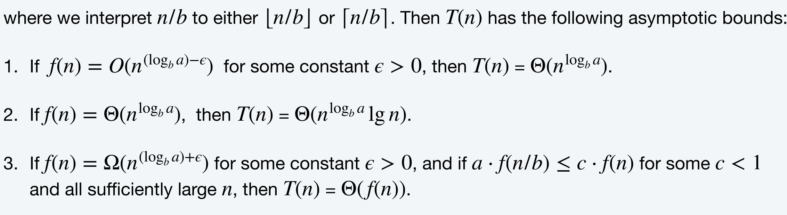
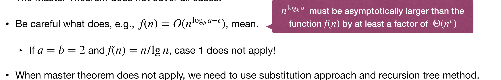

### Ignoring Floors and Ceilings is Okay
When consider the recurrence of MergeSort, i.e.,$T(n) = 2 ⋅ T(n/2) + \Theta(n)$
What if the given n is odd?
Actually, the actual recurrence of MergeSort is $T(n) = T(⌈n/2⌉) + T(⌊n/2⌋) + \Theta(n)$
However, this equation is complex.

#### Domain Transformation
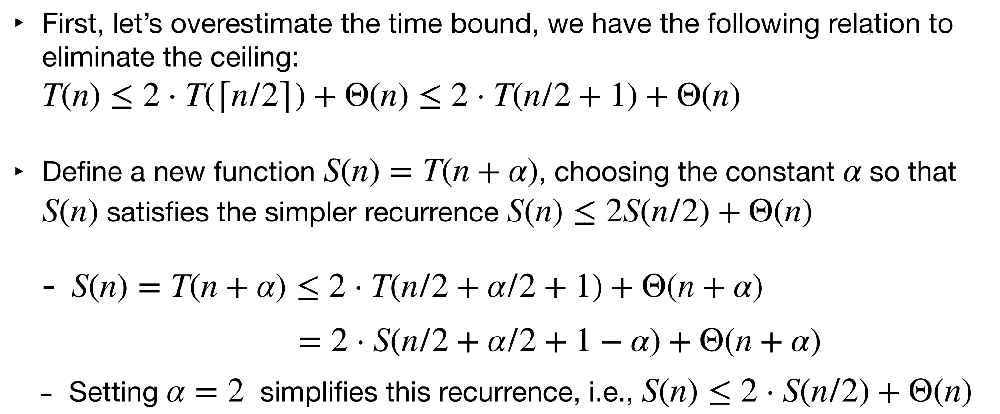
First make the floor to ceiling, then eliminate the 2 ceilings.
Then the form is like a subproblem, but with one more `1`
So we set one $\alpha$, and use a certain relationship to solve $\alpha$, and setting $\alpha$ does not affect the time complexity.
Then we can use Master Method to get the final answer of $T(n)$

In the same way we make ceiling to floor, getting the same result, illustrating that floors and ceilings does not really affect the time complexity of merge sort.

Domain Transformation can change one recurrence that's not really good into one recurrence we want, thus convenient to solve by `guess and verify` or `Master Method`.

Bad recurrence: $T(n)=2T(\frac{n}{2}+15)+f(n)$
Good one: $T(n)=2T(\frac{n}{2})+f(n)$

## Reduce-and-Conquer
We might not need to consider all subproblems, sometimes only one subproblem is needed to consider.
So that the combine step would be easier.

### The Search Problem
Input an array containing n elements, and an element x.
Output index of x if it's in A, otherwise return false.
Inevitably the runtime is $\Theta (n)$, But what if the input array is **sorted**?

#### Binary Search
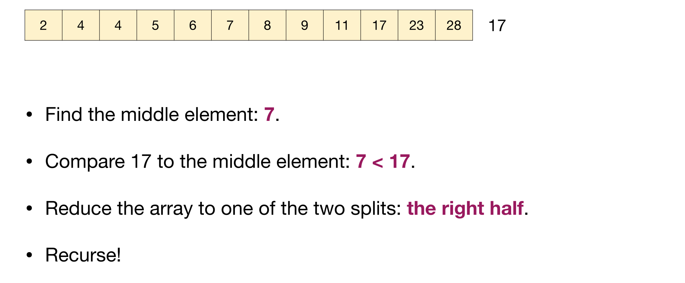
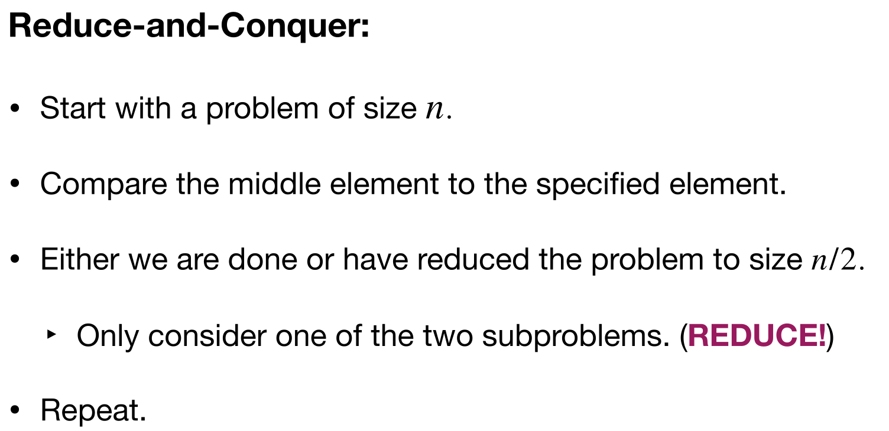
Only consider one side, and dispose the other.
As we update the two pointers `left` and `right`, when left>right, indicates that x is not in A, so exit successfully.
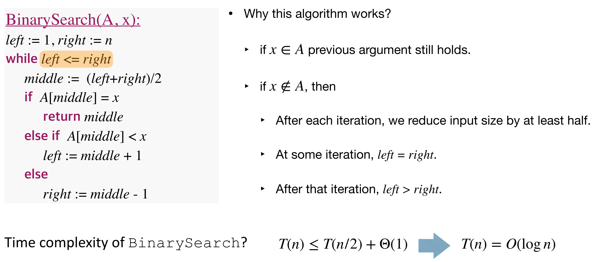

### Peak Finding
Input an array A of n elements, find a local maximum(peak)
An element A[i] is a **peak** if it is not smaller than its adjacent elements, including the edges of A.
Finding a global maximum is difficult, sometimes a peak is **good enough** and costs much less time.

This algorithm is like binary search.
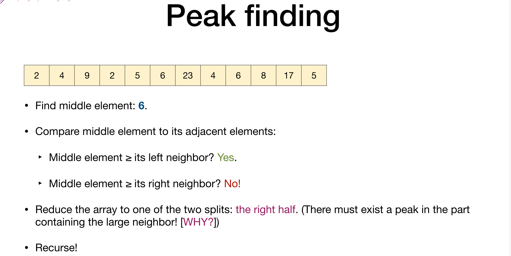
Choose one middle element first, if it is not a peak, assume on its left is smaller and right one is bigger.
**In worst case**, the left side will include 0 peak, but the right side will definitely include at least 1 peak, on the edge of the array in the worst case.
So we can safely **dispose** the smaller side, and focus on the bigger half to search for a peak.

The algorithm will always terminate for the two pointers left and right will meet together at last.
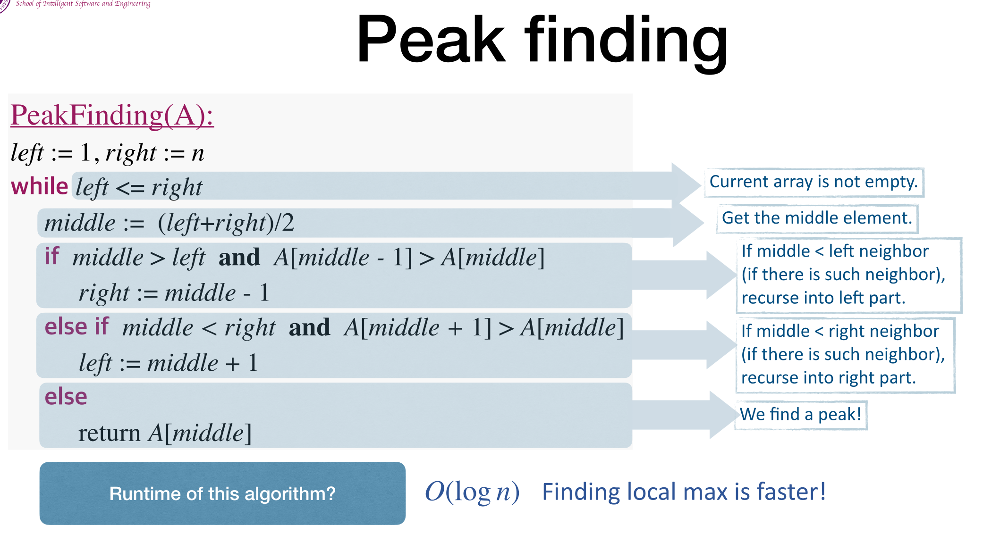

### Peak Finding in Matrices
Input a 2d array A of $n^2$ elements
Output a peak when it is no smaller than its four adjacent elements.

#### Algorithm I
**Compress** each column into one element, resulting into an 1d array, that is using the maximum in this column to represent this column, and run previous peak finding to get a peak in the 1d array.

The result peak must be one peak in the matrix.

Unfortunately the complexity of this algorithm is still $\Theta(n^2)$, as we need to find one maximum in one column and n columns exist.

#### Algorithm II
Scan the middle column and find the max element m, start from m, if m is peak return.
Otherwise, assume that left neighbor is larger than m, then recurse this algorithm in the left half, and the right half can be disposed.

Runtime: $T(n, n')\leq T(n/2, n')+\Theta(n')=\Theta(nlgn)$

Can we do better?

#### Algorithm III
Scan the cross and find one max element m
If m not peak, one neighbor of m is bigger, and recurse into the quadrant.
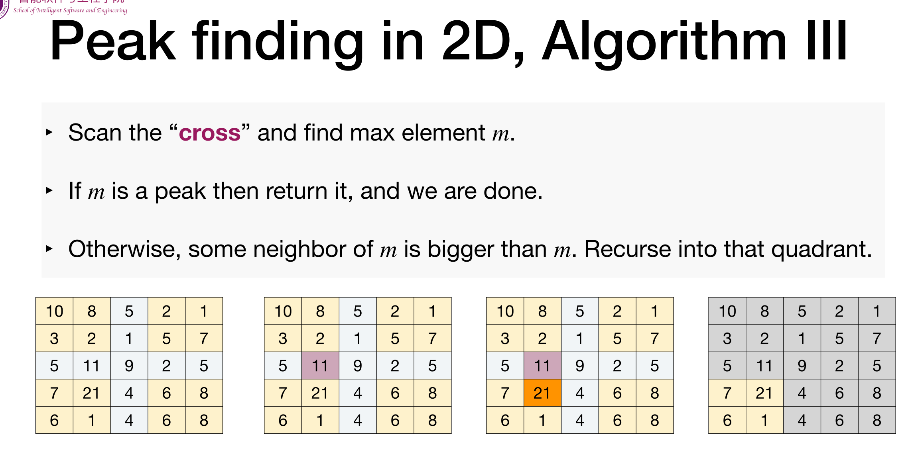
However, this is a wrong algorithm.
**False Claim**: A peak (found by the algorithm) in the quadrant containing the large neighbor is also a peak in the original matrix.

In previous ones, the peak of one column and bigger than its row neighbors is bound to be a peak of the matrix.
While in this case, choosing crosses is not a right choice. Some elements are not scanned in the crosses.

To solve it: Add a frame of the cross.

Runtime of the algorithm: $T(n, n)=\Theta(n)$