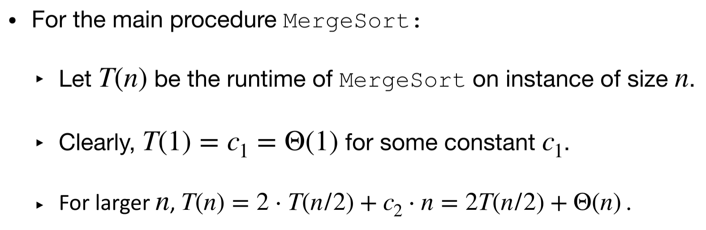
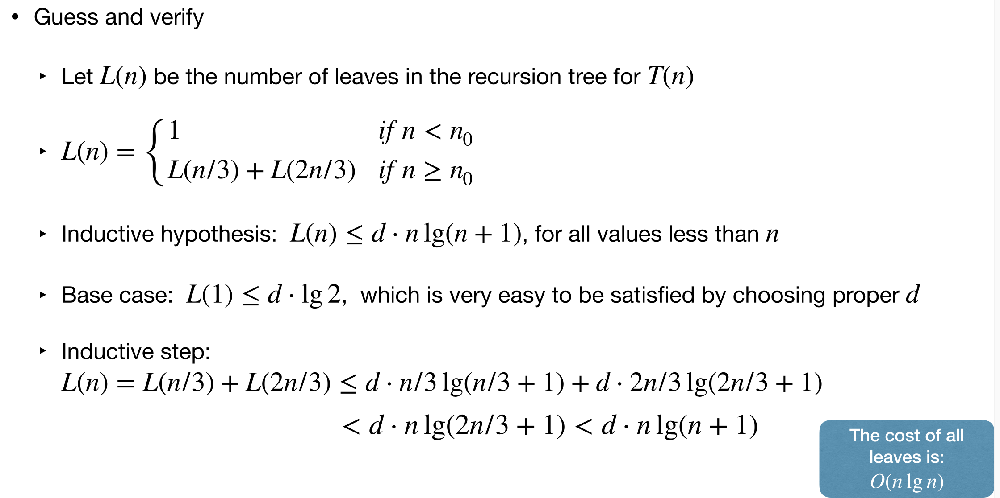

# Lec4: Divide and Conquer
## The Divide-and-Conquer Approach
- Divide the given problem into a number of **subproblems** that are smaller instances of the same problem.
- Conquer the subproblems by solving them **recursively**.
- Use brute-force to solve one subproblem if it is small enough.
- Combine the solutions of subproblems to obtain the solution for the original one.

Use (strong) mathematical induction to prove the correctness of the approach.

## Merge Sort

How to merge?
Use two indices, Aindex and Bindex, put the one smaller into the result array, and move the index forward(only the chosen one).
When one index meets the end, copy the rest of the another array into the result and finished.

Divide the original array and recursively sort, when meet base case then return and merge.

### Time Complexity of Merge Sort
For subroutine `Merge`: 

Use iteration to implement merge sort

## Matrix Multiplication
Suppose we wanna multiply two $n\times n$ matrices $X$ and $Y$
The straightforward method takes $\Theta(n^3)$, so we do it block-wise.

Solve 8 submultiplication with size n/2, and merge them together, whose time needs $\Theta(n^2)$

### Strassen's Algorithm for Matrix Multiplication
We don't need to know AE and BG separately, we just need their sum.
But how can we get AE+BG without knowing AE and BG?

`Substitution method` to get time complexity: (aka guess and verify)
- Guess the form of the solution
- Use induction to find proper constants and prove the solution works

This contradicts our assumption, so it can't prove our guess.
While looking at the result we find an additional $cn^2$, so next we try to **subtract** to see whether we can prove.

Now we can prove the time complexity of Strassen's algorithm is $O(n^{log_27})$
There is no general way to correctly guess the **tightest** asymptotic solution to an arbitrary recurrence.
**Making a good guess** takes experience and, occasionally, creativity.

Using Strassen's Algorithm, as we divide it into 7 subproblems, many **dependencies** and **recursions** are needed, not very able to calculate simultaneously, thus only when the matrix is big enough Strassen would outperform.

## The Recursion-Tree Method
A recursion tree is a rooted tree with one node for each **recursive subproblem**.

$f(n)$ can be viewed as the time needed to merge the answers of the subproblems together.

The value of each node is the time spent on that subproblem **excluding** recursive calls.

When a subproblem is small enough that we can violently solve it, we needn't divide more times to save divide and merge time.
In theory we set when we meet f(1), we stop creating branches and f(1) as a leaf, so total number of levels can be decided. In practical situations, we might not always get deep until f(1), but a specific constant $n_0$ when we can solve the small enough subproblem violently.

### What if the subproblems are of different sizes?

In this case $\Theta(n)$ is $f(n)$, so c as a random number, cn represents $\Theta(n)$
The number of levels(tree height), as the tree is unbalanced, is different from a balanced tree.

The cost of all internal nodes is:$O(nlgn)$(level cost:cn, times height)

$T(n)$ to be a addition of time of internal nodes and time of leaves.
leave calculation $O(1)$, so need to get number of leaves.

The answer $O(n^{1.71})$ is not so accurate, as we might not have so many leaves.
Use `guess and verify`, we guess the time to be $O(nlgn)$

Why we hypothesize $L(n)\leq d\times nlg(n+1)$
Give a number `d` to better adjust and do induction while not changing time complexity.
When n=1, lg1=0, we can't satisfy the base case, while getting lg(n+1) solves the problem.

By mathetical induction we prove the number of leaves is also $O(nlgn)$

So the total time is $O(nlgn)$

## Master Method
Only works to certain divide and conquer questions, while very convenient.

### Simple Version of Master Method
Target problems: $T(n)=a\times T(\frac{n}{b})+\Theta(n^d)$
a: number of subproblems
b: factor by which input size shrinks
d: need to do $n^d$ work to divide into subproblems and combine their solutions.
The 3 constants are independent from input `n`.

#### Application

