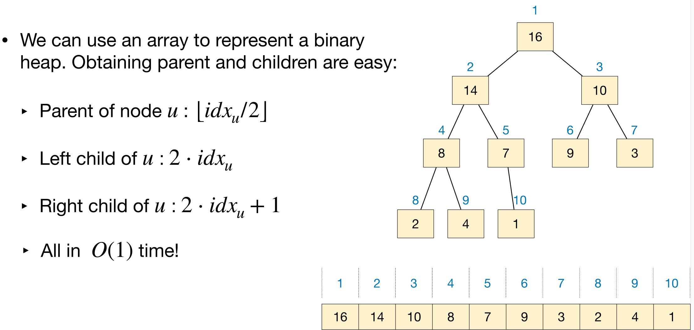
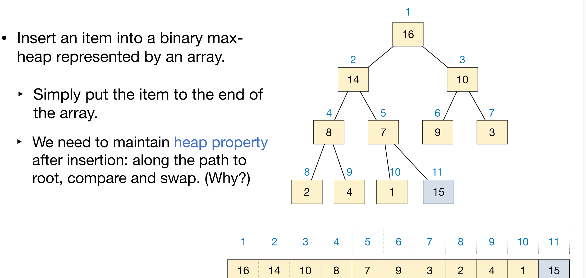
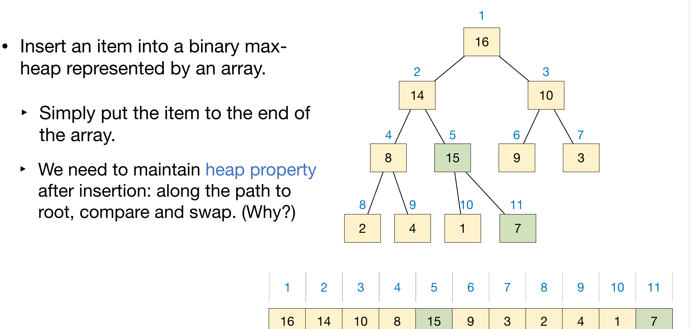
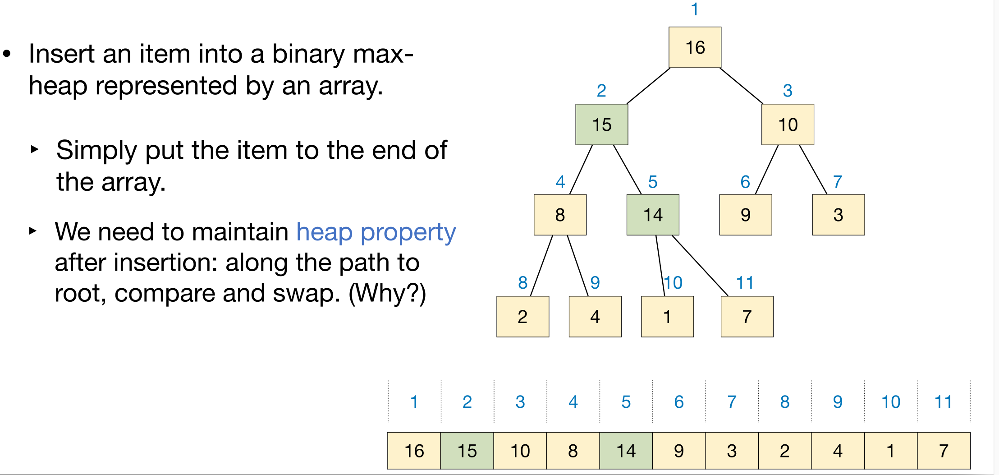
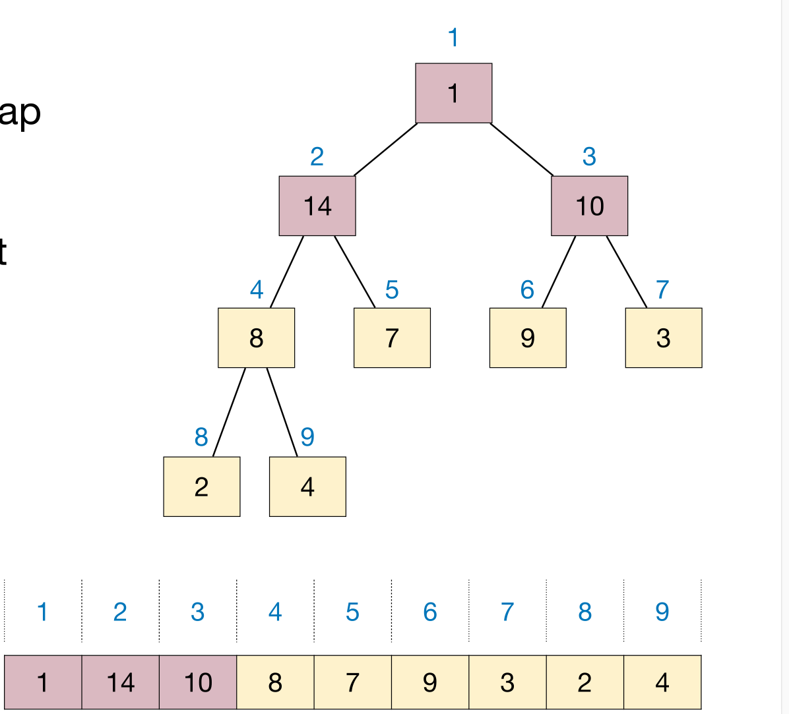
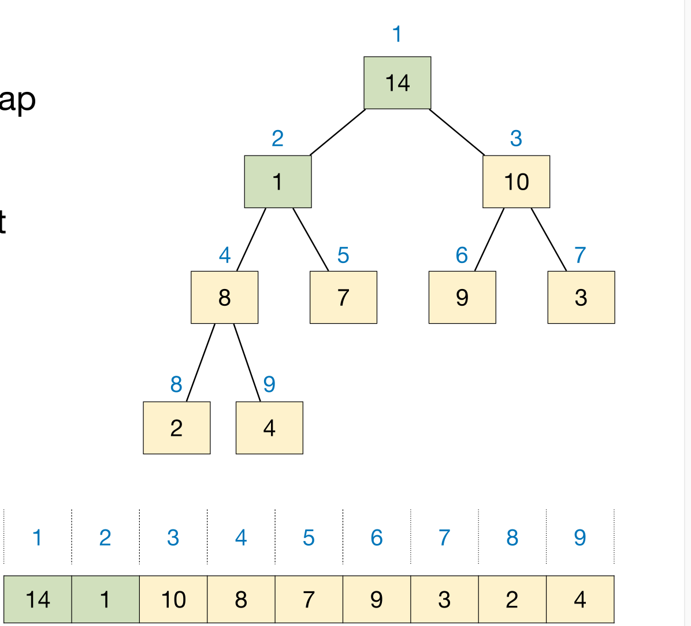
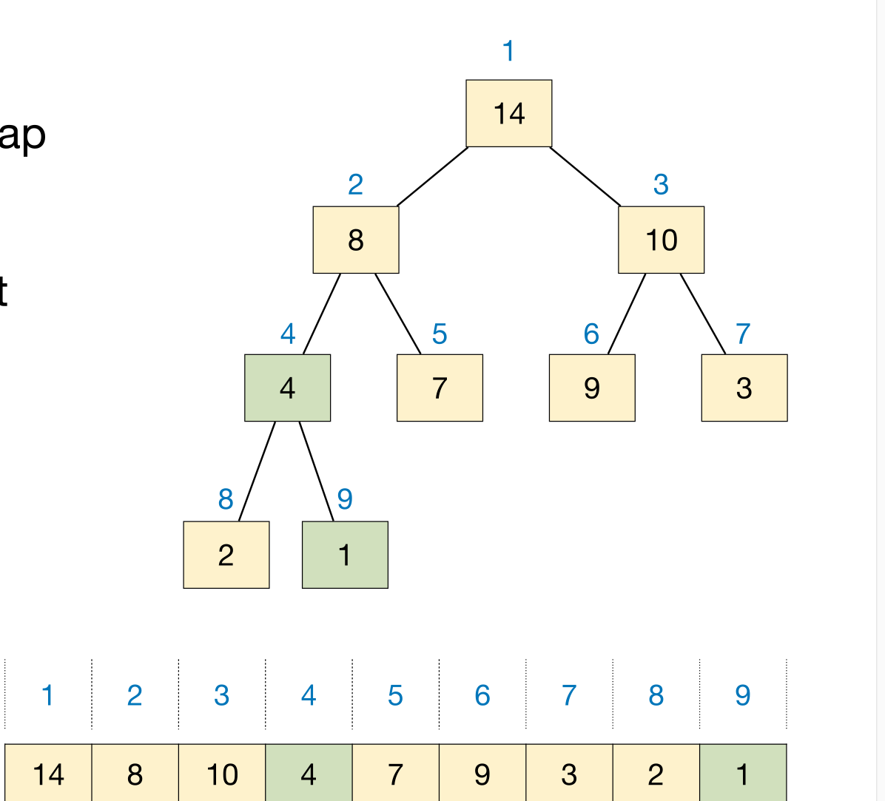

# Lec5: Heaps
## Binary Heap
A binary heap is a complete binary tree, in which each node representing an item.
A **complete** binary tree's level is completely filled, except possibly the last, and all nodes in the last level are as far left as possible.

Values in the nodes satisfy heap-property:
- Max-heap: for each node except root, value of that node $\leq$ value of its parent.
- Min-heap: for each node except root, value of that node $\geq$ value of its parent.

We can use an **array** to represent a binary heap.

The index of leftmost node on level k is $2^{k-1}$
It's very convenient to use indeces to obtain parents and children.
While this is only for complete binary trees, if a normal tree it's obviously not working.

### Common Operations of Binary Max-heap
3 most common ones:
- HeapInsert: insert an element into the heap
- HeapGetMax: return the item with maximum value
- HeapExtractMax: remove the item with maximum value and return it

#### HeapInsert
When we insert one item, it must retain being a binary heap.
Firstly, it must be a complete binary tree, so we put the item at the end of the array first.
Now, it might not follow heap properties.

As 15 is no less than 7, we swap the two to make sure parents are bigger than children.

In the same way we swap 14 and 15, getting the final result of inserting 15 into the existing binary heap.

So we keep comparing the parent and the newcoming item, swap them if not following properties.

Time complexity is $O(lgn)$ as we swap **height** of times in worst case, and the height of tree is $lgn$.

#### HeapExtractMax
When we remove the maximum item from the heap, how to retain being a binary heap?
Easily we know the root must be the maximum(heap properties).

To maintain a binary heap, we move the last item to the root first.
Now the root is relatively small, so we need to swap the root with its children.
Which one to swap? The one with bigger value, becuase it needs to be bigger than its brother after being the root of the tree.

And we repeat these actions until the item is no smaller than its children.

