# Lec6: Sorting
## Sorting Problem
Sort $n$ numbers into ascending order.
As long as the type of data is comparable, it can be viewed as a sorting problem.

Characteristics of sorting algorithms:
- In-place: if $O(1)$ extra space is needed
- Stability: if numbers with the same value appear in the output array **in the same order** as they do in the input array


## The Selection Sort Algorithm
Pick out minimum value of the input, recursively sort remaining elements, and swap the place with minimum of remaining array.
```cpp
void selection_sort(int[] a){
    for (int i = 0; i < a.length(); i++){
        minIndex = i;
        for (int j = i + 1; j < a.length(); j++){
            if a[j] < a[minIndex];
            minIndex = j;
        }
        swap(i, minIndex); // swap the minimum right now in the remaining array and put it in place.
    }
}
```


Time complexity: $O(n)+O(n-1)+\dots+O(1)=O(n^2)$

If we switch the selection sort into picking max putting at last, it would be heapsort.
Therefore, now the two algorithms are basically the same, only difference lies in data structure, so heap can largely make the sort faster.

## The Bubble Sort Algorithm
Repeatedly step through the array, compare 2 adjacent pairs and swap them if they're in wrong order.

Time complexity is $O(n^2)$


### Improve Bubble Sort
What if in one iteration, no swap take place?
That means there're no wrong pairs, the array is sorted and we are done!

The worst case is still $O(n^2)$, but obviously we have speeded up a lot.

But not enough! We can do further improvement.

The rest of the array might be sorted already, thus we're repeating for extra times and wasting time.
So, we can be more **aggressive** when reducing n after each iteration
Items after the **last swap** are all in correct sorted position, cuz if it does, it would have been sorted.


## Insertion Sort

If one element needs to go far, there would be numerous swaps.
Swaps would be bad for computer, so we try to reduce swaps.
Shell Sort(not important)

## Quick Sort
A unified view of many sorting algorithms:
**Divide** problem into subproblems. **Conquer** subproblems recursively. **Combine** solutions of subproblems.
1. Divide the input into size 1 and size n-1:
- InsertionSort
- SelectionSort
2. Divide the input into two parts of same size:
- MergeSort
3. Divide the input into **approximately** same size:
QuickSort

Basic idea of QuickSort:
Choose one item $x$ in the given array $A$ as **pivot**.
Use the pivot to **partition**(divide) the input into $B$ and $C$, so that items in $B$ are $\leq x$ , and items in $C$ are $> x$.
Then recursively sort $B$ and $C$, and output $<B, x, C>$ stick them together, getting the sorted array.

### Choosing the Pivot
Ideally the pivot should partition the input into two parts of **roughly the same size** (we’ll see why later).
But for every simple deterministic method of choosing pivot, we can construct corresponding bad input to make sort very slow.
For now we choose the very last number as pivot.

### The Partition Process
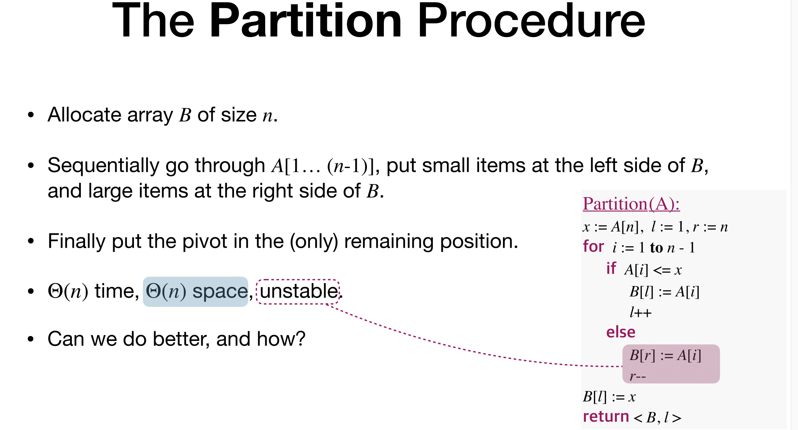
This costs much space, and unstable.
Can we turn space complexity into $O(1)$?
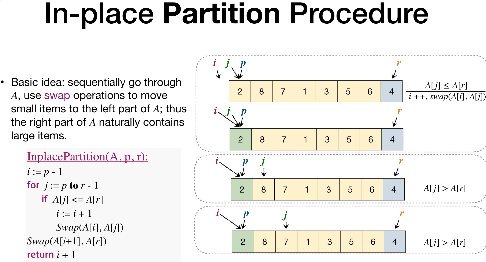
From p to i, the elements are $\leq x$, and from i+1 to j, they are $>x$, and from j to r, yet to be compared.

### Time Complexity of QuickSort
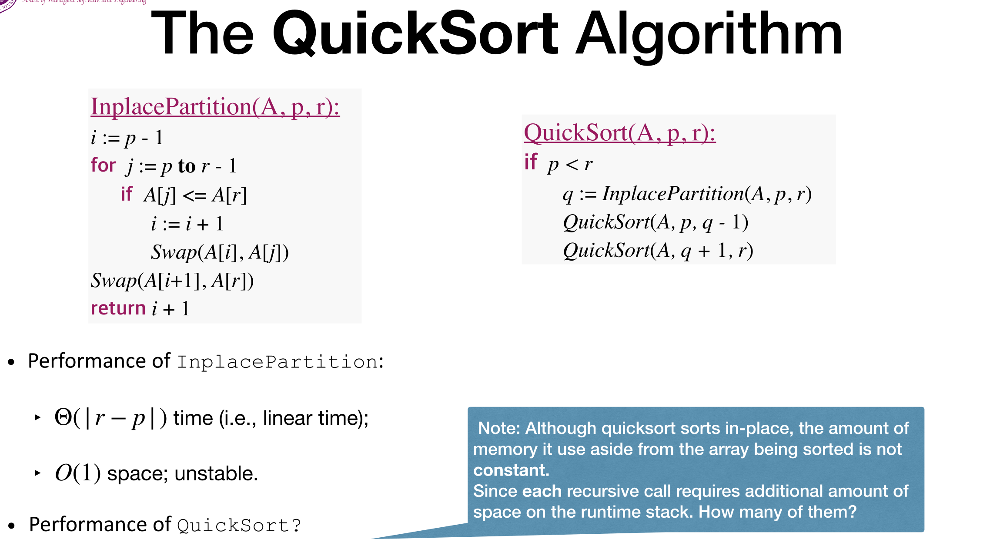
The hardest part of anylyzing time of quick sort is to know how many recursions we have to do.
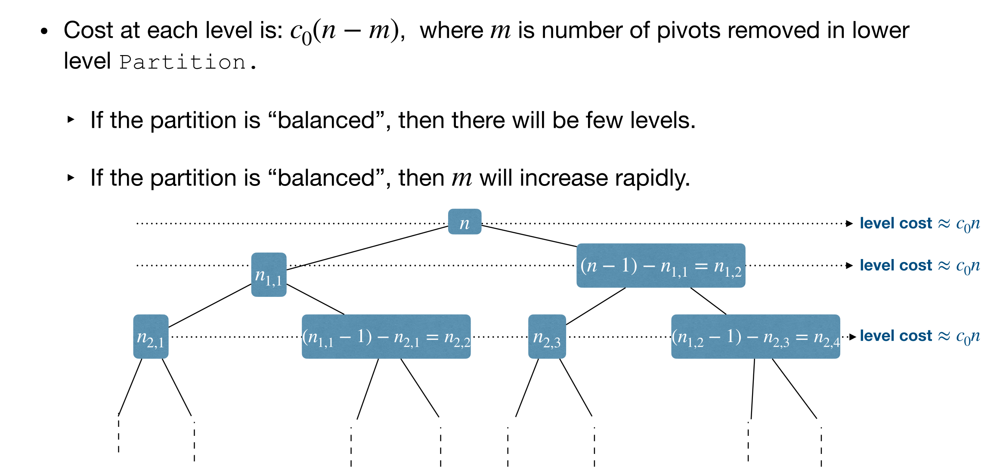
We're not sure the left and right size divided by the pivot.
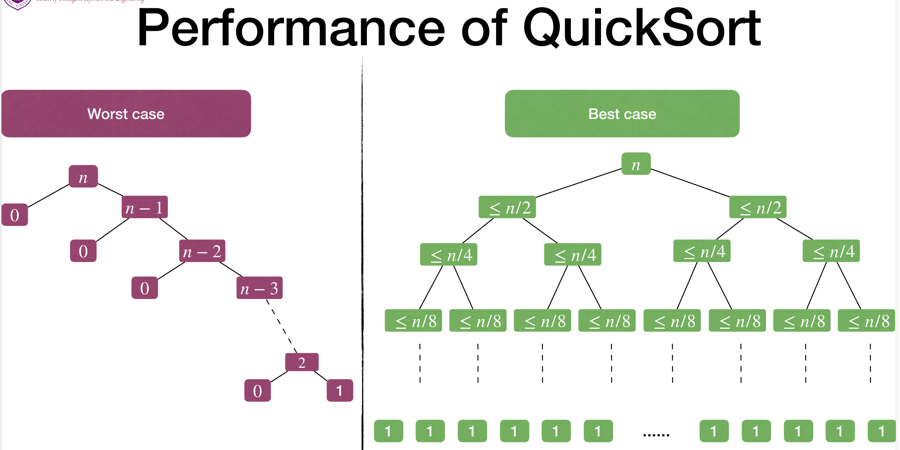
The best case if when we're choosing the median of the array every time, thus creating two subarrays of same size.
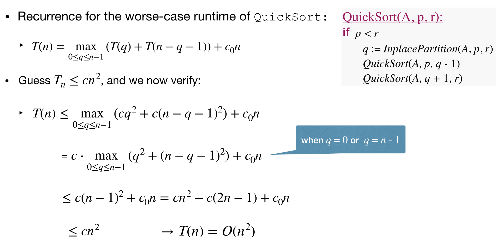
Use guess and verify to prove the time of worst case is $O(n^2)$
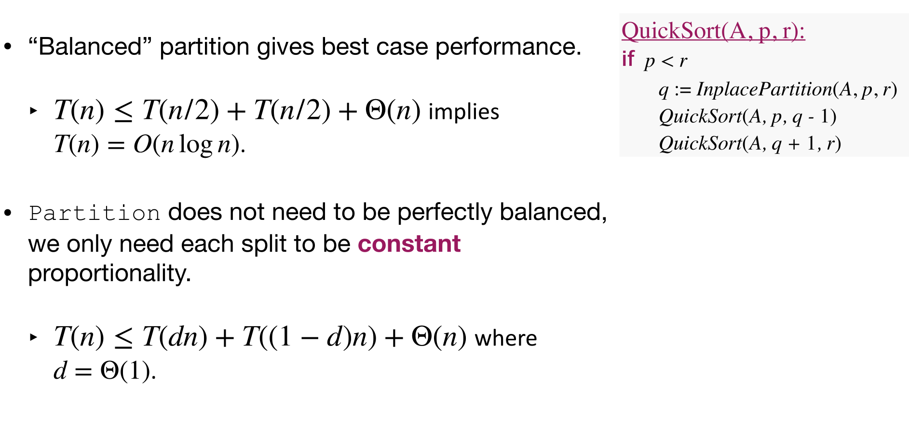
And for best case we can calculate that getting $O(nlogn)$
It's extremely hard to reach worst case, so in most cases time complexity of QuickSort is $O(nlogn)$ or slightly bigger than that.
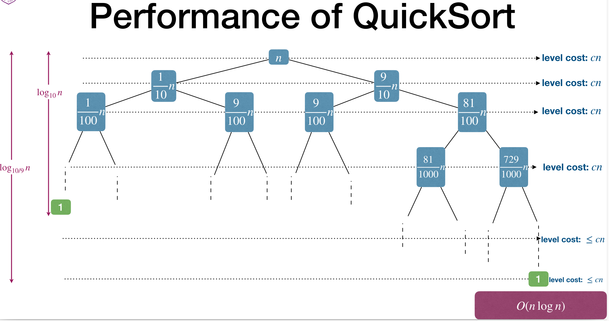
Even if we're not balanced, even very unbalanced like we divede into 1/10 size and 9/10 size, we can still reach $O(nlogn)$. As long as the partition is relatively balanced, we can have $O(nlogn)$ time complexity.

To get the **average time cost** of QuickSort, we multiply the expected time and the probability, and then sum it together(expectation).

For sorting problems we only focus on the **relative ordering** of the values instead of the absolute numbers.
Therefore, the input array is a **permutation** of all possible permutations of input numbers.
Assume that all permutations share an equal probability, to make analysis simple, we assume every number to be distinct.

When we wanna know the average time cost, we assume the `Partition Process` produces a **mix of good and bad** splits.
Further, for the sake of intuition, suppose that the good and bad splits **alternate** levels in the tree, and that the good splits are **best** case splits and the bad splits are **worst** case splits.
The cost of “bad” Partition can be **absorbed** by recent “good” Partition
In this way, the time is still $O(nlogn)$, illustrating the average time cost.

Strictly prove it:
Choose pivot (uniformly) **at random!**
Since the choice is randomly made, there is a good chance(**constant probability**) that we choose a “good” pivot.
We can swap the chosen pivot with the last element so we needn't change any code of our `Partition Process`.
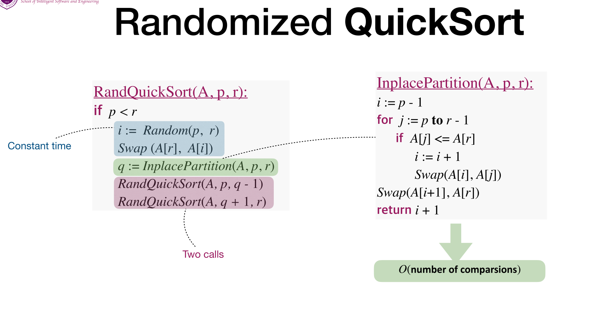

### Randomnized Quicksort
Now that any deterministic choice of pivot, there could be one particular "bad" input for it.
So we can choose pivots uniformly at random.

Since the choice is randomly made, there is **a good chance**(constant probability) that we choose a “good” pivot.

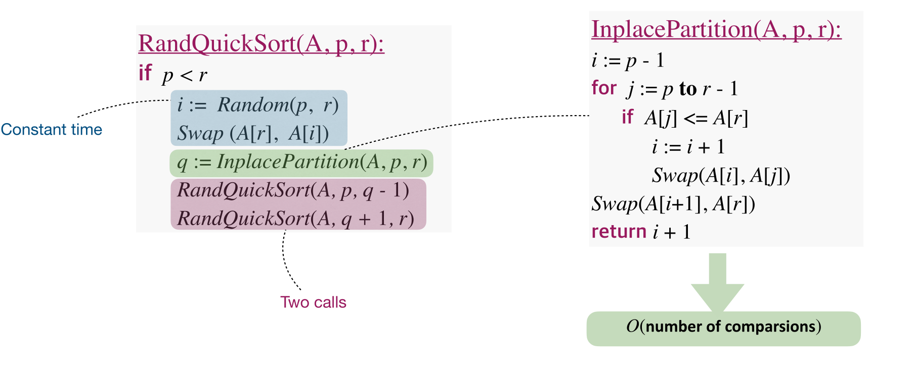
Most time spent on the InplacePartition function.
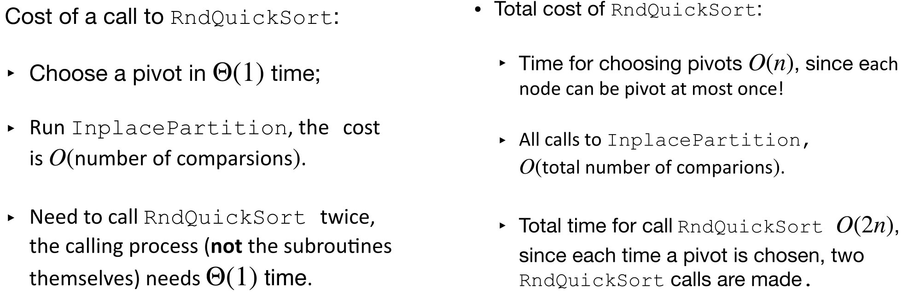
What is the total number of comparisons? The most difficult part for analyzing the time complexity.

It is **not pairwise**! If pairwise, it would spend $n^2$ times, but in real there's not that much comparisons.

It is worth noting that if we sort $a_1a_2\dots a_n$ into $z_1z_2\dots z_n$, let $X_{ij}$ be the event that $z_i$ had been compared to $z_j$, so $X_{ij}$ can only be 1 or 0.
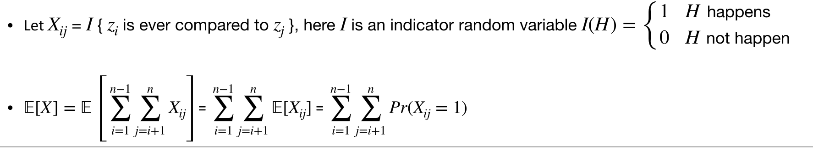
So what is $Pr(X_{ij}=1)$?

If the elements between $z_i$ and $z_j$ are chosen to be pivot priorily, the two are seperated to be in different halves in the sequence, and in a sorted sequence generated by a pivot, the elements on the left of the pivot would never be compared with the right elements.

Only choosing $z_i$ or $z_j$ first would cause the two to compare with the other, so $Pr(X_{ij}=1)=\frac{2}{j-i+1}$
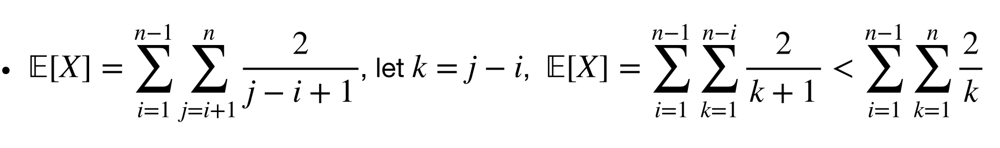
This is a harmonic series, and we try to get the result.
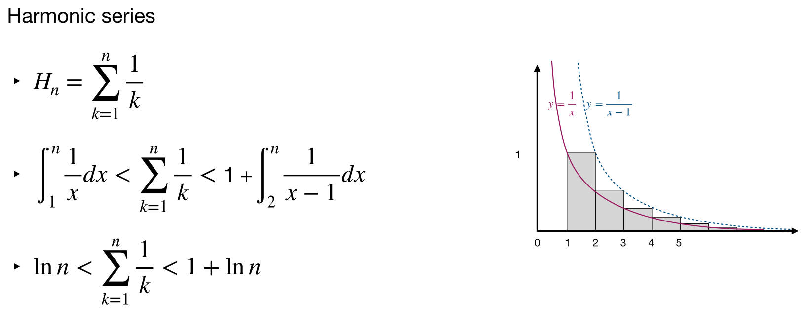
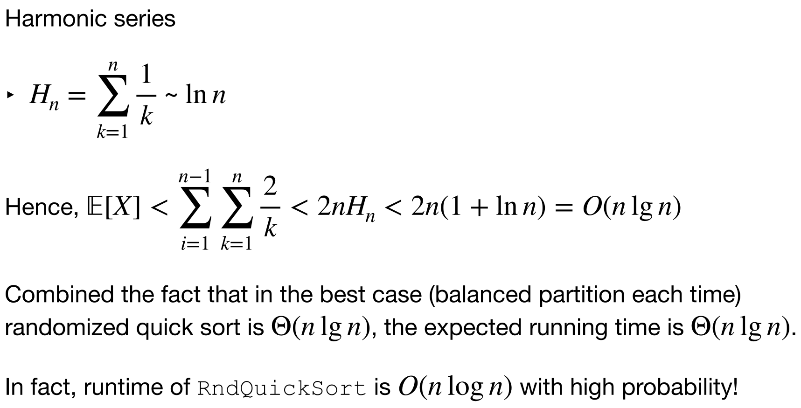
So the time complexity of qsort is nlgn, and has a high probability that it remains nlgn.

### A bit more about qsort
If there're many duplicates?
Maintain 4 regions: $<pivot, =pivot, in process, >pivot$
End up with three regions (“<”, “=”, and “>”), and only recurse into two ofthem (“<” and “>”): the more the duplicates, the less to recurse, and thebetter the algorithm!

Stop recursion if it is small enough to solve.
Usually use InsertionSort when is about 10 elements left.

If we choose multiple pivot?
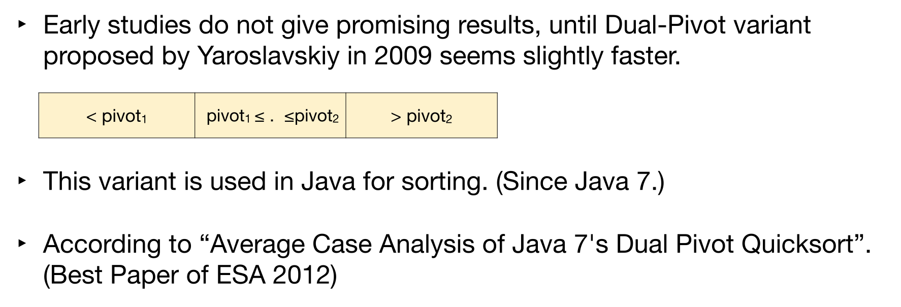

## The $nlgn$ Sorting Algorithms
QuickSort, MergeSort and HeapSort are all nlgn. Which is better?
- QuickSort is faster in most cases. Although it needs more comparison than MergeSort, it has much less **movement**(copies) of array elements.
- HeapSort is the slowest among them, with poor locality of reference, but needs less amount of space.
- MergeSort scanning the 2 arrays would take advantage in  handling slow-to-access sequential media, and partially pre-sorted input would be alot faster.

## External Sorting(*not requested)
External sorting is required when the data must reside in the slow external memory, usually a disk drive.
There is one I/O between disk and memory, and I/O is very expensive at time.
If we wonna sort big files we might want this algorithm.

### Key Idea
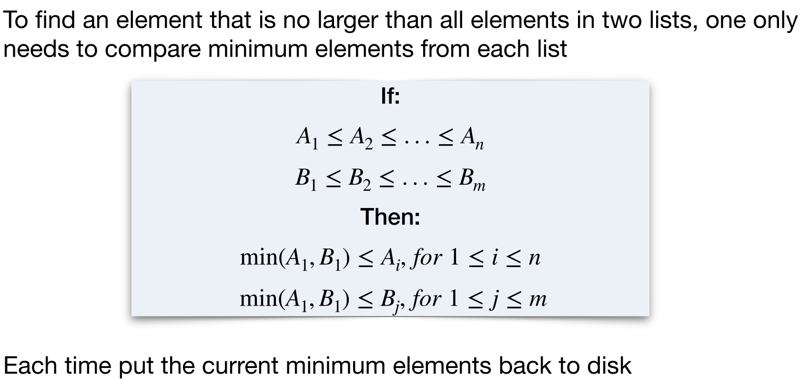
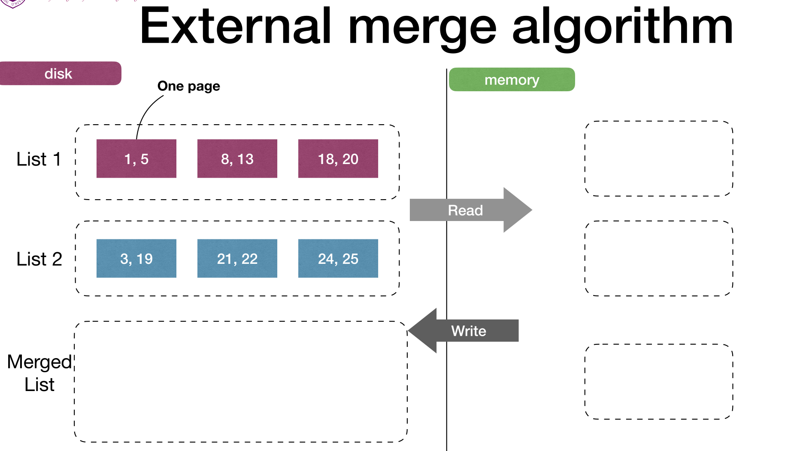
Look at this example.
We read 1,5 and 3,19 into memory, and get 1,3 as the smallest, write them back into the disk.
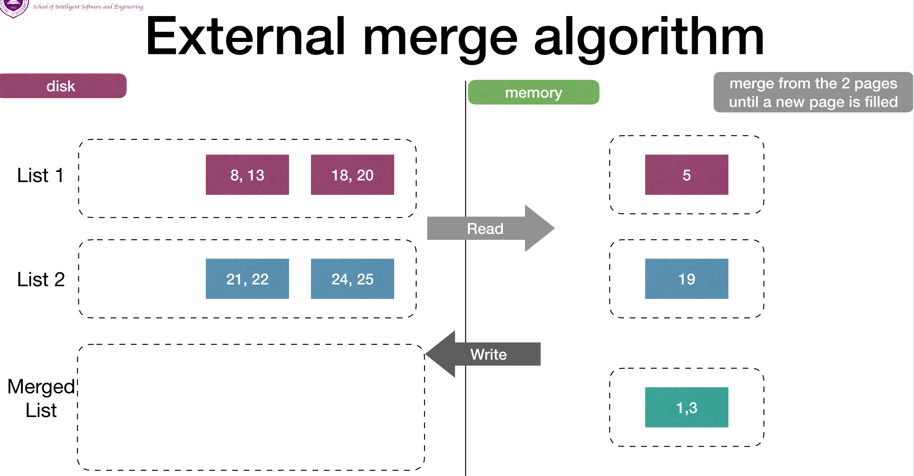
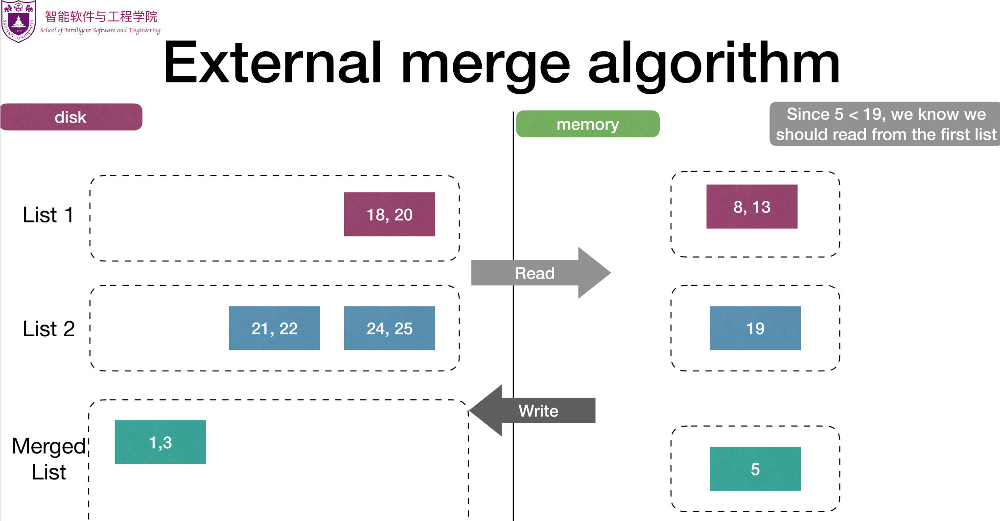
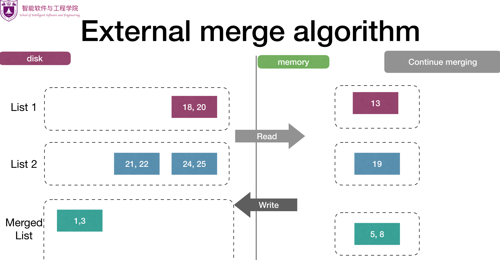
Repeating this we can sort the pages.
Choosing one small element in the memory is little time compared with I/O.
So we focus on the time we call I/O, and the cost is $2(M+N)$, M being length of list A and N is length of list B.

If we have B lists, we need B+1 buffer pages in memory, and the I/O cost is the same.
If we only have 3 buffer pages for B lists, just merge 2 lists at one time and recursively merge their results.

