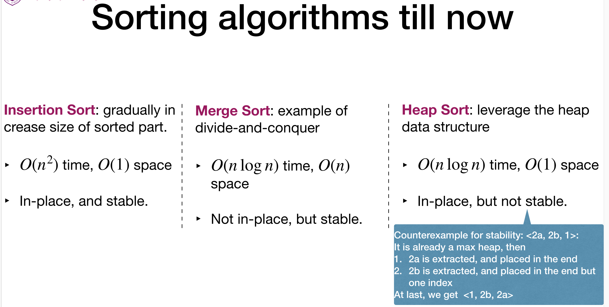
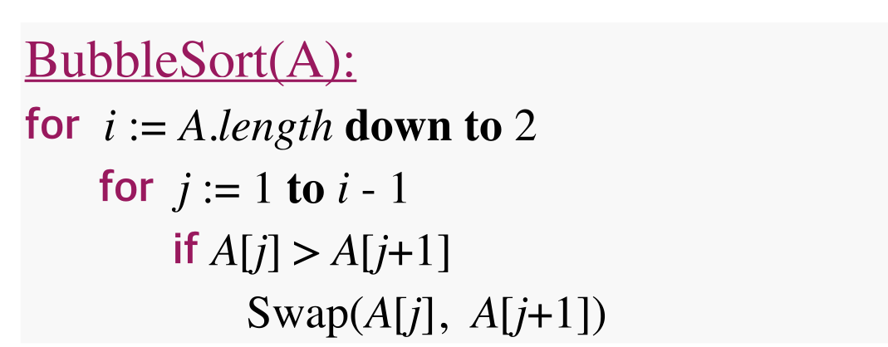
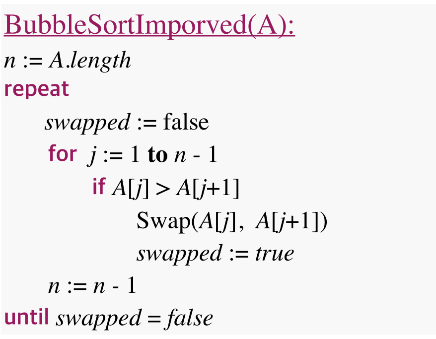
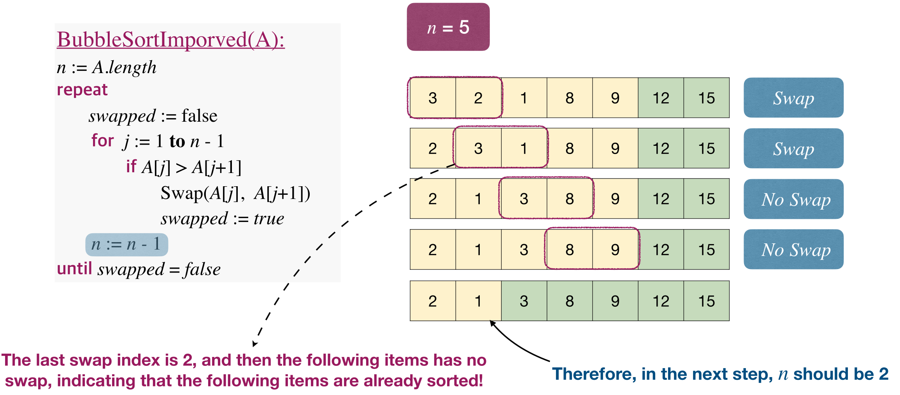
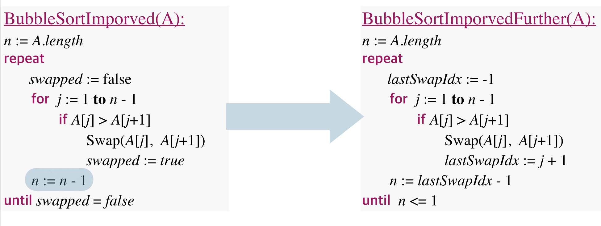
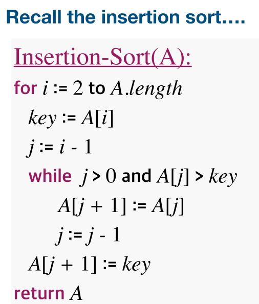

# Lec6: Sorting
## Sorting Problem
Sort $n$ numbers into ascending order.
As long as the type of data is comparable, it can be viewed as a sorting problem.

Characteristics of sorting algorithms:
- In-place: if $O(1)$ extra space is needed
- Stability: if numbers with the same value appear in the output array **in the same order** as they do in the input array


## The Selection Sort Algorithm
Pick out minimum value of the input, recursively sort remaining elements, and swap the place with minimum of remaining array.
```cpp
void selection_sort(int[] a){
    for (int i = 0; i < a.length(); i++){
        minIndex = i;
        for (int j = i + 1; j < a.length(); j++){
            if a[j] < a[minIndex];
            minIndex = j;
        }
        swap(i, minIndex); // swap the minimum right now in the remaining array and put it in place.
    }
}
```


Time complexity: $O(n)+O(n-1)+\dots+O(1)=O(n^2)$

If we switch the selection sort into picking max putting at last, it would be heapsort.
Therefore, now the two algorithms are basically the same, only difference lies in data structure, so heap can largely make the sort faster.

## The Bubble Sort Algorithm
Repeatedly step through the array, compare 2 adjacent pairs and swap them if they're in wrong order.

Time complexity is $O(n^2)$


### Improve Bubble Sort
What if in one iteration, no swap take place?
That means there're no wrong pairs, the array is sorted and we are done!

The worst case is still $O(n^2)$, but obviously we have speeded up a lot.

But not enough! We can do further improvement.

The rest of the array might be sorted already, thus we're repeating for extra times and wasting time.
So, we can be more **aggressive** when reducing n after each iteration
Items after the **last swap** are all in correct sorted position, cuz if it does, it would have been sorted.


## Insertion Sort

If one element needs to go far, there would be numerous swaps.
Swaps would be bad for computer, so we try to reduce swaps.
Shell Sort(not important)

## Quick Sort
A unified view of many sorting algorithms:
**Divide** problem into subproblems. **Conquer** subproblems recursively. **Combine** solutions of subproblems.
1. Divide the input into size 1 and size n-1:
- InsertionSort
- SelectionSort
2. Divide the input into two parts of same size:
- MergeSort
3. Divide the input into **approximately** same size:
QuickSort

Basic idea of QuickSort:
Choose one item $x$ in the given array $A$ as **pivot**.
Use the pivot to **partition**(divide) the input into $B$ and $C$, so that items in $B$ are $\leq x$ , and items in $C$ are $> x$.
Then recursively sort $B$ and $C$, and output $<B, x, C>$ stick them together, getting the sorted array.

### Choosing the Pivot
Ideally the pivot should partition the input into two parts of **roughly the same size** (we’ll see why later).
