# Lec6: Sorting

## Sorting Problem

Sort $n$ numbers into ascending order.
As long as the type of data is comparable, it can be viewed as a sorting problem.

Characteristics of sorting algorithms:

- In-place: if $O(1)$ extra space is needed
- Stability: if numbers with the same value appear in the output array **in the same order** as they do in the input array
  

## The Selection Sort Algorithm

Pick out minimum value of the input, recursively sort remaining elements, and swap the place with minimum of remaining array.

```cpp
void selection_sort(int[] a){
    for (int i = 0; i < a.length(); i++){
        minIndex = i;
        for (int j = i + 1; j < a.length(); j++){
            if a[j] < a[minIndex];
            minIndex = j;
        }
        swap(i, minIndex); // swap the minimum right now in the remaining array and put it in place.
    }
}
```

Time complexity: $O(n)+O(n-1)+\dots+O(1)=O(n^2)$

If we switch the selection sort into picking max putting at last, it would be heapsort.
Therefore, now the two algorithms are basically the same, only difference lies in data structure, so heap can largely make the sort faster.

## The Bubble Sort Algorithm

Repeatedly step through the array, compare 2 adjacent pairs and swap them if they're in wrong order.

Time complexity is $O(n^2)$


### Improve Bubble Sort

What if in one iteration, no swap take place?
That means there're no wrong pairs, the array is sorted and we are done!

The worst case is still $O(n^2)$, but obviously we have speeded up a lot.

But not enough! We can do further improvement.

The rest of the array might be sorted already, thus we're repeating for extra times and wasting time.
So, we can be more **aggressive** when reducing n after each iteration
Items after the **last swap** are all in correct sorted position, cuz if it does, it would have been sorted.


## Insertion Sort


If one element needs to go far, there would be numerous swaps.
Swaps would be bad for computer, so we try to reduce swaps.
Shell Sort(not important)

## Quick Sort

A unified view of many sorting algorithms:
**Divide** problem into subproblems. **Conquer** subproblems recursively. **Combine** solutions of subproblems.

1. Divide the input into size 1 and size n-1:

- InsertionSort
- SelectionSort

2. Divide the input into two parts of same size:

- MergeSort

3. Divide the input into **approximately** same size:
   QuickSort

Basic idea of QuickSort:
Choose one item $x$ in the given array $A$ as **pivot**.
Use the pivot to **partition**(divide) the input into $B$ and $C$, so that items in $B$ are $\leq x$ , and items in $C$ are $> x$.
Then recursively sort $B$ and $C$, and output $<B, x, C>$ stick them together, getting the sorted array.

### Choosing the Pivot

Ideally the pivot should partition the input into two parts of **roughly the same size** (we'll see why later).
But for every simple deterministic method of choosing pivot, we can construct corresponding bad input to make sort very slow.
For now we choose the **very last number** as pivot.

### The Partition Process


This costs much space, and unstable.
Can we turn space complexity into $O(1)$?

From p to i, the elements are $\leq x$, and from i+1 to j, they are $>x$, and from j to r, yet to be compared.

### Time Complexity of QuickSort


The hardest part of anylyzing time of quick sort is to know how many recursions we have to do.

We're not sure the left and right size divided by the pivot.

The best case if when we're choosing the median of the array every time, thus creating two subarrays of same size.

Use guess and verify to prove the time of worst case is $O(n^2)$

And for best case we can calculate that getting $O(nlogn)$
It's extremely hard to reach worst case, so in most cases time complexity of QuickSort is $O(nlogn)$ or slightly bigger than that.

Even if we're not balanced, even very unbalanced like we divede into 1/10 size and 9/10 size, we can still reach $O(nlogn)$. As long as the partition is relatively balanced, we can have $O(nlogn)$ time complexity.

To get the **average time cost** of QuickSort, we multiply the expected time and the probability, and then sum it together(expectation).

For sorting problems we only focus on the **relative ordering** of the values instead of the absolute numbers.
Therefore, the input array is a **permutation** of all possible permutations of input numbers.
Assume that all permutations share an equal probability, to make analysis simple, we assume every number to be distinct.

When we wanna know the average time cost, we assume the `Partition Process` produces a **mix of good and bad** splits.
Further, for the sake of intuition, suppose that the good and bad splits **alternate** levels in the tree, and that the good splits are **best** case splits and the bad splits are **worst** case splits.
The cost of “bad” Partition can be **absorbed** by recent “good” Partition
In this way, the time is still $O(nlogn)$, illustrating the average time cost.

Strictly prove it:
Choose pivot (uniformly) **at random!**
Since the choice is randomly made, there is a good chance(**constant probability**) that we choose a “good” pivot.
We can swap the chosen pivot with the last element so we needn't change any code of our `Partition Process`.


### Randomnized Quicksort

Now that any deterministic choice of pivot, there could be one particular "bad" input for it.
So we can choose pivots uniformly at random.

Since the choice is randomly made, there is **a good chance**(constant probability) that we choose a “good” pivot.


Most time spent on the InplacePartition function.

What is the total number of comparisons? The most difficult part for analyzing the time complexity.

It is **not pairwise**! If pairwise, it would spend $n^2$ times, but in real there's not that much comparisons.

It is worth noting that if we sort $a_1a_2\dots a_n$ into $z_1z_2\dots z_n$, let $X_{ij}$ be the event that $z_i$ had been compared to $z_j$, so $X_{ij}$ can only be 1 or 0.

So what is $Pr(X_{ij}=1)$?

If the elements between $z_i$ and $z_j$ are chosen to be pivot priorily, the two are seperated to be in different halves in the sequence, and in a sorted sequence generated by a pivot, the elements on the left of the pivot would never be compared with the right elements.

Only choosing $z_i$ or $z_j$ first would cause the two to compare with the other, so $Pr(X_{ij}=1)=\frac{2}{j-i+1}$

This is a harmonic series, and we try to get the result.


So the time complexity of qsort is nlgn, and has a high probability that it remains nlgn.

### A bit more about qsort

If there're many duplicates?
Maintain 4 regions: $<pivot, =pivot, in process, >pivot$
End up with three regions (“<”, “=”, and “>”), and only recurse into two ofthem (“<” and “>”): the more the duplicates, the less to recurse, and thebetter the algorithm!

Stop recursion if it is small enough to solve.
Usually use InsertionSort when is about 10 elements left.

If we choose multiple pivot?


## The $nlgn$ Sorting Algorithms

QuickSort, MergeSort and HeapSort are all nlgn. Which is better?

- QuickSort is faster in most cases. Although it needs more comparison than MergeSort, it has much less **movement**(copies) of array elements.
- HeapSort is the slowest among them, with poor locality of reference, but needs less amount of space.
- MergeSort scanning the 2 arrays would take advantage in  handling slow-to-access sequential media, and partially pre-sorted input would be alot faster.

## External Sorting(*not requested)

External sorting is required when the data must reside in the slow external memory, usually a disk drive.
There is one I/O between disk and memory, and I/O is very expensive at time.
If we wonna sort big files we might want this algorithm.

### Key Idea


Look at this example.
We read 1,5 and 3,19 into memory, and get 1,3 as the smallest, write them back into the disk.


Repeating this we can sort the pages.
Choosing one small element in the memory is little time compared with I/O.
So we focus on the time we call I/O, and the cost is $2(M+N)$, M being length of list A and N is length of list B.

If we have B lists, we need B+1 buffer pages in memory, and the I/O cost is the same.
If we only have 3 buffer pages for B lists, just merge 2 lists at one time and recursively merge their results.

## About Sorting Itself

Can we have an algorithm smaller than $O(nlgn)$?
This can be called **computational complexity theory**.

### Upper bond and Lower bond

Upper bound: how **fast** can we solve the problem?
Lower bound: how **slow** solving the problem has to be?

If we can enumerate all algorithms $A$ that solves problem $P$:
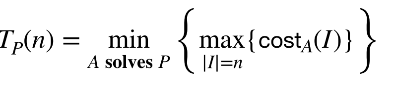
Obviously this is just a definition and not practical. We can't enumerate the infinite ways to solve $P$.

When upper and lower bound meet, we get a specific value, and meaning we got the answer.
Therefore, we want larger lower bounds.

#### Trivial Lower Bounds

Lower Bound based on Output Size
Any algorithm that for inputs of size $n$ has a worst-case output size of $f(n)$ needs to have a runtime of $Θ(f(n))$.
The larger the lower bound, the more useful it is.

How to get a tighter lower bound?

### Adversary Argument

Assume there is an adversary, for every algorithm solving P, he designs the worst input for the algorithm, and it must solve it.
He must be informed of the **Key Operation** of the algorithm.

Key Operation:
Representative of the computation, represent or dominate other operations.
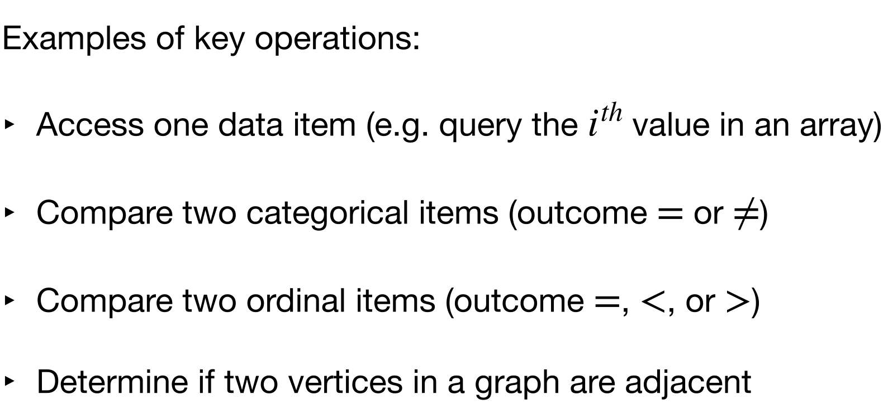

Key operation of sorting: Comparison.

Every time the algorithm does key operation, the adversary tries his best to make it do the most work.

Example: check if a bit sequence has 1.

For the problem, key operation is check the $i$th element if it is 1.

Every time the algorithm asks what the $i$th is, the adversary answers 0, so the algorithm keeps going.
If he answers 1, the algorithm terminates, which is not what he wants.

One absolutely crucial feature of this argument is that the adversary makes absolutely **no assumptions** about the algorithm.
The adversary strategy can’t depend on some predetermined order of examining bits, and it doesn’t care about anything the algorithm might or might not do when it’s not looking at bits.

However, as long as there are at least two different answers to the problem by the algorithm that are consistent with all answers given by the adversary, the algorithm cannot be done!(2 different outputs)

### Adversary Argument for Comparison-based Sorting

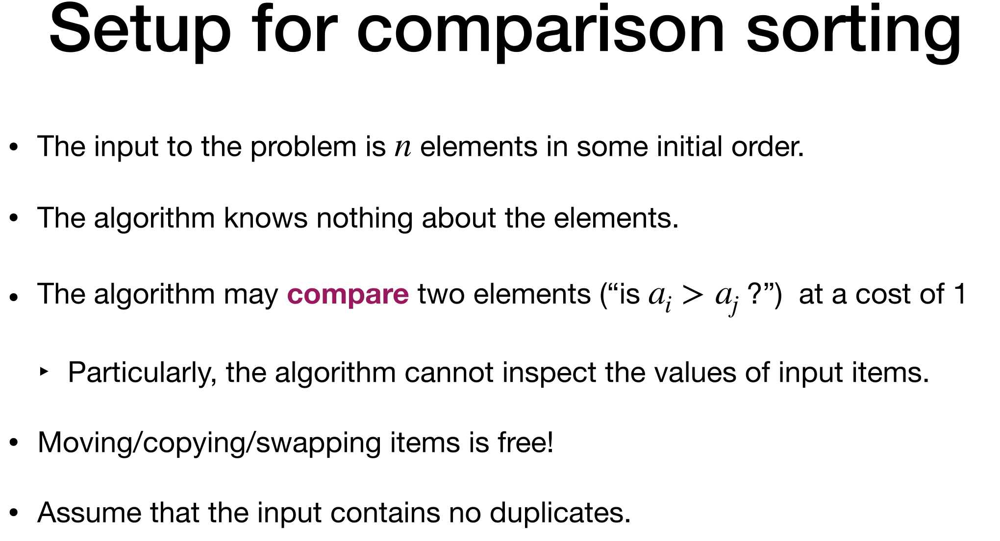
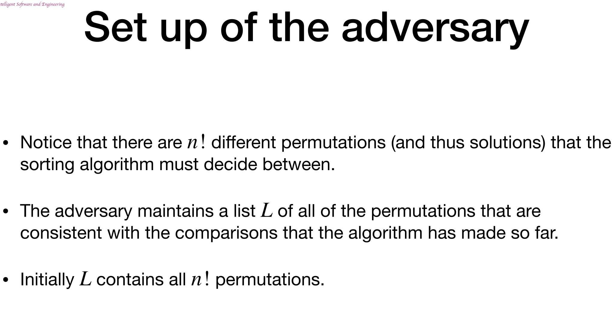
We set up the adversary, there're $n!$ permutations at first.

The adversary can respond the question: "Is element i less than element j?"
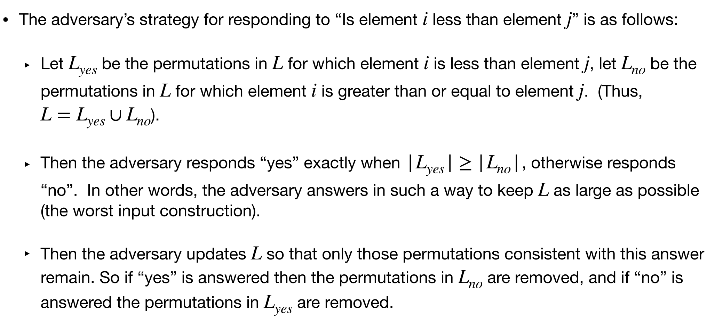
To make the algorithm take more time, the adversary responds the bigger one.
When L=1, the attack from the adversary can terminate.

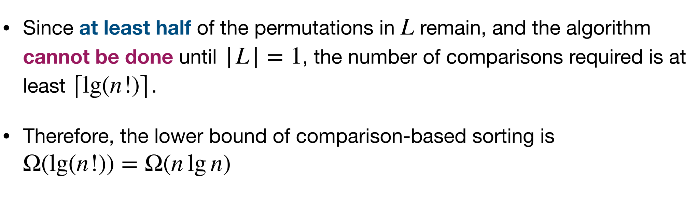
In this way we get the lower bond of comparison-based sort.

Therefore, sorting cannot be faster than $O(nlgn)$

### Information-Theoretic Argument

Consider the minimum number M of distinct outputs that a sorting algorithm must be able to produce to be able to sort any possible input of length n.

$$
M = n!
$$

The algorithm must be capable of outputting at least M different permutations, or there would exist some input that it was not capable of sorting.

Remember, the algorithm is deterministic and its behavior is determined entirely by the results of the **comparisons**.

If we make c comparisons already, at most it produces $2^c$ different possible permutations, which must be greater than M.
Therefore $2^c\geq n!$, and c is $lgn$

### An Alternative View: Decision Trees

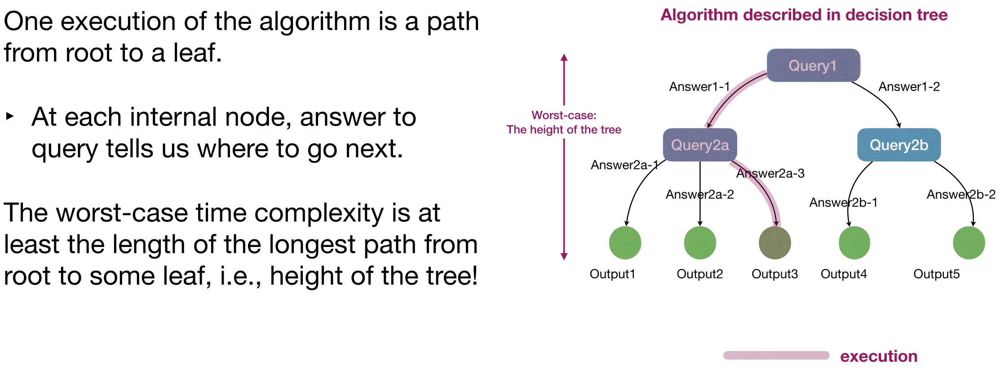
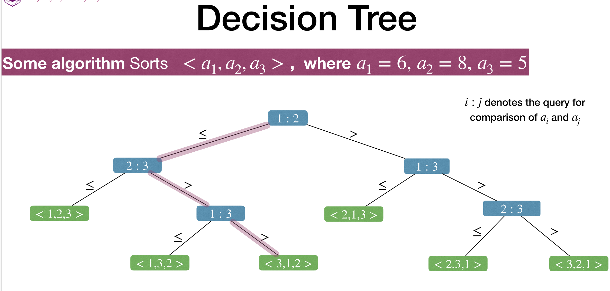
Every node has 2 children(except leaves), because it only answers ye or no for every comparison query.
And so the tree must have n! leaves, so the height must be $\geq lg(n!)$, meaning $\geq nlgn$, and the height is the number of comparisons.

### Information Content(*not requested)

Information content, or Self-information or Shannon information of an event x:

$$
I(x)=-logPr(x)=log\frac{1}{Pr(x)}
$$

If a highly likely event occurs, it carries very little information. In fact, a 100% likely event occurs, it has no information.
On the other hand, if a highly unlikely event occurs, it is much more informative.

Why use log?
For 2 mutual independent events x and y, we want the information of event xy to be the sum of x and y information.
So using log would give us the ability to sum.

#### Information Entropy

Given a discrete random variable $X$, which takes values in the alphabet $\mathcal{X}$ and is distributed as $Pr: \mathcal{X}\rightarrow [0,1]$
The **entropy** $H(X)$ of a random variable X is the average level of "information", "surprise", or "uncertainty" inherent to the variable's possible outcomes.

$$
H(X)=\sum_{x\in\mathcal{X}}-Pr(X=x)logPr(X=x)=E[-logPr(X)]
$$

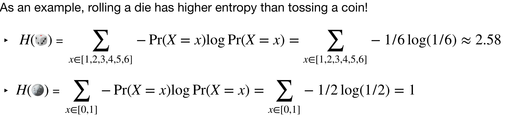

#### Information-theoretic Lower Bound

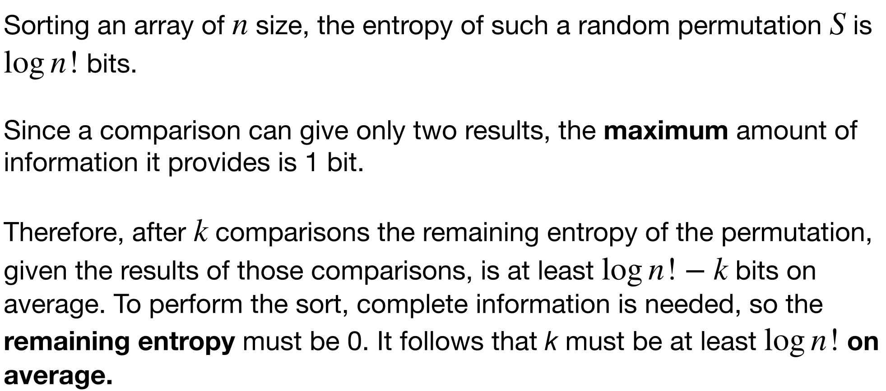

## Non-comparison-based Sorting

### Bucket Sort

Assume we already know each item is from the set [10], it is very easy to beat $O(nlogn)$
Create 10 empty lists(buckets), scan through input and for each item append them to the end of the corresponding bucket.
Then merge all the buckets and output the results.
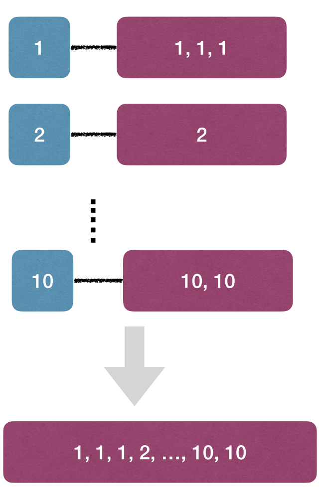
The time complexity is $O(n)$
This can be referred to as rolling a dice, whose information content is much bigger than flipping a coin.

In fact the time complexity is $\Theta(n+d)$, and d is the number of buckets(range of elements)
When n is much smaller than d, it might still be slower than other sorts.

However we can improve the bucket sort into a coarse-grained bucket.
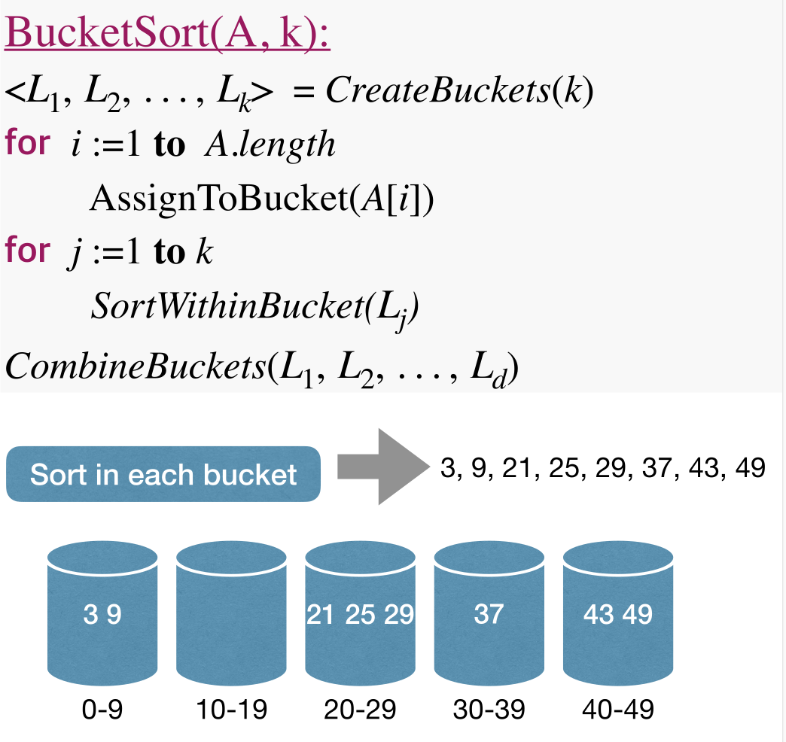
When sort within bucket, we can use bubble sort(or any other), and time is $O(k\times(\frac{n}{k})^2)=O(\frac{n^2}{k})$
And the time complexity is $O(n+k+(\frac{n^2}{k}))$, which is $O(n)$ when k is roughly equal to n.

If the array is not so uniform, the algorithm can turn into a $O(n^2)$ one.

### Radix Sort

Assume we want to sort $n$ decimal integers each of $d$-digits.
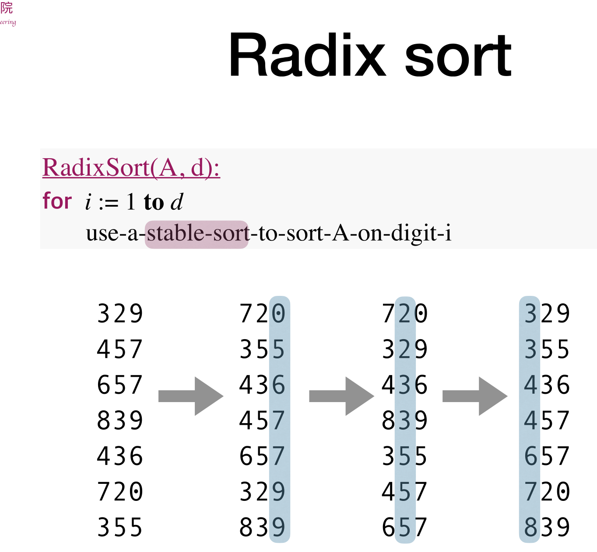
The stable sort must satisfy that if a higher digit, the two number equal, compare their lower digit.

We can use bucket sort as the stable sort here, and as we know they're all integers, only 10 buckets are needed.
RadixSort can sort $n$ decimal $d$-digits numbers in $O(dn)$ time.

### Lower Bound for Sorting by Querying the Value(bucket and radix sort)

Use an adversary argument.
The algorithm, which queries the input $n − 1$ times, does not solve the problem.
Any algorithm which queries the input at most $n − 1$ times does not solve the problem.
Solving the “sort n integers” problem by querying values of input has a time complexity of $\Omega(n)$.

Must check all n elements or the sorting could be wrong.
