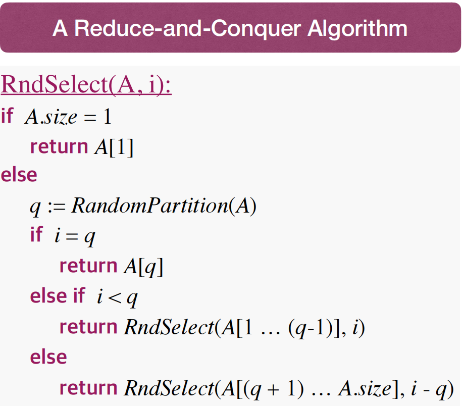

# Lec7: Selection

Given a set of n items, the $i^{th}$ **order statistic** of it is the $i^{th}$ smallest item in the set.
The Selection Problem: given a set $A$ of n distinct items and an integer $i$, find the $i^{th}$ smallest item in $A$.

## Find Min/Max

Scan the whole sequence and update if find a smaller/larger item.
Time complexity: $O(n)$
Can we do better?

No! We must scan to the very end to make sure we have compared all possible items.
Can use adversary analysis to show that we must scan the whole sequence to find the min/max.

If we want max and min at the same time?

- Scan the sequence twice: once to find the min and once to find the max.
- Number of comparisons: $2n-2$ at worst case.

Surprisingly we can do better in this case. Some values needn't be compared in the second scan.

- Group the sequence into pairs(first item itself being a pair if n is odd).
- Compare each pair and keep the **local** smaller/larger item. $\lfloor{n/2}\rfloor$ comparisons
- Scan the sequence of local smaller/larger items to find the global min/max. at most $2\times\lfloor{n/2}\rfloor$ comparisons, one for min and one for max so need to multiply by 2.
- Total comparisons: $3\times \lfloor{n/2}\rfloor$

By adverasary analysis we know this is the best we can do.

## General Selection Problem

How to find the $i^{th}$ smallest item in a set of n items?

- quickSort the sequence and return the $i^{th}$ item. $O(n\log n)$
  Can we do better?

Thus we could do much less comparisons to find the $i^{th}$ smallest item.

### Randomized Selection Algorithm

Best case: choosing the answer as the pivot, $i=q$ at the first time $O(n)$ (barely possible)
Worst case: $O(n^2)$ (barely possible)
How about the average case?

Choosing one pivot and two partitions allows us to reduce the problem size by a constant factor.
Call a partition **good** if it reduces the problem size to at most $0.8\times n$
After k times of good partitions, the problem size is reduced to at most $0.8^k\times n$
When $0.8^k\times n\leq 1$, we succeed, and get $k\leq log_{1.25}n$
Cost (total comparisons of bad partitions between two good ones): $O(1)\times C_i\leq 0.8{n-1}n$
This can be viewed as a Bernoulli trial, success as good partition with probability $p=0.8$, failure as bad partition.

Can we guarantee worst cases to be $O(n)$?
The reason RandomSelect could be slow is that RandomPartition might create an unbalanced partition.
Any other ways to create partitions?

## Median of Medians

- Divide elements into $\lceil{n/5}\rceil$ groups, shown as a column in the image, each group has 5 elements except possibly the last one.
- Find the medians of these groups and let $M$ be the set of these medians.
- Then find the median $m^*$ of $M$.
- Use $m^*$ as the pivot to partition the original set.
  
  As the `>` mark and `<` mark are transitive, there're elements which are definitely bigger or smaller than $m^*$ in the original set.

Using $m^*$ as the pivot to create partitions, in worst case it create about 7/10 smaller(bigger), 3/10 bigger(smaller) than $m^*$.
So it's a good partition.

Total time:

- Divide, $O(n)$
- Find medians, create M, $O(n)$
- Recursively find $m^*\in M$: Use RandomSelect recursively.
  
  T(0.7n) is to quickSelect the subproblem as the $m^*$ reduces the problem size to 0.7n.
  T(0.2n) is to find the **median** of medians, and $O(n)$ is other time.
  
  Total time spent is shown as above.
  
