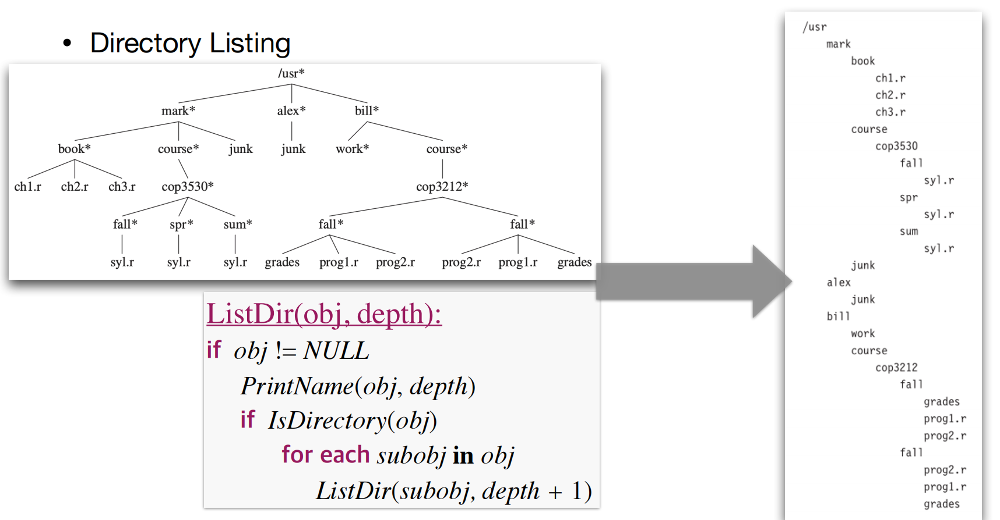

# Lec8: Tree
## Tree
A **tree** is a connected, acyclic undirected graph.
- connected: there's a path between any two vertices.
- acyclic: there's no cycle.
- undirected: the edges have no direction.

In CS, we focus on **rooted** trees.

Recursive definition:
- A tree is empty, or
- A tree has a root node with zero or a list of non-empty subtrees.

Root of each subtree is a child of `r`, and `r` is their parent.
Nodes without children are called *leaves*.
Nodes with same parent are called *siblings*.

The path from `r` to `u` is unique, r being ancester of `u`, u being descendant of `r`.

The **depth** of a node `u` is the length of the path from root `r` to `u`.
The **height** of a node `u` is the length of the longest path from `u` to a leaf(longest path to one of its descendants).

Height of every non-leaf node is the maximum height of its children plus one.

A **binary tree** is a tree in which each node has at most two children, left and right.
A **full binary tree** is a binary tree in which every node has **either zero or two** children.
A **complete binary tree** is a binary tree in which every level, **except possibly the last**, is completely filled, and all nodes are as **far left** as possible.
A **perfect binary tree** is a binary tree in which **all interior nodes have two children** and all leaves have **the same depth**.

```
class Node{
    Data data
    Node parent
    Node left
    Node right
}
```
Or if a lot of children, we can use a list to store them.
```
class Node{
    Data data
    Node parent
    Node firstChild
    Node nextSibling
}
```

## Traversal of a Tree
We want to visit every node in the tree.
There are three ways to traverse a tree:
- Preorder: visit the **root first**, then traverse the **left** subtree, and finally traverse the **right** subtree.
- Inorder: traverse the **left** subtree first, then visit the **root**, and finally traverse the **right** subtree.
- Postorder: traverse the **left** subtree first, then traverse the **right** subtree, and finally visit the **root**.

### Preorder Traversal


### Inorder Traversal


### Postorder Traversal


## Complexity of Tree Traversal
- Preorder, Inorder, Postorder: $O(n)$, where $n$ is the number of nodes in the tree.
- Space complexity: recursion needs to push into stack, and in worst case we need to push all n calls of function into stack, so $O(n)$

Preorder Traversal can be used for directory listing.


Postorder Traversal can be used for parsing expressions.
Expressions are parsed into a tree, and postorder traversal can be used to evaluate the expression.

## Iterative Tree Traversal

This is using stack and iteration to simulate the preorder traversal.
First we don't visit the root, we push it into stack.
And then we push all its children, and then visit root.

For InorderTraversal, mind the order of pushing frames.

## Level-order Traversal
A special kind of traversal is **breadth-first traversal**.
Previous traversals are all depth-first traversals.

In a breadth-first traversal, the nodes are visited **level-by-level** starting at the root and moving down, visiting the nodes at each level **from left to right**.
