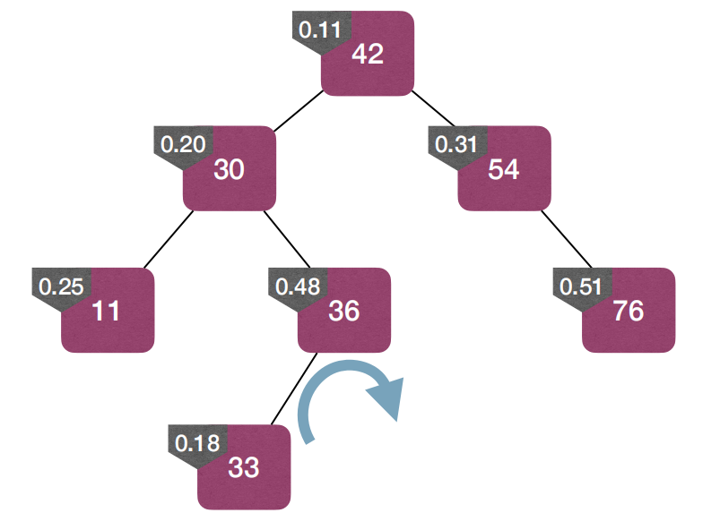

# Lec9: Search Trees

## The Dictionary ADT

A **dictionary** is a collection of items where each item has a **key** that **uniquely identifies** it.
Each element has a `key` and a `value`.
Key must be unique, while values can be duplicated.

Operations:

- Search(S, key): Find an element with the given key.
- Insert(S, x): Insert element x into the dictionary.(If element with same key exists, replace it.)
- Delete(S, x): Delete element x from the dictionary.
- Remove(S, key): Delete the element with the given key.

Typically, keys are from an ordered set, such as integers.

- Min(S) and Max(S): Find the element with the minimum and maximum keys.
- Successor(S, x): Find the smallest element with the key greater than x's key.
- Predecessor(S, x): Find the largest element with the key smaller than x's key.

Implement dictionary.

BinaryHeap just need to improve its search operation to be $O(\log n)$.

## Binary Search Trees(BST)

A binary search tree (BST) is a binary tree in which each node stores an element, and satisfies the **binary-search-tree property** (BST property):

- For every node x in the tree, if y is a node in the left subtree of x, then $y.key \leq x.key$.
- For every node x in the tree, if y is a node in the right subtree of x, then $y.key \geq x.key$.

Use Inorder Traversal to visit all nodes, we would visit them in ascending order of their keys.

### Search in BST

Given a BST root x and key k, find an element with key k.
Reduce and Conquer:

- If x.key = k then return and we are done!
- If x.key > k then recurse into the BST rooted at x.left.
- If x.key < k then recurse into the BST rooted at x.right.
  

#### Complexity of Search in BST

needs $O(h)$ time where h is the height of the tree.

- Worst case: the BST is not balanced, turning into a linked list, and needs $O(n)$ time.
- Best case: the BST is well-balanced, and in this case, h = $\log n$, which means $O(\log n)$ for a balanced BST.

### Max and Min in BST

Minimum: Keep going left until we hit a node without a left child.
Maximum: Keep going right until we hit a node without a right child.
Time: $O(h)$ where h is the height of the tree.

### Successor in BST

`BSTSuccessor(x)`: Find the smallest key element in the BST with key value larger than x.key
If the right subtree of x is not empty, then the successor is the minumum element in the right subtree.
So this takes $O(h)$ time.

If no right subtree?
Then the successor is the nearest ancestor of x whose left child is also an ancestor of x.

### Insert in BST

BSTInsert(T,z): Add z to BST T. Notice, insertion **should not break** the BST property.
Just like doing a search in T with key `z.key`.
This search will fail and **end at a leaf** `y`. Insert z as left or right child of `y`.

Reach leaf 32 at last and as 36 larger than 32, add to right child of 32.

$O(h)$ where h is the height of the tree.

### Remove in BST

BSTRemove(T,z): Remove element z from T. Notice, removal should not break the BST property.

Case 1: z has no children.
Easily remove z by setting its parent's corresponding pointer to NULL, and delete z.

Case 2: z has one child.
Replace z with its child, and update its parent's pointer to point to its child.

Case 3: z has 2 children.
We must choose either its left or right subtree to replace z, or it would be not connected.
Choose z's successor(or predecessor) to replace z.
As it is a successor, the right subtree would be bigger than it if replace z with its successor.

But if z.right.left is empty? How to choose z's successor?
Just choose z.right as its successor! And replace z with z.right.

If z.right.left is not empty, find the left most node to replace z, and the children of the successor take over the original position of the successor.

Use BST to implement the Dictionary ADT.

### Height of BST

The height could be $O(n)$ in the worst case, and $O(\log n)$ in the best case.
Definitely we want the height to be $O(\log n)$, so that we could be fast in search, insert, and remove.

Choosing the first element from the sequence is in fact choosing a pivot and create partitions!
The left subtree is smaller than the pivot, and the right subtree is larger than the pivot.
A random insertion is like **quickSort**, randomly choosing pivot and to create partitions.
So the expected height of a BST is $O(\log n)$.

## Treaps

A treap is a binary tree in which each node has a key value and a priority value.
The key values follow the BST property, meaning that

- For every node x in the tree, if y is a node in the left subtree of x, then $y.key \leq x.key$.
- For every node x in the tree, if y is a node in the right subtree of x, then $y.key \geq x.key$.

The priority values follow the min-heap property, for every node x in the tree, if y is a node in the left or right subtree of x, then $y.priority \geq x.priority$.

### Uniqueness of Treaps

Given a set of `n` nodes with distinct key values and distinct priority values, a unique Treap is determined.
By induction we can prove this.

### How to Build a Treap

Starting from an empty Treap, whenever we are given a node x that needs to be added, we assign a **random priority** for node x, and insert the node into the Treap.
Another view: a BST built with insertions, in the order of **increasing priorities**.

A Treap is like a randomly built BST, regardless of the **order** of the insert operations! (Since we use random priorities!)
So we just sort the nodes by priorities, and insert them into the Treap using BSTInsert.

### Insert in Treap

Step 1: Assign a random priority to node x.
Step 2: Insert node x into the Treap using BSTInsert.
Step 3: Fix the min-heap property without breaking the BST property.

Use **rotation** to fix the min-heap property.

Once we find a node x that breaks the min-heap property, we rotate it to fix the property.
Use rotations to push-up these nodes until the min-heap property is restored.

### Remove in Treap

Just invert the insert operation.
Step 1: Use rotations to push-down the node till it is a **leaf**.
Step 2: Remove the **leaf**.

## Red-Black Trees

Can we have a data structure supporting ordered dictionary operations in $O(log n)$ time, **even in worst-case**?
A balanced n-node BST has height $O(\log n)$, which is what we want.

A Red-Black Tree is a BST in which each node has a color, satisfying:

- A node is either red or black.
- The root is black.
- Every leaf (NIL) is black.
- If a node is red, then both its children are black.(no red edge)
- For each node, all simple paths from the node to descendant leaves contain the same number of black nodes.(black height)

### Black Height

Call the number of black nodes on any simple path from a node x (not including x) to a descendant leaf the **black height** of x, denoted as $bh(x)$.
From the black-height perspective, RB-Trees are “perfectly balanced”.
Due to the no-red-edge property, the height of the whole tree does not deviate a lot from its black height.

In a RB-Tree, the subtree rooted at x contains at least $2^{bh(x)} - 1$ internal nodes.

### Insert Node into RB-Tree

Now we wonna insert node z into the RB-Tree.
Step 1: Color z as red(so that maintains the black-height property).
Step 2: Insert z into the RB-Tree as if the RB-Tree is a regular BST.
Step 3: Fix the RB-Tree property.

How to fix?
If z has a black parent after Step 2, then no further fix is needed.

In the fix step, z no longer represents the inserted node, but the node to be fixed.
Step 3: Fix the RB-Tree property

- Case 0: z becomes the root, just recolor it as black.
- Case 1: z has a red parent, and z has **a black grandparent and a red uncle**.
  
  Fix: recolor z’s parent and uncle to black, recolor z’s grandparent to red
  
  But we might push-up the violation! Turn to case 2 for further fix.
  
- Case 2: z’s **parent is red, has black uncle y**
  (a) z is **right child** of its parent.
  Left-rotate at z's parent:
  
  
  Then turn to case 2(b).

(b) z is **left child** of its parent.
Right-rotate at z's grandparent, recolor z's grandparent and parent:

Summing up:

### Remove Node from RB-Tree

Recall the removal in BST:

4 different cases:

These are called structurally delete cases.

- If z’s right child is an external node (**leaf**) , then z is the node to be deleted **structurally**: subtree rooted at z.left will replace z.
- If z’s right child is an internal node, then let y be the node in subtree rooted at z.right. Overwrite z’s info with y’s info, and y is the node to be deleted structurally: subtree rooted at y.right will replace y.
  
  In this case we wonna delete 13, just find y=15 and let 13 be 15, and delete 15, replace 15 with nil.
  Either way, **only one structural deletion** needed!

To sum up:

For the repair step, it's crucial.
Assume black x is left child of its parent after taking black y’s place, and we focus on fixing black-height property

4 cases in total.

## Skip Lists

A special form of linked list.
Traditional linked list is not efficient at removing a node, because we need to traverse from the very beginning to find the node to be removed, one element at a time so very slow.
Can we skip some nodes to speed up the removal?

We can represented it as two linked lists — one for **express stops** and one for **all stops**.

What if we have multiple layers of express ways?
We can reduce number of elements by half at each level

We can turn this into binary search.
So search becomes more efficient, $O(\log n)$ time.

How about insert and remove?

### The Real Skip List

Every time we insert we randomly decide which layer it belongs to.
By flipping a coin, we decide the highest layer the inserted item in.

Additionally, insertion requires first searching the appropriate position to be inserted, so call search operation first.

To remove, just search the item to be removed and remove in all layers, update pointers too.
